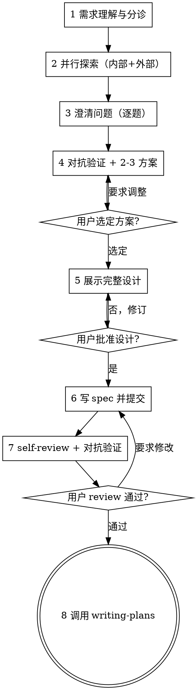

### 任务 T02：共享入口分层与容量驱动派发

任务类型：behavior
覆盖 Scenario：S15、S16、S19、S20、S42

**文件**：
- 修改：`skills/requirement-analysis/SKILL.md`
- 修改：`skills/exploring/SKILL.md`
- 创建：`skills/requirement-analysis/references/exploration-entry.md`
- 修改：`skills/requirement-analysis/references/exploration-patterns.md`
- 创建：`skills/requirement-analysis/references/plugin-root.md`
- 创建：`skills/requirement-analysis/references/output-contracts.md`
- 创建：`skills/requirement-analysis/references/agent-dispatch.md`
- 修改：`skills/requirement-analysis/references/codex-compat.md`
- 修改：`agents/external-resource-explorer.md`
- 修改：`README.md`
- 修改：`README.zh-CN.md`
- 修改：`scripts/tests/plugin-root.test.mjs`
- 修改：`skills/requirement-analysis/evals/evals.json`
- 测试：`scripts/tests/skill-streamlining-T02.test.mjs`
- 本票证据：`.spec-dev/2026-09-11-01-skill-instruction-streamlining/execution/serial/T02`
- 状态：`.spec-dev/2026-09-11-01-skill-instruction-streamlining/plan/progress.yaml`

**接口**：
- 消费：T00 的 binding（真实 worktree/branch/source、所有权）；T01 的 readPolicy(root, entry) → {documents, text}；本 spec 的公共规则/客户端行为落点。
- 产出：本票文件块列出的完整指令/测试版本；普通 v1 completed 检查点引用真实代码提交，后继消费导航所列接口及自己的票。
- 验证边界：本票 Node 测试是文档/结构契约验证，不证明模型服从；实际模型取证在 T13。编译、导入、环境或零测试故障不算有效红。

**执行 cwd**：所有片段从 T00 已核实的实施 worktree 根执行；每次工具调用显式指定该目录。bound() 会拒绝来源工作区或错误分支。所有下列程序仅在执行计划获准后运行。


**步骤 1：写本票失败契约测试**

```````python
from pathlib import Path
import hashlib,json,os,subprocess,uuid,re,shlex
FEATURE=".spec-dev/2026-09-11-01-skill-instruction-streamlining"
ROOT=Path.cwd().resolve()
STATE=ROOT/FEATURE/"plan/progress.yaml"
def git(*args, cwd=None, check=True):
    r=subprocess.run(["rtk","proxy","git",*args],cwd=cwd or ROOT,capture_output=True,text=True)
    if check and r.returncode:raise RuntimeError(r.stdout+r.stderr)
    return r.stdout.strip()
def read_state(): return json.loads(STATE.read_text())
def binding():
    rows=[n[len("binding:"): ] for n in read_state()["notes"] if n.startswith("binding:")]
    if not rows:raise RuntimeError("T00 has not recorded a binding")
    return json.loads(rows[-1])
def bound():
    b=binding()
    if ROOT!=Path(b["worktree"]).resolve():raise RuntimeError("wrong task cwd")
    if git("branch","--show-current")!=b["branch"]:raise RuntimeError("wrong task branch")
    return b
def doc_commit(paths,message):
    staged=git("diff","--cached","--name-only")
    if staged:raise RuntimeError("unexpected staged files: "+staged)
    git("add","--",*paths)
    r=subprocess.run(["rtk","proxy","git","diff","--cached","--check"],cwd=ROOT)
    if r.returncode:raise RuntimeError("staged whitespace check failed")
    r=subprocess.run(["rtk","proxy","env","SKIP_CODEX_PACKAGE_HOOK=1","SKIP_RELEASE_HOOK=1",
                      "git","commit","-m",message],cwd=ROOT)
    if r.returncode:raise RuntimeError("commit failed; preserve staged files")
    return git("rev-parse","HEAD")
def checkpoint(task,status,commit=None,tests=None,note=None,extra_paths=()):
    state=read_state()
    state["tasks"][task]["status"]=status
    if commit is not None:state["tasks"][task]["commit"]=commit
    if tests is not None:state["tasks"][task]["tests"]=tests
    state["current"]=task if status in ("in_progress","blocked") else None
    if note:state["notes"].append(note)
    temp=STATE.with_name(STATE.name+"."+str(uuid.uuid4())+".tmp")
    with temp.open("x") as out:
        out.write(json.dumps(state,ensure_ascii=False,indent=2)+"\n");out.flush();os.fsync(out.fileno())
    os.replace(temp,STATE)
    return doc_commit([str(STATE.relative_to(ROOT)),*extra_paths],"docs(progress): "+task+" "+status)
def start(task,deps):
    bound();state=read_state()
    if any(state["tasks"][d]["status"]!="completed" for d in deps):raise RuntimeError("dependency incomplete")
    if state["tasks"][task]["status"]=="completed":raise RuntimeError("already completed: resume next ready task")
    if state["tasks"][task]["status"]=="blocked":raise RuntimeError("resolve recorded blocker before resume")
    if state["tasks"][task]["status"]!="in_progress":checkpoint(task,"in_progress")
def payload(task,name):
    text=(ROOT/FEATURE/"plan/tasks"/(task+".md")).read_text()
    fence="~"*16
    prefix="<!-- payload:"+name+" -->\n"+fence+"text\n"
    suffix="\n"+fence+"\n<!-- /payload:"+name+" -->"
    if text.count(prefix)!=1:raise RuntimeError("missing/duplicate payload "+name)
    rest=text.split(prefix,1)[1]
    if suffix not in rest:raise RuntimeError("payload terminator missing")
    return rest.split(suffix,1)[0]
def apply_rows(task,rows):
    bound();prepared=[]
    for row in rows:
        rel=row["path"]
        if rel.startswith(("skills/anysearch/","skills/sequential-thinking/")) or rel in (
            "scripts/update-vendored-skill.mjs","scripts/tests/update-vendored.test.mjs"):
            raise RuntimeError("excluded write: "+rel)
        target=ROOT/rel
        if target.resolve()!=target or not target.is_relative_to(ROOT) or ".." in Path(rel).parts:
            raise RuntimeError("noncanonical write: "+rel)
        content=payload(task,row["payload"])
        after=hashlib.sha256(content.encode()).hexdigest()
        current=hashlib.sha256(target.read_bytes()).hexdigest() if target.exists() else None
        if current==after:continue
        if current!=row["before"]:raise RuntimeError("unexpected source content: "+rel)
        prepared.append((target,content))
    for target,content in prepared:
        target.parent.mkdir(parents=True,exist_ok=True)
        temp=target.with_name(target.name+"."+str(uuid.uuid4())+".tmp")
        with temp.open("x") as out:
            out.write(content);out.flush();os.fsync(out.fileno())
        os.replace(temp,target)
def capture(task,label,argv,expected=0,cwd=None):
    b=bound();run=uuid.uuid4().hex
    base=ROOT/FEATURE/"execution/serial"/task/label/run
    base.mkdir(parents=True)
    actual_cwd=Path(cwd).resolve() if cwd else ROOT
    r=subprocess.run(argv,cwd=actual_cwd,capture_output=True)
    for stream,data in [("stdout",r.stdout),("stderr",r.stderr)]:(base/(stream+".log")).write_bytes(data)
    record={"argv":argv,"cwd":str(actual_cwd),"exit_code":r.returncode,"base_commit":git("rev-parse","HEAD"),
            "stdout_sha256":hashlib.sha256(r.stdout).hexdigest(),"stderr_sha256":hashlib.sha256(r.stderr).hexdigest(),
            "kind":"actual-command-result","expected_exit":expected}
    (base/"record.json").write_text(json.dumps(record,ensure_ascii=False,indent=2)+"\n")
    print(r.stdout.decode(errors="replace"));print(r.stderr.decode(errors="replace"))
    print("RECORD",str(base.relative_to(ROOT))+"/record.json")
    if r.returncode!=expected:
        checkpoint(task,"blocked",tests="fail",note=task+" unexpected exit at "+str(base.relative_to(ROOT)),
                   extra_paths=[str(base.relative_to(ROOT))])
        raise RuntimeError("unexpected exit; actual record saved, preserve working changes")
    return base

start('T02',['T01'])
apply_rows('T02',[{'path': 'scripts/tests/skill-streamlining-T02.test.mjs', 'before': None, 'payload': 'T02-test'}])
```````

**步骤 2：观察有效失败**

```````python
from pathlib import Path
import hashlib,json,os,subprocess,uuid,re,shlex
FEATURE=".spec-dev/2026-09-11-01-skill-instruction-streamlining"
ROOT=Path.cwd().resolve()
STATE=ROOT/FEATURE/"plan/progress.yaml"
def git(*args, cwd=None, check=True):
    r=subprocess.run(["rtk","proxy","git",*args],cwd=cwd or ROOT,capture_output=True,text=True)
    if check and r.returncode:raise RuntimeError(r.stdout+r.stderr)
    return r.stdout.strip()
def read_state(): return json.loads(STATE.read_text())
def binding():
    rows=[n[len("binding:"): ] for n in read_state()["notes"] if n.startswith("binding:")]
    if not rows:raise RuntimeError("T00 has not recorded a binding")
    return json.loads(rows[-1])
def bound():
    b=binding()
    if ROOT!=Path(b["worktree"]).resolve():raise RuntimeError("wrong task cwd")
    if git("branch","--show-current")!=b["branch"]:raise RuntimeError("wrong task branch")
    return b
def doc_commit(paths,message):
    staged=git("diff","--cached","--name-only")
    if staged:raise RuntimeError("unexpected staged files: "+staged)
    git("add","--",*paths)
    r=subprocess.run(["rtk","proxy","git","diff","--cached","--check"],cwd=ROOT)
    if r.returncode:raise RuntimeError("staged whitespace check failed")
    r=subprocess.run(["rtk","proxy","env","SKIP_CODEX_PACKAGE_HOOK=1","SKIP_RELEASE_HOOK=1",
                      "git","commit","-m",message],cwd=ROOT)
    if r.returncode:raise RuntimeError("commit failed; preserve staged files")
    return git("rev-parse","HEAD")
def checkpoint(task,status,commit=None,tests=None,note=None,extra_paths=()):
    state=read_state()
    state["tasks"][task]["status"]=status
    if commit is not None:state["tasks"][task]["commit"]=commit
    if tests is not None:state["tasks"][task]["tests"]=tests
    state["current"]=task if status in ("in_progress","blocked") else None
    if note:state["notes"].append(note)
    temp=STATE.with_name(STATE.name+"."+str(uuid.uuid4())+".tmp")
    with temp.open("x") as out:
        out.write(json.dumps(state,ensure_ascii=False,indent=2)+"\n");out.flush();os.fsync(out.fileno())
    os.replace(temp,STATE)
    return doc_commit([str(STATE.relative_to(ROOT)),*extra_paths],"docs(progress): "+task+" "+status)
def start(task,deps):
    bound();state=read_state()
    if any(state["tasks"][d]["status"]!="completed" for d in deps):raise RuntimeError("dependency incomplete")
    if state["tasks"][task]["status"]=="completed":raise RuntimeError("already completed: resume next ready task")
    if state["tasks"][task]["status"]=="blocked":raise RuntimeError("resolve recorded blocker before resume")
    if state["tasks"][task]["status"]!="in_progress":checkpoint(task,"in_progress")
def payload(task,name):
    text=(ROOT/FEATURE/"plan/tasks"/(task+".md")).read_text()
    fence="~"*16
    prefix="<!-- payload:"+name+" -->\n"+fence+"text\n"
    suffix="\n"+fence+"\n<!-- /payload:"+name+" -->"
    if text.count(prefix)!=1:raise RuntimeError("missing/duplicate payload "+name)
    rest=text.split(prefix,1)[1]
    if suffix not in rest:raise RuntimeError("payload terminator missing")
    return rest.split(suffix,1)[0]
def apply_rows(task,rows):
    bound();prepared=[]
    for row in rows:
        rel=row["path"]
        if rel.startswith(("skills/anysearch/","skills/sequential-thinking/")) or rel in (
            "scripts/update-vendored-skill.mjs","scripts/tests/update-vendored.test.mjs"):
            raise RuntimeError("excluded write: "+rel)
        target=ROOT/rel
        if target.resolve()!=target or not target.is_relative_to(ROOT) or ".." in Path(rel).parts:
            raise RuntimeError("noncanonical write: "+rel)
        content=payload(task,row["payload"])
        after=hashlib.sha256(content.encode()).hexdigest()
        current=hashlib.sha256(target.read_bytes()).hexdigest() if target.exists() else None
        if current==after:continue
        if current!=row["before"]:raise RuntimeError("unexpected source content: "+rel)
        prepared.append((target,content))
    for target,content in prepared:
        target.parent.mkdir(parents=True,exist_ok=True)
        temp=target.with_name(target.name+"."+str(uuid.uuid4())+".tmp")
        with temp.open("x") as out:
            out.write(content);out.flush();os.fsync(out.fileno())
        os.replace(temp,target)
def capture(task,label,argv,expected=0,cwd=None):
    b=bound();run=uuid.uuid4().hex
    base=ROOT/FEATURE/"execution/serial"/task/label/run
    base.mkdir(parents=True)
    actual_cwd=Path(cwd).resolve() if cwd else ROOT
    r=subprocess.run(argv,cwd=actual_cwd,capture_output=True)
    for stream,data in [("stdout",r.stdout),("stderr",r.stderr)]:(base/(stream+".log")).write_bytes(data)
    record={"argv":argv,"cwd":str(actual_cwd),"exit_code":r.returncode,"base_commit":git("rev-parse","HEAD"),
            "stdout_sha256":hashlib.sha256(r.stdout).hexdigest(),"stderr_sha256":hashlib.sha256(r.stderr).hexdigest(),
            "kind":"actual-command-result","expected_exit":expected}
    (base/"record.json").write_text(json.dumps(record,ensure_ascii=False,indent=2)+"\n")
    print(r.stdout.decode(errors="replace"));print(r.stderr.decode(errors="replace"))
    print("RECORD",str(base.relative_to(ROOT))+"/record.json")
    if r.returncode!=expected:
        checkpoint(task,"blocked",tests="fail",note=task+" unexpected exit at "+str(base.relative_to(ROOT)),
                   extra_paths=[str(base.relative_to(ROOT))])
        raise RuntimeError("unexpected exit; actual record saved, preserve working changes")
    return base

capture('T02','red',['rtk','proxy','node','--test','scripts/tests/skill-streamlining-T02.test.mjs'],expected=1)
```````

预期：TAP 显示本票目标规则断言失败，测试已实际运行。逐条核对失败是旧规则与获批要求的差异，而非缺 Node、导入错误或零测试；此为文档契约红，不冒称模型行为红。若原状已满足全部目标，保留原输出并核对任务是否只剩语义保持移动，不制造失败。

**步骤 3：应用最小完整修改**

```````python
from pathlib import Path
import hashlib,json,os,subprocess,uuid,re,shlex
FEATURE=".spec-dev/2026-09-11-01-skill-instruction-streamlining"
ROOT=Path.cwd().resolve()
STATE=ROOT/FEATURE/"plan/progress.yaml"
def git(*args, cwd=None, check=True):
    r=subprocess.run(["rtk","proxy","git",*args],cwd=cwd or ROOT,capture_output=True,text=True)
    if check and r.returncode:raise RuntimeError(r.stdout+r.stderr)
    return r.stdout.strip()
def read_state(): return json.loads(STATE.read_text())
def binding():
    rows=[n[len("binding:"): ] for n in read_state()["notes"] if n.startswith("binding:")]
    if not rows:raise RuntimeError("T00 has not recorded a binding")
    return json.loads(rows[-1])
def bound():
    b=binding()
    if ROOT!=Path(b["worktree"]).resolve():raise RuntimeError("wrong task cwd")
    if git("branch","--show-current")!=b["branch"]:raise RuntimeError("wrong task branch")
    return b
def doc_commit(paths,message):
    staged=git("diff","--cached","--name-only")
    if staged:raise RuntimeError("unexpected staged files: "+staged)
    git("add","--",*paths)
    r=subprocess.run(["rtk","proxy","git","diff","--cached","--check"],cwd=ROOT)
    if r.returncode:raise RuntimeError("staged whitespace check failed")
    r=subprocess.run(["rtk","proxy","env","SKIP_CODEX_PACKAGE_HOOK=1","SKIP_RELEASE_HOOK=1",
                      "git","commit","-m",message],cwd=ROOT)
    if r.returncode:raise RuntimeError("commit failed; preserve staged files")
    return git("rev-parse","HEAD")
def checkpoint(task,status,commit=None,tests=None,note=None,extra_paths=()):
    state=read_state()
    state["tasks"][task]["status"]=status
    if commit is not None:state["tasks"][task]["commit"]=commit
    if tests is not None:state["tasks"][task]["tests"]=tests
    state["current"]=task if status in ("in_progress","blocked") else None
    if note:state["notes"].append(note)
    temp=STATE.with_name(STATE.name+"."+str(uuid.uuid4())+".tmp")
    with temp.open("x") as out:
        out.write(json.dumps(state,ensure_ascii=False,indent=2)+"\n");out.flush();os.fsync(out.fileno())
    os.replace(temp,STATE)
    return doc_commit([str(STATE.relative_to(ROOT)),*extra_paths],"docs(progress): "+task+" "+status)
def start(task,deps):
    bound();state=read_state()
    if any(state["tasks"][d]["status"]!="completed" for d in deps):raise RuntimeError("dependency incomplete")
    if state["tasks"][task]["status"]=="completed":raise RuntimeError("already completed: resume next ready task")
    if state["tasks"][task]["status"]=="blocked":raise RuntimeError("resolve recorded blocker before resume")
    if state["tasks"][task]["status"]!="in_progress":checkpoint(task,"in_progress")
def payload(task,name):
    text=(ROOT/FEATURE/"plan/tasks"/(task+".md")).read_text()
    fence="~"*16
    prefix="<!-- payload:"+name+" -->\n"+fence+"text\n"
    suffix="\n"+fence+"\n<!-- /payload:"+name+" -->"
    if text.count(prefix)!=1:raise RuntimeError("missing/duplicate payload "+name)
    rest=text.split(prefix,1)[1]
    if suffix not in rest:raise RuntimeError("payload terminator missing")
    return rest.split(suffix,1)[0]
def apply_rows(task,rows):
    bound();prepared=[]
    for row in rows:
        rel=row["path"]
        if rel.startswith(("skills/anysearch/","skills/sequential-thinking/")) or rel in (
            "scripts/update-vendored-skill.mjs","scripts/tests/update-vendored.test.mjs"):
            raise RuntimeError("excluded write: "+rel)
        target=ROOT/rel
        if target.resolve()!=target or not target.is_relative_to(ROOT) or ".." in Path(rel).parts:
            raise RuntimeError("noncanonical write: "+rel)
        content=payload(task,row["payload"])
        after=hashlib.sha256(content.encode()).hexdigest()
        current=hashlib.sha256(target.read_bytes()).hexdigest() if target.exists() else None
        if current==after:continue
        if current!=row["before"]:raise RuntimeError("unexpected source content: "+rel)
        prepared.append((target,content))
    for target,content in prepared:
        target.parent.mkdir(parents=True,exist_ok=True)
        temp=target.with_name(target.name+"."+str(uuid.uuid4())+".tmp")
        with temp.open("x") as out:
            out.write(content);out.flush();os.fsync(out.fileno())
        os.replace(temp,target)
def capture(task,label,argv,expected=0,cwd=None):
    b=bound();run=uuid.uuid4().hex
    base=ROOT/FEATURE/"execution/serial"/task/label/run
    base.mkdir(parents=True)
    actual_cwd=Path(cwd).resolve() if cwd else ROOT
    r=subprocess.run(argv,cwd=actual_cwd,capture_output=True)
    for stream,data in [("stdout",r.stdout),("stderr",r.stderr)]:(base/(stream+".log")).write_bytes(data)
    record={"argv":argv,"cwd":str(actual_cwd),"exit_code":r.returncode,"base_commit":git("rev-parse","HEAD"),
            "stdout_sha256":hashlib.sha256(r.stdout).hexdigest(),"stderr_sha256":hashlib.sha256(r.stderr).hexdigest(),
            "kind":"actual-command-result","expected_exit":expected}
    (base/"record.json").write_text(json.dumps(record,ensure_ascii=False,indent=2)+"\n")
    print(r.stdout.decode(errors="replace"));print(r.stderr.decode(errors="replace"))
    print("RECORD",str(base.relative_to(ROOT))+"/record.json")
    if r.returncode!=expected:
        checkpoint(task,"blocked",tests="fail",note=task+" unexpected exit at "+str(base.relative_to(ROOT)),
                   extra_paths=[str(base.relative_to(ROOT))])
        raise RuntimeError("unexpected exit; actual record saved, preserve working changes")
    return base

apply_rows('T02',[{'path': 'skills/requirement-analysis/SKILL.md', 'before': '868bfb200841f8a10b166049de10b35bf7fdea90ca6be232671ad1cdaf49ef65', 'payload': 'T02-0'}, {'path': 'skills/exploring/SKILL.md', 'before': '255f6c70a84bf8504291222a1de4f1ae2c0ae7d493755c6682d0eb4722d0d9e1', 'payload': 'T02-1'}, {'path': 'skills/requirement-analysis/references/exploration-entry.md', 'before': None, 'payload': 'T02-2'}, {'path': 'skills/requirement-analysis/references/exploration-patterns.md', 'before': '92f474bf8104fe83c8f5e3135757d818ee58de1650b7fa68592155af5504bfd5', 'payload': 'T02-3'}, {'path': 'skills/requirement-analysis/references/plugin-root.md', 'before': None, 'payload': 'T02-4'}, {'path': 'skills/requirement-analysis/references/output-contracts.md', 'before': None, 'payload': 'T02-5'}, {'path': 'skills/requirement-analysis/references/agent-dispatch.md', 'before': None, 'payload': 'T02-6'}, {'path': 'skills/requirement-analysis/references/codex-compat.md', 'before': '1595014d63830c7fb6c6b13958d1ab485ec060d32ebf8d96b259e4c867d1ed2e', 'payload': 'T02-7'}, {'path': 'agents/external-resource-explorer.md', 'before': '9861ac5756294451f05184a49613d17c428c84b899db6d2e9f5ce3e1df3fbb31', 'payload': 'T02-8'}, {'path': 'README.md', 'before': '7a9c0e3b4255141d5bd026afdc8b7f5f05d50682fe3b698f225fa8bc389a1e6a', 'payload': 'T02-9'}, {'path': 'README.zh-CN.md', 'before': '65a27d237ed7580f9538d4e727238052449aa3f7b8a201419e32ba2c69cf8a79', 'payload': 'T02-10'}, {'path': 'scripts/tests/plugin-root.test.mjs', 'before': '03a1ac51a74c84c682b3e453f4be621300a1c31bde2f8930d25f4e34f4986e22', 'payload': 'T02-11'}, {'path': 'skills/requirement-analysis/evals/evals.json', 'before': '2d2dd391a553414878018e90c2d932e8d9970d65d7a40b00558b27028c844de9', 'payload': 'T02-12'}])
```````


**步骤 4：验证目标与相关回归**

```````python
from pathlib import Path
import hashlib,json,os,subprocess,uuid,re,shlex
FEATURE=".spec-dev/2026-09-11-01-skill-instruction-streamlining"
ROOT=Path.cwd().resolve()
STATE=ROOT/FEATURE/"plan/progress.yaml"
def git(*args, cwd=None, check=True):
    r=subprocess.run(["rtk","proxy","git",*args],cwd=cwd or ROOT,capture_output=True,text=True)
    if check and r.returncode:raise RuntimeError(r.stdout+r.stderr)
    return r.stdout.strip()
def read_state(): return json.loads(STATE.read_text())
def binding():
    rows=[n[len("binding:"): ] for n in read_state()["notes"] if n.startswith("binding:")]
    if not rows:raise RuntimeError("T00 has not recorded a binding")
    return json.loads(rows[-1])
def bound():
    b=binding()
    if ROOT!=Path(b["worktree"]).resolve():raise RuntimeError("wrong task cwd")
    if git("branch","--show-current")!=b["branch"]:raise RuntimeError("wrong task branch")
    return b
def doc_commit(paths,message):
    staged=git("diff","--cached","--name-only")
    if staged:raise RuntimeError("unexpected staged files: "+staged)
    git("add","--",*paths)
    r=subprocess.run(["rtk","proxy","git","diff","--cached","--check"],cwd=ROOT)
    if r.returncode:raise RuntimeError("staged whitespace check failed")
    r=subprocess.run(["rtk","proxy","env","SKIP_CODEX_PACKAGE_HOOK=1","SKIP_RELEASE_HOOK=1",
                      "git","commit","-m",message],cwd=ROOT)
    if r.returncode:raise RuntimeError("commit failed; preserve staged files")
    return git("rev-parse","HEAD")
def checkpoint(task,status,commit=None,tests=None,note=None,extra_paths=()):
    state=read_state()
    state["tasks"][task]["status"]=status
    if commit is not None:state["tasks"][task]["commit"]=commit
    if tests is not None:state["tasks"][task]["tests"]=tests
    state["current"]=task if status in ("in_progress","blocked") else None
    if note:state["notes"].append(note)
    temp=STATE.with_name(STATE.name+"."+str(uuid.uuid4())+".tmp")
    with temp.open("x") as out:
        out.write(json.dumps(state,ensure_ascii=False,indent=2)+"\n");out.flush();os.fsync(out.fileno())
    os.replace(temp,STATE)
    return doc_commit([str(STATE.relative_to(ROOT)),*extra_paths],"docs(progress): "+task+" "+status)
def start(task,deps):
    bound();state=read_state()
    if any(state["tasks"][d]["status"]!="completed" for d in deps):raise RuntimeError("dependency incomplete")
    if state["tasks"][task]["status"]=="completed":raise RuntimeError("already completed: resume next ready task")
    if state["tasks"][task]["status"]=="blocked":raise RuntimeError("resolve recorded blocker before resume")
    if state["tasks"][task]["status"]!="in_progress":checkpoint(task,"in_progress")
def payload(task,name):
    text=(ROOT/FEATURE/"plan/tasks"/(task+".md")).read_text()
    fence="~"*16
    prefix="<!-- payload:"+name+" -->\n"+fence+"text\n"
    suffix="\n"+fence+"\n<!-- /payload:"+name+" -->"
    if text.count(prefix)!=1:raise RuntimeError("missing/duplicate payload "+name)
    rest=text.split(prefix,1)[1]
    if suffix not in rest:raise RuntimeError("payload terminator missing")
    return rest.split(suffix,1)[0]
def apply_rows(task,rows):
    bound();prepared=[]
    for row in rows:
        rel=row["path"]
        if rel.startswith(("skills/anysearch/","skills/sequential-thinking/")) or rel in (
            "scripts/update-vendored-skill.mjs","scripts/tests/update-vendored.test.mjs"):
            raise RuntimeError("excluded write: "+rel)
        target=ROOT/rel
        if target.resolve()!=target or not target.is_relative_to(ROOT) or ".." in Path(rel).parts:
            raise RuntimeError("noncanonical write: "+rel)
        content=payload(task,row["payload"])
        after=hashlib.sha256(content.encode()).hexdigest()
        current=hashlib.sha256(target.read_bytes()).hexdigest() if target.exists() else None
        if current==after:continue
        if current!=row["before"]:raise RuntimeError("unexpected source content: "+rel)
        prepared.append((target,content))
    for target,content in prepared:
        target.parent.mkdir(parents=True,exist_ok=True)
        temp=target.with_name(target.name+"."+str(uuid.uuid4())+".tmp")
        with temp.open("x") as out:
            out.write(content);out.flush();os.fsync(out.fileno())
        os.replace(temp,target)
def capture(task,label,argv,expected=0,cwd=None):
    b=bound();run=uuid.uuid4().hex
    base=ROOT/FEATURE/"execution/serial"/task/label/run
    base.mkdir(parents=True)
    actual_cwd=Path(cwd).resolve() if cwd else ROOT
    r=subprocess.run(argv,cwd=actual_cwd,capture_output=True)
    for stream,data in [("stdout",r.stdout),("stderr",r.stderr)]:(base/(stream+".log")).write_bytes(data)
    record={"argv":argv,"cwd":str(actual_cwd),"exit_code":r.returncode,"base_commit":git("rev-parse","HEAD"),
            "stdout_sha256":hashlib.sha256(r.stdout).hexdigest(),"stderr_sha256":hashlib.sha256(r.stderr).hexdigest(),
            "kind":"actual-command-result","expected_exit":expected}
    (base/"record.json").write_text(json.dumps(record,ensure_ascii=False,indent=2)+"\n")
    print(r.stdout.decode(errors="replace"));print(r.stderr.decode(errors="replace"))
    print("RECORD",str(base.relative_to(ROOT))+"/record.json")
    if r.returncode!=expected:
        checkpoint(task,"blocked",tests="fail",note=task+" unexpected exit at "+str(base.relative_to(ROOT)),
                   extra_paths=[str(base.relative_to(ROOT))])
        raise RuntimeError("unexpected exit; actual record saved, preserve working changes")
    return base

capture('T02','green',['rtk','proxy','node','--test','scripts/tests/skill-streamlining-T02.test.mjs'])
capture('T02','regression',['rtk','proxy','node','--test',*['scripts/tests/manifests.test.mjs', 'scripts/tests/search-clause.test.mjs', 'scripts/tests/numbering-docs.test.mjs', 'scripts/tests/resource-ledger-split.test.mjs', 'scripts/tests/plan-single-format.test.mjs', 'scripts/tests/plugin-root.test.mjs', 'scripts/tests/policy-documents.test.mjs', 'scripts/tests/plan-index.test.mjs', 'scripts/tests/integration-plan.test.mjs', 'scripts/tests/skill-streamlining-T01.test.mjs', 'scripts/tests/skill-streamlining-T02.test.mjs']])
```````

预期：目标及上述相关回归 exit 0，实际测试数非零，无未解释 SKIP。保留 stdout/stderr/record，失败按日志归属修复；不把“文件存在”或模型自报告作为通过。未到期最终全量保留给 T14。

**步骤 5：契约自检、提交与独立进度检查点**

对照本票实际 diff 核对范围与接口，没有夹带排除技能或其他工作。取得真实代码提交后再更新状态，状态提交不引用自身。下列两项 pass 只能在已读实际 diff 和日志后记录。

```````python
from pathlib import Path
import hashlib,json,os,subprocess,uuid,re,shlex
FEATURE=".spec-dev/2026-09-11-01-skill-instruction-streamlining"
ROOT=Path.cwd().resolve()
STATE=ROOT/FEATURE/"plan/progress.yaml"
def git(*args, cwd=None, check=True):
    r=subprocess.run(["rtk","proxy","git",*args],cwd=cwd or ROOT,capture_output=True,text=True)
    if check and r.returncode:raise RuntimeError(r.stdout+r.stderr)
    return r.stdout.strip()
def read_state(): return json.loads(STATE.read_text())
def binding():
    rows=[n[len("binding:"): ] for n in read_state()["notes"] if n.startswith("binding:")]
    if not rows:raise RuntimeError("T00 has not recorded a binding")
    return json.loads(rows[-1])
def bound():
    b=binding()
    if ROOT!=Path(b["worktree"]).resolve():raise RuntimeError("wrong task cwd")
    if git("branch","--show-current")!=b["branch"]:raise RuntimeError("wrong task branch")
    return b
def doc_commit(paths,message):
    staged=git("diff","--cached","--name-only")
    if staged:raise RuntimeError("unexpected staged files: "+staged)
    git("add","--",*paths)
    r=subprocess.run(["rtk","proxy","git","diff","--cached","--check"],cwd=ROOT)
    if r.returncode:raise RuntimeError("staged whitespace check failed")
    r=subprocess.run(["rtk","proxy","env","SKIP_CODEX_PACKAGE_HOOK=1","SKIP_RELEASE_HOOK=1",
                      "git","commit","-m",message],cwd=ROOT)
    if r.returncode:raise RuntimeError("commit failed; preserve staged files")
    return git("rev-parse","HEAD")
def checkpoint(task,status,commit=None,tests=None,note=None,extra_paths=()):
    state=read_state()
    state["tasks"][task]["status"]=status
    if commit is not None:state["tasks"][task]["commit"]=commit
    if tests is not None:state["tasks"][task]["tests"]=tests
    state["current"]=task if status in ("in_progress","blocked") else None
    if note:state["notes"].append(note)
    temp=STATE.with_name(STATE.name+"."+str(uuid.uuid4())+".tmp")
    with temp.open("x") as out:
        out.write(json.dumps(state,ensure_ascii=False,indent=2)+"\n");out.flush();os.fsync(out.fileno())
    os.replace(temp,STATE)
    return doc_commit([str(STATE.relative_to(ROOT)),*extra_paths],"docs(progress): "+task+" "+status)
def start(task,deps):
    bound();state=read_state()
    if any(state["tasks"][d]["status"]!="completed" for d in deps):raise RuntimeError("dependency incomplete")
    if state["tasks"][task]["status"]=="completed":raise RuntimeError("already completed: resume next ready task")
    if state["tasks"][task]["status"]=="blocked":raise RuntimeError("resolve recorded blocker before resume")
    if state["tasks"][task]["status"]!="in_progress":checkpoint(task,"in_progress")
def payload(task,name):
    text=(ROOT/FEATURE/"plan/tasks"/(task+".md")).read_text()
    fence="~"*16
    prefix="<!-- payload:"+name+" -->\n"+fence+"text\n"
    suffix="\n"+fence+"\n<!-- /payload:"+name+" -->"
    if text.count(prefix)!=1:raise RuntimeError("missing/duplicate payload "+name)
    rest=text.split(prefix,1)[1]
    if suffix not in rest:raise RuntimeError("payload terminator missing")
    return rest.split(suffix,1)[0]
def apply_rows(task,rows):
    bound();prepared=[]
    for row in rows:
        rel=row["path"]
        if rel.startswith(("skills/anysearch/","skills/sequential-thinking/")) or rel in (
            "scripts/update-vendored-skill.mjs","scripts/tests/update-vendored.test.mjs"):
            raise RuntimeError("excluded write: "+rel)
        target=ROOT/rel
        if target.resolve()!=target or not target.is_relative_to(ROOT) or ".." in Path(rel).parts:
            raise RuntimeError("noncanonical write: "+rel)
        content=payload(task,row["payload"])
        after=hashlib.sha256(content.encode()).hexdigest()
        current=hashlib.sha256(target.read_bytes()).hexdigest() if target.exists() else None
        if current==after:continue
        if current!=row["before"]:raise RuntimeError("unexpected source content: "+rel)
        prepared.append((target,content))
    for target,content in prepared:
        target.parent.mkdir(parents=True,exist_ok=True)
        temp=target.with_name(target.name+"."+str(uuid.uuid4())+".tmp")
        with temp.open("x") as out:
            out.write(content);out.flush();os.fsync(out.fileno())
        os.replace(temp,target)
def capture(task,label,argv,expected=0,cwd=None):
    b=bound();run=uuid.uuid4().hex
    base=ROOT/FEATURE/"execution/serial"/task/label/run
    base.mkdir(parents=True)
    actual_cwd=Path(cwd).resolve() if cwd else ROOT
    r=subprocess.run(argv,cwd=actual_cwd,capture_output=True)
    for stream,data in [("stdout",r.stdout),("stderr",r.stderr)]:(base/(stream+".log")).write_bytes(data)
    record={"argv":argv,"cwd":str(actual_cwd),"exit_code":r.returncode,"base_commit":git("rev-parse","HEAD"),
            "stdout_sha256":hashlib.sha256(r.stdout).hexdigest(),"stderr_sha256":hashlib.sha256(r.stderr).hexdigest(),
            "kind":"actual-command-result","expected_exit":expected}
    (base/"record.json").write_text(json.dumps(record,ensure_ascii=False,indent=2)+"\n")
    print(r.stdout.decode(errors="replace"));print(r.stderr.decode(errors="replace"))
    print("RECORD",str(base.relative_to(ROOT))+"/record.json")
    if r.returncode!=expected:
        checkpoint(task,"blocked",tests="fail",note=task+" unexpected exit at "+str(base.relative_to(ROOT)),
                   extra_paths=[str(base.relative_to(ROOT))])
        raise RuntimeError("unexpected exit; actual record saved, preserve working changes")
    return base

bound()
commit=doc_commit(['scripts/tests/skill-streamlining-T02.test.mjs', 'skills/requirement-analysis/SKILL.md', 'skills/exploring/SKILL.md', 'skills/requirement-analysis/references/exploration-entry.md', 'skills/requirement-analysis/references/exploration-patterns.md', 'skills/requirement-analysis/references/plugin-root.md', 'skills/requirement-analysis/references/output-contracts.md', 'skills/requirement-analysis/references/agent-dispatch.md', 'skills/requirement-analysis/references/codex-compat.md', 'agents/external-resource-explorer.md', 'README.md', 'README.zh-CN.md', 'scripts/tests/plugin-root.test.mjs', 'skills/requirement-analysis/evals/evals.json', '.spec-dev/2026-09-11-01-skill-instruction-streamlining/execution/serial/T02'],'feat(T02): 共享入口分层与容量驱动派发')
checkpoint('T02','completed',commit=commit,tests='pass',note='T02'+' self_check: scope and interface checked; actual logs in execution/serial/T02')
```````


**完整文件内容（执行片段从本票提取，不能改成引用前票）**

测试 `scripts/tests/skill-streamlining-T02.test.mjs`
<!-- payload:T02-test -->
~~~~~~~~~~~~~~~~text
import {test} from 'node:test';
import assert from 'node:assert/strict';
import {readFileSync,existsSync} from 'node:fs';
import path from 'node:path';
import {fileURLToPath} from 'node:url';
import {readPolicy} from './helpers/policy-documents.mjs';
const root=path.resolve(path.dirname(fileURLToPath(import.meta.url)),'../..');
const raw=f=>readFileSync(path.join(root,f),'utf8');
const policy=f=>readPolicy(root,f).text;

test("S15 内部入口不强制加载全部外部专题",()=>{

for(const f of ['skills/requirement-analysis/SKILL.md','skills/exploring/SKILL.md']){
 assert.match(raw(f),/共享入口/);
 assert.doesNotMatch(raw(f),/先收到各自内容，再(?:开始项目材料读取|读取项目材料)/);
}

});

test("S16 外部研究与恢复在动作前取得完整权威",()=>{

const s=policy('skills/requirement-analysis/SKILL.md');
assert.match(s,/外部研究在读取材料前取得/);
assert.match(s,/派发、接管或恢复代理前取得/);
assert.match(s,/新 worker/);

});

test("S19 容量分批且未启动不算完成",()=>{

const s=raw('skills/requirement-analysis/references/exploration-patterns.md');
assert.match(s,/平台容量/);assert.match(s,/分批/);assert.match(s,/未启动/);
assert.doesNotMatch(s,/必须在单个响应中发起所有并行任务|分批发起会退化为串行等待/);

});

test("S20 输入独立时尽早启动而非立即逐个等待",()=>{

const s=raw('skills/requirement-analysis/SKILL.md');
assert.match(s,/不要无故逐个启动后立即等待/);
assert.doesNotMatch(s,/必须在单条消息中一次性发起全部子代理/);

});

~~~~~~~~~~~~~~~~
<!-- /payload:T02-test -->

文件 `skills/requirement-analysis/SKILL.md`；写前 SHA-256：868bfb200841f8a10b166049de10b35bf7fdea90ca6be232671ad1cdaf49ef65
<!-- payload:T02-0 -->
~~~~~~~~~~~~~~~~text
---
name: requirement-analysis
description: >-
  需求设计工作流——在任何创造性开发工作（新功能、新组件、行为变更、API/数据库设计）开始前必须使用。通过需求分诊、并行探索、逐题澄清、对抗验证与 2-3 方案对比，把想法打磨成完整设计，落盘 spec 并交接 writing-plans。当用户已明确要交付某功能或变更（功能开发、API/数据库设计、行为变更、技术选型落地）时触发；不适用于纯问答、跑测试、无设计空间的小 bug 修复/小调整（用 quick-fix）；想法尚未定型、还没决定要不要做时先用 exploring。
---

> 语言协议：以对话语言输出——用户显式指定（含平台 `language` 设置）优先，其次跟随用户近期消息语言；均无法判定时默认英语。落盘产物以创建时对话语言为准，增量修改保持产物既有语言。本 skill 中的固定话术是语义模板，用对话语言表达其意，不逐字照搬。

> **插件根**：`${CLAUDE_PLUGIN_ROOT}`——本 skill 正文与其 references 中的插件根命令以此为准；若上式仍为变量字面量（平台未替换），按 requirement-analysis 的 references/exploration-patterns.md「插件根解析」序列推导。

# 需求设计工作流

通过自然的协作对话，把想法转化为经过验证的完整设计与 spec。

先理解项目现状，再逐题澄清打磨想法；理解到位后做对抗验证、给出多方案对比；用户批准设计后落盘 spec，最终交接 writing-plans 生成实施计划。

**进入本流程先取得适用入口规则**：实际读取 [clarifying 核心纪律](../clarifying/SKILL.md) 与 [共享入口](references/exploration-entry.md)，再开始项目材料读取或提问；已有当前定义直接复用。按共享入口区分内部材料、外部事实与下一动作，再在动作前取得对应完整专题，不无条件加载全部外部派发和恢复细则。澄清按被引用模式消费。

**首次材料读取前分类**：按共享入口核对事实归属；本地存放的第三方材料仍属外部事实。外部研究前取得来源纪律，派发、插件命令与结果消费前分别取得适用专题。

<HARD-GATE>
在设计展示给用户并获得批准之前，不得调用任何实施类 skill、不得编写任何代码、不得搭建任何脚手架、不得采取任何实施动作。此门槛适用于所有项目，无论看起来多简单。
</HARD-GATE>

## 反模式："这需求太简单，不需要设计"

所有需求都要走完本流程。加一个字段、改一处文案、一个单函数工具——都一样。"简单"需求恰恰是未经检验的假设造成返工最多的地方。设计可以很短（light 档几句话即可），但**必须展示并获得批准**。

## Checklist

必须为以下每一项创建任务（Claude Code 用 `TaskCreate`，Codex 用 `update_plan`），按序完成；被跳过的项标记完成并注明原因：

1. **需求理解与分诊** — 理解意图，判定档位，标记外部探索/视觉候选
2. **并行探索** — 内部代码 + 外部资源同一波次 fan-out，深度按档位
3. **澄清问题** — 一次一个问题，不限轮数；视觉问题 JIT 提议 visual-preview
4. **对抗验证 + 提出 2-3 方案** — sequential-thinking 校验信息后给方案与推荐，用户选定
5. **展示完整设计** — 整篇展示不分章节，获得用户批准
6. **写 spec 并提交** — 落盘 `.spec-dev/YYYY-MM-DD-NN-<feature>/spec/<feature>-design.md` 并 git commit
7. **Spec self-review + 对抗验证** — inline 自检 + 审查子代理；有修改则请用户再 review
8. **交接 writing-plans** — 唯一终态；经用户确认后调用 writing-plans 生成实施计划

## 流程图



**终态是调用 writing-plans。** 不得调用 executing-plans、acceptance-qa 或任何其他实施类 skill——本 skill 之后唯一可调用的 skill 是 writing-plans。

## 执行档位

档位在阶段 1 判定，向用户声明并允许覆盖；它只调节探索规模与 spec 篇幅，**不豁免任何 Checklist 项与 HARD-GATE**。

```
light    — 单文件/单模块、无新依赖、无方案分歧（如加字段、改文案）
           探索：主线程直查或 1 个子代理；方案可收敛为 1 个（说明为何无分歧）；spec 几句话到半页
standard — 默认档。跨 2-3 模块或有方案取舍
           探索：按架构层次或功能模块 3-5 个子代理；完整 2-3 方案对比
deep     — 跨层架构变更、新技术栈、用户使用"彻底/全面/审计"等措辞
           探索：multi-modal sweep，按模态数派发、不设上限；方案对比含更完整的风险分析
```

**判定依据**：涉及文件数与模块数（阶段 1 初判、阶段 2 修正）、是否引入新依赖、是否存在多解取舍、用户措辞强度。声明格式：「本需求判定为 {档位}（理由），如需更彻底/更轻量请告知」。

## 执行环境兼容性

本 skill 同时兼容 Claude Code 和 Codex。工具映射（澄清 AskUserQuestion↔对话消息、进度 TaskCreate↔update_plan、并行 Agent↔spawn_agent+wait_agent、规范文件 CLAUDE.md↔AGENTS.md 优先序、搜索 anysearch 降级链）以 [codex-compat.md](references/codex-compat.md) 的工具映射总表为准——全 skill 共用的单一定义点，此处不复述整表；Codex 环境的完整规则同见该文件。

---

## 阶段 1: 需求理解与分诊

**目标**：理解意图，给流程定参。

- 理解核心功能、业务实体、约束与成功标准；描述模糊或多模块时用 sequential-thinking skill（插件内嵌）分解
- **上下文复用**：提出路由建议前按 [context-reuse.md](references/context-reuse.md) 双查相关实现与历史否决，并读取适用共享术语；已有有效决定直接消费。
- **意图承诺检查**：用户仍在"要不要做"的犹豫期（探索性措辞、无交付承诺）→ 建议切换 exploring skill，不硬拉八阶段；存在相关的 `.spec-dev/explorations/` 探索笔记时作为本阶段输入，已探索过的部分阶段 2 不重做
- **小修检查**：需求其实是"已决定要修、无设计空间"的小 bug 修复/小调整（单点 bug、单常量、单文案，无方案取舍、不跨模块、不引入新依赖）→ 建议切换 quick-fix skill，不硬拉八阶段；这是意图承诺检查的对偶——那边挡"还没决定要不要做"，这边挡"决定了但不值得走完整设计"。建议式（不自动切换），由用户裁决。大小/设计空间拿不准的已承诺开发请求，同样建议先走 quick-fix——其步骤 2.5 基于根因证据的升级门（含上下文交接）比入口猜测更准，升级便宜、降级浪费
- **任务类型检查（报告通道权威定义）**：按用户最终交付目标判断。已明确交付功能、组件或 API 时，本轮只做澄清、方案设计或 spec 仍属于开发流程，保留方案与设计的用户裁决门，不能因本轮暂不写代码而转为报告通道；开发流程中的研究子题可以返回研究摘要，但不改变主流程。只有最终交付物本身是调研报告、方案对比、日志分析等非开发成果，且未要求功能落地时 → 建议走报告通道，不硬拉八阶段：不建特性目录、不写 spec/plan；需要时按 clarifying 纪律澄清关注点；主线程产出结论后**问一次**「落盘为 `.spec-dev/reports/YYYY-MM-DD-NN-<topic>.md` 吗」（结构从轻：问题、结论、依据来源；目录随首个报告创建；同一 NN 序列全 `.spec-dev/` 日期前缀产物共用），用户婉拒则只留对话、零落盘。建议式，由用户裁决。结论要落地成代码时回归正常分诊——报告通道不是实施后门
- **范围分解检查**：需求的意图必须能用一句话说清——说不清就该拆。出现过大信号（范围读起来像不相关功能清单、审查一份 spec 要一下午、两人同时做会撞车、一半任务可独立交付）或描述了多个独立子系统（如"做一个带聊天、文件存储、计费、分析的平台"）时立即指出，先帮用户分解为子项目（各自独立的 spec → plan → 实施周期）——不要在一个需要分解的项目上浪费澄清轮次。分解说完不算完，两个配套动作：
  - **分解登记（roadmap）**：拆分方案（子项目清单、一句话范围、依赖顺序）经用户确认后，按 [roadmap-template.md](assets/roadmap-template.md) 落盘 `.spec-dev/roadmaps/YYYY-MM-DD-NN-<project>.md`（同一 NN 序列全 `.spec-dev/` 日期前缀产物共用）并 git commit（登记时同步填写「原始需求」节——用户原话全文，与每子项目「上下文胶囊」——关键裁决/探索指针/已扫范围），然后只对第一个（或用户指定的）子项目走本流程。roadmap 是分解决策唯一的持久化位置——不落盘，其余子项目就只活在本次对话里，会话一结束静默蒸发
  - **续接检查**：需求命中某 active roadmap 的既有子项目时（用户点名"继续 <项目>"，或 `.spec-dev/roadmaps/` 下某 active roadmap 的 pending 子项目与本需求对得上）→ 载入该 roadmap 的目标/分解边界/备注，**并读取该子项目上下文胶囊指向的前置产物**（前置子项目 spec 的「背景与目标」与验收报告结论、探索指针文件），以此为阶段 1-2 输入直接走本流程、不重新分解、**不要求用户重新提供原始需求**；阶段 2 探索对胶囊「已扫范围」登记过的模态不重扫、只补缺口；依赖的前置子项目未交付时先向用户指出。roadmap 目录不存在或无命中 → 本条零动作，正常走流程
- 判定档位并声明（见"执行档位"）
- 打标记，供后续阶段消费：
  - **需要外部探索？**——涉及新第三方库/框架、需要行业最新实践、内部示例不足，任一满足即标记
  - **视觉候选？**——需求涉及 UI 布局、页面结构、视觉风格等"看比说清楚"的题材时标记；此标记只影响阶段 3 的 JIT 提议时机，**不在此时提议**
  - **契约姿态判定**：需求措辞含破坏性重构信号（"重构""推翻""可破坏""不留兼容"等）且预计触及既有 active spec/ADR 时，**在本阶段（先于阶段 2 派发）以一道澄清题当场确认**这些旧契约是**硬约束**（默认）还是**仅现状输入**——姿态结论决定探索派发词，不能等到阶段 3。确认降格后：阶段 2 主波次与回补探索的派发词均须携带该姿态结论，子代理不得把降格契约当设计约束报告（仅作现状与迁移分析输入）；阶段 4 方案对比不因"违反旧 spec 契约"排除选项

## 阶段 2: 并行探索

**目标**：一个波次拿齐内部代码事实与外部最佳实践。

**首要任务**：查找并阅读项目规范文件（优先级按环境映射表）。

**编排**：内部与外部主题在无依赖、输入齐全时尽早并发；同波次可多次调用，容量不足分批完成全部已选主题。不要为满足单条消息而超容量派发，也不要无故逐个启动后立即等待；策略见 [exploration-patterns.md](references/exploration-patterns.md)。

- **light**：主线程直查（Glob/Grep/Read 或 codegraph），或 1 个 `code-explorer`
- **standard**：按架构层次或功能模块拆 3-5 个 `code-explorer`；阶段 1 标记了外部探索时，同波次加 1-2 个 `external-resource-explorer`
- **deep**：multi-modal sweep——每个模态一个 `code-explorer` 彼此盲扫，模态数由项目形态决定、不设上限；外部按主题拆多个 `external-resource-explorer` 同波次发起

外部研究沿入口的首次材料分类和规则取得要求执行；分类、定义加载与派发细则以 [exploration-patterns.md](references/exploration-patterns.md) 为单点。

外部探索工具优先级：AnySearch（通用/垂直/批量，插件内嵌）优先 → `WebSearch` / `WebFetch` 兜底；**派发外部探索子代理时须在派发词中主动重申此优先级**（不依赖 agent 定义文件生效，Codex 端尤其如此）；降级链与模态定义、契约校验、失败隔离规则见 [exploration-patterns.md](references/exploration-patterns.md)。

**每个子代理必须给定**：有界主题、来源线索、可判定的完成条件、显式排除项、期望输出及适用的工具优先级/文档时效提醒；按 [exploration-patterns.md](references/exploration-patterns.md)「完成条件与排除项」和派发要求校准，不复制定义。失败先缩小范围重试 1 次，再失败主线程接管（定义见 exploration-patterns「派发要求与失败隔离」）。

## 阶段 3: 澄清问题

**目标**：解决所有模糊、歧义与多解取舍。

**提问纪律遵循 clarifying skill（被引用模式，纪律定义以 clarifying 为准）**：用单题澄清与可见清单处理当前范围，不在此复述核心纪律枚举。澄清后直接进入阶段 4，不触发独立共识摘要或三出口；Codex 逐题规则见 clarifying，三道门呈现见 [codex-compat.md](references/codex-compat.md)。

- 优先覆盖：目的、约束、成功标准；阶段 1-2 暴露的歧义、约束冲突、隐含假设、边缘场景
- 术语挑战裁决出的规范术语全程沿用；共享术语及冲突处理遵循 [context-reuse.md](references/context-reuse.md)，特性局部术语留在 spec，完整设计批准后再按该约定保存词汇表。

**可视化预览（JIT 提议）**：不要在开场提议。当某个问题**用看的比用说的更清楚**时（真实的 mockup/布局/图示问题，而不只是"话题涉及 UI"），首次出现的那一刻单独发一条消息提议使用 visual-preview skill——该消息只含提议、不夹带其他问题。用户接受则按 visual-preview skill 执行；拒绝则继续纯文字，不再重复提议。逐题判断浏览器 vs 终端：内容本身是视觉的（线框、布局对比、架构图）用浏览器，内容是文字的（需求、取舍、概念选择）留在终端。

**回补探索**：澄清或方案期发现新库/新领域，允许回补一轮外部探索（同样按实际容量尽早派发），回补后继续当前阶段。

## 需求完备性与约束归属

standard 档在既有有界探索主题内核对相邻测试、公共行为入口与 fixture/mock 惯例，或单独分配这个主题；细则见 exploration-patterns，不将 standard 升成 deep 多模态盲扫。

在方案定型前枚举实际参与者及其适用行为/错误路径，包括真实的后台或系统触发者；独立约束分别映射负责边界和验证位置。判据沿 writing-plans/references/design-principles 的迁移过渡与约束归属单点，spec 模板保存参与者及有依据的拒绝解读。没有真实 actor/歧义时不为凑数发明，也不重开获批 seam。参与者盘点只记录有来源的能力与边界，不把后台身份推成已有凭据或授权策略。下游先读采用理解及裁决来源；已有完整记录且需求无冲突就直接消费，不因存在拒绝记录而假定 spec 写错、缺项或必须重新批准。确实缺记录或存在冲突时才按原修订流程处理。

## 阶段 4: 对抗验证 + 提出 2-3 方案

**目标**：先证伪自己的信息，再给出可比较的方案。

**零子代理**：本阶段全部在主线程完成，用 sequential-thinking skill（插件内嵌，bun/tsx → scripts/think.mjs Node 端口自动降级）结构化推进；该 skill 及其运行时均不可用时降级为在回复中显式分点推演并注明工具降级原因，不得因工具缺失跳过分析。

**第一步——信息对抗验证**。对阶段 1-3 收集的每条承重结论（将直接决定方案取舍的事实）逐条质询：

- 来源可靠吗？（外部结论：官方文档还是二手博客？版本时效？）
- 与代码库事实冲突吗？（外部最佳实践与项目现有模式矛盾时，回读代码裁决）
- 是未验证的假设吗？（是→标记，能在代码中验证的立即验证，只能由用户裁决的回到阶段 3 补问）

冲突未消解前不进入方案设计。

**第二步——提出 2-3 个方案**。基于验证后的信息给出方案对比：

- 每个方案：核心思路、与现有模式的契合度、改动半径、风险、成本、设计原则符合度（对照 writing-plans/references/design-principles.md 八条及「模块判据」——尤其"是否引入投机抽象""是否留兼容垫片""是否权宜之计"三问）
- **推荐方案放首位并说明理由**，以对话方式呈现，不堆砌表格
- YAGNI：从所有方案中删掉没人要求的功能
- light 档确无分歧时可收敛为 1 个方案，但必须说明"为何无分歧"
- 用户选定方案后才进入阶段 5；用户提出调整则修订方案重新呈现

## 阶段 5: 展示完整设计

**目标**：把选定方案展开为完整设计，整篇获得批准。

- **整篇展示、不分章节逐节确认**——一次性给出全文，用户整体反馈
- 覆盖：架构与组件划分、数据流、关键接口/数据结构、错误处理、测试策略、风险与边缘情况
- **测试落点声明**：在本次完整设计中一并展示公共接口与签名/协议、覆盖 Scenario、允许替换的外部依赖（无则写无）和来源。按 test-driven-development 的落点规则优先复用、选择仍可稳定观察行为的较高层接口、减少新接口；获批后写入 spec 测试策略，不增加独立 seam 批准门。
- 篇幅与复杂度匹配：light 档几句话，复杂设计每节最多两三百词——设计文档不是越长越好
- **面向隔离与清晰设计**：拆成职责单一、接口明确、可独立理解与测试的单元；每个单元能回答"做什么、怎么用、依赖什么"；不读内部实现就能理解一个单元、改内部实现不破坏消费者——做不到就重划边界；整体设计对照 design-principles.md 八条自检
- **在既有代码库中**：跟随现有模式；当前工作触及的既有问题（文件过大、边界混乱）可纳入设计做定向改进，但不做无关重构
- 用户批准前不进入阶段 6；有修改意见则修订后重新整篇展示

## 阶段 6: 写 spec 并提交

- 为本需求创建特性目录 `.spec-dev/YYYY-MM-DD-NN-<feature>/`（所有 spec-dev 产物统一收纳在项目根目录 `.spec-dev/` 下；NN 为当日两位序号——扫描 `.spec-dev/` 下当日已有的日期前缀产物（特性目录，及 `reports/`、`roadmaps/` 下的文件名）取最大加一、01 起步，**落盘前重扫一次防并发撞号**：发现同号已被占则顺延并同步修正自引路径；feature 取需求主题的短语义名，跟随项目语言；存量旧命名 `YYYY-MM-DD-<feature>` 目录不改名（grandfather）；同一 NN 序列由全部 `.spec-dev/` 日期前缀产物共用），将批准的设计写入其 `spec/<feature>-design.md`（用户对 spec 位置的偏好优先于此默认值）
- 按 [context-reuse.md](references/context-reuse.md) 将本次获批共享术语与 spec 同次保存和范围提交；无共享术语不创建空 glossary，特性局部术语只留 spec。
- spec 与后续 writing-plans 的计划（同目录 `plan/` 分文件形态：index.md + tasks/ + progress.yaml）共用这一个特性目录——一个需求的全部产物收纳在一处
- **决策分流（ADR）**：检查"已确认的关键决策"中是否有同时满足三判据的决策——**难以逆转**（事后改主意成本高）、**缺上下文会费解**（未来读者会问"当初为什么这么做"）、**真实取舍**（存在真正的备选且因具体理由选定其一）——满足者每条沉淀为仓库级 `.spec-dev/adr/NNNN-<slug>.md`（全项目共用一个目录、统一编号：扫描现有最高编号递增，目录不存在时随首个 ADR 创建；**落盘前重扫一次目录防撞号**——并行会话可能已用掉同号，发现同号文件已存在则顺延取下一号并同步修正正文与链接中的自引编号；正文 1-3 句写清背景、决定与理由即可，值得记住的被否方案附一行），spec 决策节保留一行摘要并链接过去；三判据缺一即不建 ADR——ADR 泛滥和没有 ADR 一样没用。**ADR 状态纪律**：每条 ADR 标题下带状态行，封闭三态——`**Status**: Accepted (YYYY-MM-DD)` / `**Status**: Deprecated (YYYY-MM-DD) — <一句原因，强制>` / `**Status**: Superseded by [ADR-NNNN](NNNN-<slug>.md) (YYYY-MM-DD)`（同目录文件名相对链接，编号强制；缺状态行的历史 ADR 视同 Accepted）。判据一句话：有替代决策用 Superseded，无替代者且决策语境消失用 Deprecated。Accepted 后正文不可变（仅 status 行、错别字、坏链可改）；**不做部分推翻**——推翻既有 ADR 的任何部分时，新 ADR 完整重述仍有效的结论并整体取代，标题下声明 `**Supersedes**: ADR-NNNN` 行，且在本阶段同一提交把旧 ADR 状态行回写为 Superseded by（ADR 取代随裁决即时生效，不等实施交付）
- **取代分流（supersede triage）**：对阶段 2 探索命中的每份行为相交 active spec 做三分类判定并写入 spec——**完全取代**（新 spec 整体替换旧特性）与**部分取代**（替换旧 spec 的部分 Requirement）登记进 frontmatter `supersedes`（仓库根相对路径）与正文「取代与共存」节（部分取代必须列出被取代的具体 Requirement 标题清单，每条附一句取代理由）；**分面共存**（同文件不同行为切面、无冲突）不登记 supersedes，记一行判定理由并各自声明 covers。节模板与标注形制见 [spec-template.md](assets/spec-template.md)。用户要求删除整个特性且无新行为承接时，产出仅含 REMOVED Requirements 的轻量 spec 作为后继（记录删除理由，交付时按完全取代回写旧 spec）。spec 的取代回写随交付生效（executing-plans 最终任务），与 ADR 的即时回写构成双轨
- 结构参考 [spec-template.md](assets/spec-template.md)，按需增删节；**行为需求必须用 Requirement + Scenario 结构表达**（`### Requirement:` 一条一个 SHALL 且可观察，`#### Scenario:` 用 GIVEN/WHEN/THEN——它们是后续 TDD 测试与验收的直接锚点）；修改既有功能时行为部分改用差量三节（ADDED/MODIFIED/REMOVED Requirements，见模板）
- **漂移守卫锚点（必填）**：落盘时保留模板顶部的 `spec_dev` frontmatter，填写 `feature` 与 `covers`（本特性拥有的代码路径 glob；纯文档特性留空数组 `[]`）——此阶段 `status` 保持 `draft`。该 frontmatter 是 pre-commit / CI 漂移守卫的锚点，缺失或永停 draft 意味着该特性代码不受"改了代码却没同步 spec"的拦截保护
- 新建/本次更新胶囊指针时使用一句用途/适用边界摘要 + 精确来源路径；摘要不能替代续接读取原文，旧胶囊没有摘要仍正常读，不全库回填。
- **roadmap 回填（仅当本特性是某 active roadmap 的子项目）**：把特性目录路径回填至 roadmap 对应子项目行、状态置 `in-progress`；不属于任何 roadmap 则无此步
- git commit 该 spec、本次按获批设计更新的 glossary、新增 ADR 与 roadmap 回填（仅本次实际修改的这些文件；非 git 仓库则跳过并向用户说明）

## 阶段 7: Spec self-review + 对抗验证

**第一步——inline 自检**（自己以新鲜眼光重读，发现即改，无需复审）：

1. **占位符扫描**：有无 "TBD"、"TODO"、未写完的节、含糊的需求？
2. **内部一致性**：各节是否互相矛盾？架构是否与功能描述匹配？术语是否全篇沿用术语表的规范名、未混入 Avoid 别名？
3. **范围检查**：整份 spec 的意图能否一句话说清？是否聚焦到单个实施计划能承载？出现过大信号（不相关功能清单、一半任务可独立交付）则回到分解。**警惕伪聚焦**：spec 正文自行写了"第一阶段/Phase 1、第二阶段/Phase 2……"或"先做 X 再做 Y"这类阶段化结构——这是未登记的分解伪装成一份聚焦 spec（读起来聚焦，实则把多个实施周期塞进一份 spec，下游 writing-plans 只会为第一阶段写 plan、其余阶段无声蒸发）。命中即回到阶段 1 范围分解检查：把阶段拆成 roadmap 子项目，本 spec 只保留第一阶段的内容
4. **歧义检查**：有无可以两种方式解读的需求？有则选定一种写明
5. **Requirement 质量**：每条 Requirement 是否一个 SHALL 且可观察？每条是否至少有一个真正检验它的 Scenario（不是复述）？最怕坏掉的场景有没有命名的 Scenario？差量三节（如使用）分类是否与既有行为对得上？

**第二步——对抗验证**：派 1 个临时子代理（Claude Code 用 general-purpose，Codex 用 `spawn_agent`），提示词按 [spec-reviewer-prompt.md](references/spec-reviewer-prompt.md) 模板构造，对 spec 做独立审查（完整性/一致性/清晰度/范围/YAGNI）。审查回报的问题逐条处置：成立则修 spec，不成立则记录理由。

**第三步——用户 review 门**：

先展示最新版 spec 链接、简短变更摘要和 2–3 个针对实际参与者、约束或边界的陈述式检查点，再使用下方一次整体确认。检查点只陈述来源已支持的事实与影响，不附“请确认”或问题；约束表示必须保护的边界，不能改写成违反约束的情况“不可能发生”。若确有未决决策，转为一次一题澄清，先处理该决策。

保存与提交状态只按本次实际证据陈述：Read 只证明读到了文件；取得真实提交回执后才能说“已提交”。只读审阅或接手现有稿件时说明“待审稿”，不从话术模板推定执行过写入或提交。

> 「待审 spec：`<路径>`。<按证据说明保存/提交状态及变更摘要>
> <2–3 个陈述式检查点>
> 是否确认这版 spec，并开始编写实施计划？」

仅认可内容不等于授权实施；保持本阶段和下一阶段的授权边界，不把审阅认可报告成执行授权。

等待用户回复。**若第一/二步曾修改 spec，必须让用户重新 review 修改后的版本**；用户要求修改则改完重跑本阶段。用户确认后才进入阶段 8。

## 阶段 8: 交接 writing-plans

- **前置确认**：须持有用户对「开始编写实施计划」的明确同意——阶段 7 的确认话术已包含此询问；用户仅认可 spec、未表态是否继续时，先问「现在开始编写实施计划吗？」，同意后才交接
- **激活漂移守卫**：交接前把 spec frontmatter 的 `status: draft` 翻为 `active` 并 commit（仅 `active` 参与漂移拦截——不翻转则守卫对本特性静默失效）
- **打取代预告（仅当 spec 的 `supersedes` 非空）**：翻 active 的同一提交内，向每份被指向的旧 spec H1 标题下写入 Superseded-pending 标注（形制见 spec-template「取代标注形制」节；部分取代写明将被取代的 Requirement 标题）——窗口期的双 active 状态由此对全部消费方显式可判定；后续该计划若被废弃，由 executing-plans 意图级偏差收尾回收此标注
- 调用 writing-plans skill，基于已批准的 spec 生成实施计划
- **不得调用任何其他 skill**——writing-plans 是本流程唯一的下一步；实施纪律（worktree 隔离、TDD、审查编排）由 writing-plans → executing-plans 链路承接

---

## Key Principles

- **一次一个问题**——不要用一串问题淹没用户
- **选择题优先**——能给具体选项就不问开放式问题
- **YAGNI 无情裁剪**——从所有设计里删掉不必要的功能
- **先证伪再方案**——承重信息未经对抗验证不得进入方案设计
- **多方案对比**——定稿前必出 2-3 个方案（light 档例外需说明理由）
- **增量验证**——方案选定、设计批准、spec review 三道门逐一通过
- **随时回退**——发现理解有误就回到对应阶段澄清，不带着错误假设前进
- **原则先于偏好**——方案对比与设计定稿以 design-principles.md 为共同裁决维度

## Red Flags

出现以下想法时，停下来重新对照 Checklist：

- "这太简单了，直接写代码吧" → HARD-GATE 适用于一切需求
- "一次多问几个问题效率高" → 一次一个
- "外部搜到的做法直接用" → 先对抗验证，与代码库事实对照
- "方案很明显，不用对比" → 除 light 档且说明理由外，必出 2-3 方案
- "设计批准了，spec 就不用再让用户看了" → self-review 后有修改必须让用户再 review
- "顺手把代码也写了" → 终态只有 writing-plans，实施是后续 skill 的职责
- "先开工，档位/任务清单回头补" → Checklist 每项建任务，跳过要注明原因
- "项目太大，先做第一部分，剩下的以后再说" → 分解必须落盘 roadmap："以后"没有登记就等于不存在
- "spec 里分个阶段（Phase 1/2/3）就能装下大目标" → 阶段化 spec 是未登记的分解，拆成 roadmap 子项目、spec 只留第一个

~~~~~~~~~~~~~~~~
<!-- /payload:T02-0 -->

文件 `skills/exploring/SKILL.md`；写前 SHA-256：255f6c70a84bf8504291222a1de4f1ae2c0ae7d493755c6682d0eb4722d0d9e1
<!-- payload:T02-1 -->
~~~~~~~~~~~~~~~~text
---
name: exploring
description: >-
  探索模式（思考伙伴）——想法尚未定型、还没决定要不要做时使用。当用户表达"我在想要不要…""帮我想想/聊聊这个思路""A 和 B 哪个合适""为什么这里这么慢/乱""这个想法可行吗""先搞懂这块代码再说"等未承诺交付的请求时触发。默认只读代码、比较方案、画图梳理；仅在授权范围内运行受控 spike，不建实施档案、不强制结论；想法结晶后交接 requirement-analysis。已明确要交付某功能时不适用（直接用 requirement-analysis）；单点事实问答（如"这个函数在哪定义"）也不适用；已决定要修的无设计空间小 bug/小调整用 quick-fix。
---

> 语言协议：以对话语言输出——用户显式指定（含平台 `language` 设置）优先，其次跟随用户近期消息语言；均无法判定时默认英语。落盘产物以创建时对话语言为准，增量修改保持产物既有语言。本 skill 中的固定话术是语义模板，用对话语言表达其意，不逐字照搬。

> **外部搜索统一入口**：需要联网检索（资料、库/框架文档、时效信息）时一律先用 anysearch skill（插件内嵌），不可用再降级 WebSearch/WebFetch；降级链与派发词要求见 requirement-analysis 的 references/exploration-patterns.md。

# 探索模式（Exploring）

**先取得适用入口规则**：实际读取 [clarifying 核心纪律](../clarifying/SKILL.md) 与 [共享入口](../requirement-analysis/references/exploration-entry.md)，再读项目材料或提问。已有当前定义直接复用；事实归属及动作前完整规则取得遵循该入口，不把全部派发/恢复资料变成普通探索的必读项。

进入探索模式：深入思考、自由可视化、跟着对话走到哪算哪。

**这是一种姿态，不是一个工作流。** 没有固定步骤、没有必需产物、没有强制结论。你是帮用户把问题想清楚的思考伙伴。

<HARD-GATE>
探索模式默认只读思考，不编写生产代码、不搭正式脚手架。唯一可写分支是下述获授权的受控 spike，用于回答决策问题；不能把正式交付改名为实验。用户催促实施或你出现“直接改代码更快”的实施冲动时，本轮明确提议交接 requirement-analysis，由用户决定是否转入。即使用户还没决定交付，也要先提出交接选择，不能将提议推迟到确认不变量、比较或选定方案之后；未获同意不自动交接。探索笔记沿已有保存授权，未授权不自动落盘。
</HARD-GATE>

## 受控 spike

问题必须明确且需要运行才能判断，用来解锁一个决策，不以交付正式功能为目的。授权遵循 [TDD 例外](../test-driven-development/SKILL.md) 的唯一清单与可追溯规则：同范围已授权直接复用，扩大问题/写入/资源范围先取得新授权。

同范围复用以已批准的问题、写入位置和资源为准，不自行收窄为“只运行既有文件”。若批准的是用独立原型回答该问题，必要文件尚未存在时，按下述隔离约束创建并运行最小原型；如实记录本次新建，不声称恢复了旧原件。用户若明确只许运行既有文件，或原问题/范围无法确定，则说明该实际限制；不把普通文件缺失本身变成再次授权条件。

创建或续写实验文件时，在顶部用注释记录本次要回答的问题，例如 `// 实验问题：<具体运行性问题>`；已有获准笔记记录该问题时可引用其位置。同范围授权复用后仍要完成问题记录，授权来源与实验问题分别说明。默认在问题附近使用名称含 spike/prototype 的独立文件；先查是否会被构建当生产内容消费，不能安全隔离则选择隔离位置或暂停，不要求所有实验都建 worktree。默认状态留内存；存储正是问题时使用获授权的独立 scratch/wipe-me 资源，不碰真实业务存储。跳过正式测试、打磨与抽象，只保留运行必需的处理。

持久资源按 [writing-plans 资源台账总则](../writing-plans/SKILL.md) 创建即登记、仅处置归属明确的授权资源；无计划时用对话记录，可随获准笔记保存，不创建 progress。复用资源保留/移交，台账外不清理。

持久资源读写或清理前，先核对最终解析的绝对路径确在本次授权位置；不能仅凭变量名或 wipe-me 字样推定归属。路径计算不符先停止并修正，不能试写未授权位置后再补登记。

收场给出问题、授权来源、文件/资源位置、实际命令或回执与观察、结论/未证实范围、保留或清理去向。运行失败不等于目标行为结论，不能把材料默认删除或直接纳入生产提交。交接 RA 只带结论与来源指针；验证过的决策表达按其 spec 模板窄范围呈现，正式实现仍走后续流程。

## 姿态

相关共享术语与历史决定按 [context-reuse.md](../requirement-analysis/references/context-reuse.md) 读取；保存遵循原授权。

**开场自我披露**：进入探索时先按 clarifying 核心纪律第 0 条披露三段（默认假设/关键信息缺口/易犯错误），再开始陪伴式探索。只使用已知事实；尚未读取的历史数值或决定保持未知，不在开场补造或改换数值的角色。

- **好奇而非规定**——问题从对话中自然涌现，不照脚本提问
- **开支线而非审讯**——**非分岔不审讯**：日常探索保持发散、不逐题逼近；仅当浮现**关键分岔**（三条件同时满足：选项互斥、不可同时探、用户不裁决则探索无法继续）时，切入 clarifying 被引用模式跑一轮逐题澄清（选择题优先、推荐首位），用户裁决后回到发散（这与 requirement-analysis 阶段 3 的全程收敛刻意不同：那边已决定要做，这边还在成形）
- **可视化**——ASCII 图（架构草图、状态机、数据流、对比表、光谱图）能说清的就画出来；出现真正"看比说清楚"的视觉问题（界面布局、mockup 对比）时可按 visual-preview skill 的 JIT 规则提议
- **落地**——相关时读真实代码，不凭空理论化
- **随弯就弯、不催结论**——跟着有价值的支线走，让问题的形状自己浮现

## 你可能做的事（按用户带来什么而定）

- **探索问题空间**：追问自然涌现的疑点、挑战假设、重述问题、找类比
- **调查代码库**：画出与讨论相关的现有架构、找集成点、识别已有模式、暴露隐藏复杂度
- **对比方案**：铺开多个思路、列取舍表、被问到时给推荐
- **暴露风险与未知**：什么会出问题、理解上还有什么缺口、值得先做什么 spike

## 外部事实研究

核查第三方依赖、服务或标准的能力与版本时（包括本地离线材料），按入口已取得的来源纪律执行；主线程直查和无后台能力时同样适用。外部分类、定义加载和派发细则以 [exploration-patterns.md](../requirement-analysis/references/exploration-patterns.md) 为单点，不把本地外部材料当成内部代码来跳过约束。

## 可选后台调研

独立有界的只读子题可委派后台调查，主线程继续不依赖结果的讨论；依赖该事实前必须回收并核对来源、覆盖与缺口。派发前先实际读取 [exploration-patterns.md](../requirement-analysis/references/exploration-patterns.md) 的定义加载、派发要求与失败隔离；能力缺失、未完成回执和恢复判断按该单点执行，失败先缩小范围重试一次，再失败主线程接管。插件根、工具优先级及离线派发也消费该 reference，外部来源纪律以 agents/external-resource-explorer.md 为准，不另设恢复例外。缺口不伪造已完成。后台不能写实现、自动落盘笔记或代用户裁决。

## 你不必做的事

照脚本提问（关键分岔漏斗期除外）、每次问同样的问题、产出特定文档、得出结论、拒绝有价值的跑题、保持简短——探索就是思考时间；分岔漏斗也不产出文档或强制结论，它只收敛分岔本身。

## 探索产物（可选，先提议后落盘）

有价值的结论浮现时**提议**落盘（不要自动写）：`.spec-dev/explorations/<topic>.md`（与 spec/plan 同在项目根目录 `.spec-dev/` 下），结构从轻——问题、关键发现（含代码证据）、考察过的选项与取舍、已排除选项、未决问题；已排除项按 [context-reuse.md](../requirement-analysis/references/context-reuse.md) 记录概念、理由、来源与适用条件，和未决事项分开。探索出"这事不值得做"也是赢，同样值得记一笔。用户婉拒就只留在对话里。

## 三个出口（没有必需的结局）

1. **结晶 → 升级**：提议转正式设计不要求先回答关键问题或认可某个方案，方案比较是 requirement-analysis 的工作。用户同意交接后消费这次决定，不能要求先在 exploring 完成 RA 的方案选择门；用户未同意时继续探索。

   能精确陈述通往交付的关键问题（即使答案未知）时即可提议「要转成正式设计吗？」——用户同意则调用 requirement-analysis，探索结论（含已落盘的 explorations 文档）作为其阶段 1 输入，已探索过的部分阶段 2 不重做
2. **就此打住**：用户拿到了想要的清晰度，结束
3. **改天再聊**：落盘一份探索笔记（提议制），随时可续

收尾时可以（非必须）给一段小结：想清楚了什么问题、浮现了什么方向、还开着什么口子。

## 被实施流程调回时

executing-plans 执行中卡壳（契约级歧义、设计疑似有误）可切回探索模式想透子问题。想透后洞见按类型归位，再回去继续执行：

| 洞见类型 | 归位 |
|----------|------|
| 设计决策变了 | 修订 spec（须让用户 review 修订） |
| 范围变了 | 回 requirement-analysis 走对应阶段 |
| 冒出新任务 | 补进 plan（对齐任务结构） |
| 假设被推翻 | 修正对应文档并记录 |

## 与相邻 skill 的分界

| 用户意图 | 该用 |
|----------|------|
| "我在考虑要不要做 X / X 值得吗 / A 还是 B" | **exploring**（未承诺） |
| "给我们加 X 功能 / 设计 X" | requirement-analysis（已承诺交付） |
| "这个函数在哪 / 这段什么意思" | 都不用，直接回答 |
| "执行这份计划" | executing-plans |
| "修一下这个 bug / 改一下这个小地方"（已决定、无设计空间） | quick-fix |

## 环境兼容

Claude Code 与 Codex 通用：默认依赖只读调查与对话；spike 需要运行能力，可选后台需要实际可用的派发能力，缺失时按对应边界说明或降级。Codex 下提问以对话消息进行；探索中的深度推演可用 sequential-thinking skill（插件内嵌；不可用则直接在回复中分点推演并注明工具降级原因）。

## Red Flags

- agent 想“直接改代码最快”或开始写正式实现 → 停止越界并提议交接正式设计；不以改名 spike 绕过授权
- spike 没有问题/临时标记、开始打磨或扩大资源 → 回查授权和实验边界
- 用户催"直接做吧" → 提示结束探索、走 requirement-analysis（那里有自己的门）
- 在没有关键分岔时把探索变成一串审讯式提问（分岔漏斗完成后不回发散同罪） → 开支线，让用户挑方向
- 强行收敛出一个结论 → 可以没有结论，思考本身就是价值
- 未经提议就自动落盘探索笔记 → 先提议，用户决定

~~~~~~~~~~~~~~~~
<!-- /payload:T02-1 -->

文件 `skills/requirement-analysis/references/exploration-entry.md`；写前 SHA-256：新建，必须不存在或已是本票同内容
<!-- payload:T02-2 -->
~~~~~~~~~~~~~~~~text
# 共享探索入口
> 阅读时机：RA/exploring 首次材料读取或提问前；当前定义已取得则复用。

先核对当前问题、已知授权与材料归属。用户项目与插件规则目录不是同一个根。
内部代码的定向调查不强制加载外部研究和代理恢复全文。
第三方依赖、服务和标准的事实，即使材料位于本地，仍按外部事实处理。
事实、引用和推断分开；不把源码静态观察说成已经运行验证。
普通提问消费 [clarifying](../../clarifying/SKILL.md) 的当前核心纪律。
外部研究在读取材料前取得 [来源纪律](../../../agents/external-resource-explorer.md)。
准备派发、接管或恢复代理前取得 [派发与恢复](agent-dispatch.md)。
使用插件内命令前取得 [插件根解析](plugin-root.md)，路径先解析为实值。
接收需契约校验的结果前取得 [输出契约](output-contracts.md)。
现行汇总入口 [exploration-patterns.md](exploration-patterns.md) 继续有效。

每个动作只加载适用专题，但必须在动作发生前取得完整定义。
当前上下文中已有相同有效定义就复用；新 worker 不以主线程曾读代替自己取得。
主题范围、用户预算和访问权限不因加载规则而扩大。
适用定义或引用缺失时报告具体缺口，不静默绕过；无关专题不因存在而变成必读。

~~~~~~~~~~~~~~~~
<!-- /payload:T02-2 -->

文件 `skills/requirement-analysis/references/exploration-patterns.md`；写前 SHA-256：92f474bf8104fe83c8f5e3135757d818ee58de1650b7fa68592155af5504bfd5
<!-- payload:T02-3 -->
~~~~~~~~~~~~~~~~text
# 并行探索模式（阶段 2）

> **阅读时机**：按 [共享入口](exploration-entry.md) 选择适用专题；本页为探索策略与有效导航，不要求普通内部调查读完全部专项。

## 核心规则

> 独立主题尽早并发；实际在途数量服从平台容量，允许同波次多调用和容量分批。
>
> 内部探索与外部探索在没有依赖时尽早启动，不无故先等完一类再启动另一类。分批启动不等于串行等待；需要结果时再等待，真实依赖先满足。

主题数量由需求结构及有界范围决定；实际在途代理数受平台容量约束。容量不足分批完成同一覆盖，不能将未启动或未完成主题报告为完成，也不能为并发而虚构独立性。

---

## 内部探索策略（code-explorer）

**策略 1：按架构层次分解**（standard 档推荐）

- Agent 1：数据层（实体、数据库、迁移）
- Agent 2：服务层（业务逻辑、验证、错误处理）
- Agent 3：API/界面层（控制器、路由、组件、请求/响应）

**策略 2：按功能模块分解**（standard 档）

- Agent 1：核心功能模块
- Agent 2：关联功能模块
- Agent 3：通用工具和模式

**standard 的定向测试先例探索**：在已有层次/模块主题中明确分配，或作为独立有界主题，检查相邻测试、公共行为入口、fixture/mock 惯例与可复用协议；提供来源和适用边界，没有则明确缺口。不得把既有测试当成新需求权威，不为缺先例发明私有 seam。该定向检查不是 deep 的盲扫；light 不因本条自动扩大。

**策略 3：multi-modal sweep**（仅 deep 档）

每个 code-explorer 各持一个**模态**、彼此盲扫——用不同的"找东西的方式"覆盖同一代码库，单一视角找不全的风险面靠模态差异兜住：

```
模态1 按入口追踪：API/UI/CLI 入口 → 调用链向下
模态2 按数据流：实体/存储 → 读写路径向上
模态3 按配置与约定：规范文件、依赖注入、构建配置
模态4 按测试用例：测试反推行为契约（项目无测试则跳过此模态）
（按项目形态增删模态，数量不设上限）
```

模态不绑定后端假设——前端项目的模态 1 是路由/页面入口，CLI 项目是命令注册表，库项目是公开 API 面。

**何时不用 multi-modal sweep**：light/standard 档禁用——模态盲扫对小范围需求是浪费（多个 agent 扫一个模块会大量重叠），standard 用策略 1/2 即可。

---

## 外部探索策略（external-resource-explorer）

外部研究按所核查事实的归属判断，不按资料是否联网或文件存放位置判断。核查第三方依赖的能力、版本或保证，即使使用本地包文档、缓存源码或离线样本，仍按外部研究加载定义和追溯来源。仅观察本地脚本的输出、耗时或文件访问，且不据此评估外部依赖能力的子题，不因输出含 SDK 名称就变成外部研究。

阶段 1 标记“需要外部探索”且输入已经齐全时，与独立内部主题尽早同波次派发；允许按实际容量分批，不要求单条消息启动全部。

- **standard**：1-2 个 agent（如：一个查库文档/官方指南，一个查行业实践/已知坑）
- **deep**：按主题拆分，每主题一个 agent（如：候选库 A 对比、候选库 B 对比、安全基线、性能基准）

**工具优先级与降级链**（agent 内部遵循，调用细节见 agents/external-resource-explorer.md）：

1. 通用外部研究/时效信息/垂直领域/多主题批量：AnySearch（插件内嵌 skill，`${CLAUDE_PLUGIN_ROOT}/skills/anysearch/`）→ 降级 `WebSearch` / `WebFetch`
2. 第三方库/框架文档： AnySearch → 降级为网页搜索 + `rg` + 文件阅读
3. 降级单向不回头：AnySearch 一旦判定不可用（CLI 缺失、两种 runtime 均失败、网络错误间隔 30s 重试仍败、配额耗尽），本轮探索后续查询直接走降级目标，不反复试探；每层最多 2 次尝试、间隔 30s，确定性失败即刻降级；报告 Sources 注明实际链路与降级原因

**回补探索**：阶段 3/4 发现新库或新领域时允许回补一轮，同样按实际容量尽早派发，结果并入已有探索报告。

---

## 插件根解析


完整解析和失败边界见 [插件根解析](plugin-root.md)，执行命令前取得。

## 输出契约与校验


完整输出契约及降级见 [输出契约与校验](output-contracts.md)，不以摘要代替校验。

## 派发要求与失败隔离


派发输入、完成条件、文档时效与失败恢复见 [派发要求与失败隔离](agent-dispatch.md)。


~~~~~~~~~~~~~~~~
<!-- /payload:T02-3 -->

文件 `skills/requirement-analysis/references/plugin-root.md`；写前 SHA-256：新建，必须不存在或已是本票同内容
<!-- payload:T02-4 -->
~~~~~~~~~~~~~~~~text
# 插件根解析

> 阅读时机：使用插件命令前；已有当前定义可复用。

## 插件根解析

插件内文件（契约校验器 `scripts/validate-output.mjs`、`skills/acceptance-qa/scripts/detect-env.mjs`、anysearch CLI 等）的路径一律写作 `"${CLAUDE_PLUGIN_ROOT}/<相对插件根路径>"`（变量双引号包裹）；**插件根**即插件安装目录的绝对路径（`skills/`、`agents/`、`scripts/` 的父目录）。cwd 是用户项目、插件文件不在其中，因此禁止相对路径。含此类命令的 skill 在语言协议块之后固定一行「**插件根**：`${CLAUDE_PLUGIN_ROOT}`」声明（载入即声明）：平台加载 skill 正文时把它替换为绝对路径，该行即本会话的插件根事实来源。

references 与派发词中出现的 `${CLAUDE_PLUGIN_ROOT}` 是**占位符**——平台不替换、也不导出到模型的 Bash 环境——执行者按下列序列解析后代入：

1. skill 正文中被平台替换后的绝对路径（声明行已显示为 `/` 起始的路径即直接取用）
2. skill base directory 上两级：skill 固定位于插件根下的 `skills/<name>/`，平台加载 skill 时给出的 base directory 向上两级即插件根
3. 已安装插件目录：Claude Code 的 plugins cache（`~/.claude/plugins/cache/<marketplace>/<plugin>/<version>/`）或 Codex 的插件安装目录

三级均失败 → 向用户报告"无法定位插件根"并停下，不得静默跳过、不得改用相对路径。skill 自身目录用官方变量 `${CLAUDE_SKILL_DIR}`（同样只在 skill 正文替换），未替换时取 skill base directory。

---

~~~~~~~~~~~~~~~~
<!-- /payload:T02-4 -->

文件 `skills/requirement-analysis/references/output-contracts.md`；写前 SHA-256：新建，必须不存在或已是本票同内容
<!-- payload:T02-5 -->
~~~~~~~~~~~~~~~~text
# 输出契约与校验

> 阅读时机：接收需要契约校验的结果前。

## 输出契约与校验

本节是全部子代理输出契约（exploration-report / review-findings / acceptance-check-items）失败处置与降级规则的定义点，其他 skill 以 gist + 指针引用。通用规则：

- 校验失败 → 把 errors 清单发回该子代理补全一次 → 再失败由主线程接管该子代理负责的范围（模态 / 维度 / 检查项）
- 校验器不可用（node 缺失或插件根无法定位）→ 主线程按对应 schema（`scripts/schemas/<name>.json`）人工核对必填键与 `coverage_note` 非空，并在报告注明"契约校验降级"

**requirement-analysis deep 档实例**：每个 code-explorer 输出 exploration-report 契约 JSON 落盘，逐份校验：

```bash
node "${CLAUDE_PLUGIN_ROOT}/scripts/validate-output.mjs" exploration-report <file>
```

- 主线程合并去重：同一文件被多模态命中是信号而非冗余——标记为高置信关键文件

light/standard 档不要求契约 JSON，子代理按其自身定义的 markdown 报告格式返回即可。

---

~~~~~~~~~~~~~~~~
<!-- /payload:T02-5 -->

文件 `skills/requirement-analysis/references/agent-dispatch.md`；写前 SHA-256：新建，必须不存在或已是本票同内容
<!-- payload:T02-6 -->
~~~~~~~~~~~~~~~~text
# 派发要求与失败隔离

> 阅读时机：派发、重试、接管或恢复对应代理动作之前。

## 派发要求与失败隔离

**每个子代理必须给定**：

1. 清晰的主题或模态（一个子代理一个角度，允许在该范围内展开）
2. 相关文件线索、目标层次（内部）或检索主题与关键词（外部）
3. 期望输出格式
4. **（外部探索）工具优先级提醒**：
   - **先填路径实值，再构造派发**：按「插件根解析」取得真实插件根和其 AnySearch CLI 目录的绝对值；不能把 `${CLAUDE_PLUGIN_ROOT}` 或其他尚未替换的根目录标签当目录发送。规则定义与 CLI 目录应来自同一根；路径未能确定时先解决或报告缺口。
   - 派发 prompt 必须主动携带完整一行：「工具优先级：AnySearch 第一优先（CLI 在 `${CLAUDE_PLUGIN_ROOT}/skills/anysearch/scripts/`），WebSearch/WebFetch 兜底」。此处是待填模板，实际发送前用目录绝对值替换变量；除路径实值外不改写提醒，不退化为相对指针或仅让 worker 自行猜根。
   - AnySearch 覆盖通用/时效/垂直/批量查询。即使 agent 定义已有优先级，派发仍主动重申，非自动加载环境尤其如此。
   - **核对最终发送的参数**：生成即将调用的 Agent/Task 参数后，核对最终 prompt（或平台等价任务说明字段）含本条完整提醒，CLI 是与定义文件同根的真实绝对目录，没有待展开标签。离线任务另写本次禁止联网，不把提醒降为可省略的背景。核对实际发送值，先前已解析根、拟稿中曾有路径或对用户的说明均不能替代。
5. **（外部探索）定义加载**：外部研究的规则依赖包括本文件的公共执行约定，以及 agents/external-resource-explorer.md 的来源纪律；各自保持单点定义。按本文件插件根解析得到两份文件的绝对路径，每次外部新派发（包括缩域重试）都传入这两个实路径。在 Codex 等不自动加载定义的环境中，要求子代理先实际读取并取得两份当前定义，再读取研究材料或执行其他研究动作。两份规则可并行读取，收到各自内容后才读材料；规则与材料不能放在同一批调用中。当前上下文已有定义可复用，规则之间的指针不要求循环重读；主线程或前一个 worker 已读不代替新 worker 自身取得，缩域也保留两份规则的读取范围。能力缺失或子题失败后由主线程接管时同样先取得这两份定义。路径或内容不可取得时报告缺口并停止此通道，不宣称来源及执行纪律已满足。最终派发的两份定义路径与 CLI 实值检查按第 4 条执行；用户每次预算不变，不能为读规则擅自加预算。
6. **（涉及 `.spec-dev/` 产物时）文档时效规则**：按 frontmatter `spec_dev.status` 分类报告——active 为现行契约；superseded、以及正文带 `Superseded-pending` / `Superseded` 标注者点名标示且仅作历史参考，不得进入"现行契约"结论；命中的 active spec/ADR 与本需求的行为交集逐一列出（供阶段 6 取代分流消费）；被 `Superseded` 标注的单条 Requirement 同样排除出现行契约。ADR 按状态行过滤（`Superseded by` / `Deprecated` 仅作历史参考，缺状态行视同 Accepted）。plan / acceptance 报告 / exploration 笔记是执行时点记录——代码现状以仓库与 active spec 为准，不得从中照抄代码片段作为现状依据。派发词已声明契约姿态降格（用户授权破坏性重构）时，命中的旧契约按"仅现状输入"报告，不作为约束

涉及 `.spec-dev` 的可选取证分支也要在派发时承接第 6 条：携带简短时效 gist 和本节已解析的权威指针，要求子代理消费文档前实际取得。仅通用路径许可不自动扩大研究范围；执行中确需进入此文档分支时，子代理先取得本节再作现行契约引用，不以“主线程已读”代替自身规则取得。

**失败隔离**：按实际回执推进同一子题的恢复，其余子代理及不依赖该子题的独立工作不受影响。平台标记 completed 不代替研究完成判断。

1. 子代理失败，或预算耗尽后目标范围确实未完成：先缩小该主题范围重试 1 次，实质收窄对象或问题，并取得这次重试的结果；在此之前，主线程不接管该子题的研究取证。单次调用预算不等于禁止另一次有界派发；没有消息续接 API 但仍有合法新派发能力时，用新派发完成这次缩域重试。重试仍遵守用户给定的每次预算、模型和访问边界。
2. 重试回执表明仍未完成：主线程才在授权范围内接管剩余研究。真实能力不可用时沿既有接管分支处理，不强求任务启动；不能仅因预期重试也会失败就提前接管，或先取证后补发重试。

最终报告按实际回执说明委派、重试与主线程取证的先后及各自完成范围；发生顺序偏差时如实保留，不把预期流程写成已执行流程。

**派发参数与预算边界**：新派发及缩域重试都沿当前平台工具定义，保留本轮已知合法的代理类型/执行通道、模型、每次预算和访问限制；可复用上次合法请求的这些参数，不依赖会改变授权边界的默认值，也不把名称误当代理类型。已知参数错误在原权限内纠正，不扩大权限或预算；真实能力不可用仍按既有接管分支处理，不强求任务启动。请求被拒与 worker 已启动后失败分别报告，不伪造任务 ID。预算短不能成为把定义和研究材料塞进同一次工具调用的理由；仍先取得定义回执，再读取材料，来不及完成就如实保留未完成。

**主线程止损**：主线程明显降质（重复遗忘既定结论、同一错误反复出现、上下文告急）时，在最近的阶段边界把产物落盘并提交后再继续或重开会话，不硬撑。

向已有子题补充信息或续接时，使用客户端实际提供的消息/续接 API 和返回的任务 ID；再次派发同名 Agent 会创建新任务，不能当作已向原任务发送消息。没有消息续接能力时，将待补充约束保留在主线程，回收时核对，并报告实际创建的任务数；失败恢复仍严格按上面的失败隔离规则，不能从本段推导出跳过缩域重试的例外。

**结果汇总**：等待全部完成 → 整合发现并去重 → 组织成结构化探索摘要（关键文件清单、现有模式、外部结论与来源），供阶段 3-5 引用。

## 完成条件与排除项

派发时把待核查的主张与用户给定的环境限制分开，后者不能替代研究主题。派发前把主题转为可判定的完成条件，说明要核对哪些对象、交付哪些证据和怎样声明未覆盖；显式列出本任务排除项及操作边界。保留来源指针、必要元数据和短摘要，不复制完整 spec 代替可恢复输入；涉及 spec 时继续携带现行/已取代条款过滤规则。没有答案预设时不得在派发中暗示预期结论。

- 不足的例子：“看看审查纪律。”
- 有界的例子：“核对指定四条审查规则，逐条返回现状/缺口和 file:line，说明未覆盖项；先读给定源码与现行契约指针，不重做生态搜索，不修改文件。”

示例供派发者校准，无须每次把教学例子复制给子代理。完成条件可以是“证实不存在缺口”，不强求发现数。失败处置仍用本文件单点规则：缩小的是扫描批次，不是最终覆盖；接管前后都记录剩余范围，未查完不能报完成。

~~~~~~~~~~~~~~~~
<!-- /payload:T02-6 -->

文件 `skills/requirement-analysis/references/codex-compat.md`；写前 SHA-256：1595014d63830c7fb6c6b13958d1ab485ec060d32ebf8d96b259e4c867d1ed2e
<!-- payload:T02-7 -->
~~~~~~~~~~~~~~~~text
# Codex 兼容指南

> **阅读时机**：仅当运行环境为 Codex 时阅读本文件；Claude Code 环境无需加载。
> 本文件是全 skill 共用的 Codex 适配定义点：工具映射总表只在此完整陈述，各 skill 以 gist + 指针引用、不复述整表；其余各节是 Codex 下的详细规则（任务管理、并行子任务、外部探索、深度思考、git 提交），skill 专属的 Codex 降级节可保留在各自文件；「提问规范」「spec 审查子代理」两节为 requirement-analysis 专属。pi / Grok Build 等其他平台的差异见 README「Platform matrix / 平台矩阵」。各 skill 定义"做什么"，本文件定义 Codex 下"用什么工具做"。

---

## 环境判定

满足以下任一特征即视为运行在 Codex：

- 会话内不存在 `AskUserQuestion`、`TaskCreate`/`TaskUpdate`、`Agent` 等 Claude Code 工具
- 存在 `update_plan`、`spawn_agent`、`wait_agent` 等 Codex 工具
- 系统提示或产品说明中标明 Codex / OpenAI 环境

无法判定时按 Claude Code 规则执行，遇到工具缺失再按本文件映射降级。

---

## 工具映射总表

| 用途 | Claude Code | Codex |
|------|-------------|-------|
| 用户澄清/确认 | `AskUserQuestion`（单题带选项） | 直接用对话消息提问并等待回复（见下文提问规范） |
| 进度跟踪 | `TaskCreate` / `TaskUpdate` | `update_plan` |
| 并行子任务 | `Agent`（按实际容量尽早派发） | `spawn_agent`（上下文继承参数见下文"并行子任务"），需要结果时 `wait_agent` |
| 项目规范文件 | 优先 `CLAUDE.md`，找不到再查 `AGENTS.md` | 优先 `AGENTS.md`，找不到再查 `CLAUDE.md` |
| 网页搜索 | anysearch skill（内嵌）→ `WebSearch` 降级 | anysearch skill（内嵌）→ 内置 web 搜索降级（托管 `web_search` 工具，会话开启联网时可用） |

---

## 任务管理（Checklist 各项通用）

- 阶段开始：`update_plan` 将该项标记 `in_progress`；阶段完成：标记 `completed`
- 被跳过的项：标记 `completed` 并在 explanation 中注明"已跳过"及原因
- **断点恢复**：检查最近一次 `update_plan`，从最后一个 `in_progress` 或未完成项继续，已完成项不重做
- 任务管理功能不可用时：降级为纯文本阶段进度说明，继续主流程并向用户说明

---

## 提问规范（阶段 4 方案选定、阶段 5 设计批准、阶段 7 spec review 三道门）

阶段 3 的逐题澄清纪律遵循 clarifying skill 内嵌的 Codex 规范节（一次一题、选项带推荐、对话消息提问），此处不重复定义。

三道门（方案选定 / 设计批准 / spec review）同样以普通对话消息呈现，等待用户明确回复后再继续；不要求用户切换模式，也不依赖环境专有输入工具。 产物 review 可先展示 2–3 个陈述式检查点，实际仍只有一次整体确认；检查暴露多项决策时按一次一题处理。集成组 capability/JSON v2 与状态检查定义在 writing-plans 和 integration-groups，不在本表复制。

---

## 并行子任务（阶段 2 探索及回补探索）

- 使用 `spawn_agent` 并按任务需要继承主会话上下文；输入齐全且独立的主题尽早派发，允许同波次多调用和容量分批，只在需要结果时等待，不丢失待启动主题。
- 上下文继承参数分版本：新版多代理工具用 `fork_turns`（`"all"` 继承全部、`"none"` 不继承、正整数字符串继承最近 N 轮），旧版用 `fork_context: true/false`。新版已移除 `fork_context` 并会直接报错——参数被拒绝时换用另一套即可
- 需要结果时使用 `wait_agent` 收集
- 失败先缩小范围重试 1 次，再失败主线程接管（定义见 exploration-patterns「派发要求与失败隔离」）

---

## 外部探索（阶段 2 外部波次）

- 工具优先级与 Claude Code 端一致：通用外部研究/时效信息/垂直领域/多主题批量检索优先 **AnySearch**（插件内嵌 skill 自带 CLI，无 MCP 依赖）优先；不可用再降级 Codex 内置 web 搜索（托管 `web_search` 工具）
- **外部 agent 定义加载**：遵循 [exploration-patterns.md](exploration-patterns.md) 的定义加载要求；RA/exploring 派发均传入已解析的定义绝对路径并要求先读，不能假定 spawn_agent 自动加载；来源规则仍只有 agent 文件一个定义点。
- **派发词必须显式携带 AnySearch 提醒**：Codex 的 `spawn_agent` 不加载 `agents/*.md` 定义文件，子代理对工具优先级零感知——主线程派发外部探索任务时，须在派发 prompt 中写明 AnySearch 第一优先、CLI 调用方式（`python3 "${CLAUDE_PLUGIN_ROOT}/skills/anysearch/scripts/anysearch_cli.py" search "查询词" --max_results 5`；python 缺依赖换同目录零依赖 Node 版 `anysearch_cli.js`，同参数；Codex 下 `${CLAUDE_PLUGIN_ROOT}` 是占位符，按 [exploration-patterns.md](exploration-patterns.md)「插件根解析」序列代入绝对路径）与降级链（AnySearch → 内置 web 搜索），重试与降级纪律以 [exploration-patterns.md](exploration-patterns.md) 为准
- 网页搜索兜底：沙箱默认禁网，全部搜索工具不可用时降级为 `rg` + 本地文件阅读并向用户说明
- 库文档： AnySearch，不可用再降级为网页搜索 + `rg` + 文件阅读

---

## 深度思考（阶段 1 分诊、阶段 4 对抗验证与方案设计）

sequential-thinking skill 在 Codex 下经插件 skill 发现提供（openai.yaml 已启用隐式调用）；skill 与运行时均不可用时降级为在回复中显式分点推演（信息质询 → 冲突消解 → 方案对比）并注明工具降级原因，不得因工具缺失跳过分析。

---

## 可视化预览（阶段 3 JIT 提议）

visual-preview 的服务器脚本自动检测 `CODEX_CI` 并切换前台模式，正常运行即可、无需额外参数；细节见 visual-preview skill 自身的说明。

---

## spec 审查子代理（阶段 7 对抗验证）

用 `spawn_agent` 以**不继承主会话上下文**的方式派发（审查者不应继承主会话立场；`fork_turns: "none"`，参数版本兼容见上文"并行子任务"），提示词按 [spec-reviewer-prompt.md](spec-reviewer-prompt.md) 模板构造，`wait_agent` 收集结果。

---

## git 提交（阶段 6）

Codex 沙箱 workspace-write 模式下工作区与 `.git` 常规内容可写，`git commit` 一般可以直接执行；但 `.git/hooks/` 与 `.codex/` 被强制只读。若因沙箱策略（如 read-only 模式）导致 commit 失败，向用户说明并请其授权或自行提交，spec 文件本身照常落盘。

## 并发 implementer（仅显式选择的执行分支）

executing-plans-parallel 可派发有界实施子任务；主线程先读 agents/implementer.md，在 prompt 中提供其绝对路径并要求子代理先读，不能假设 spawn_agent 自动加载 agent 定义。模型声明见 executing-plans-parallel；参数选择仍服从当前工具与用户约束，不硬编码模型、强度或并发上限。

工具没有 cwd/worktree 参数时，主线程先建立并验证独立 worktree，派发绝对路径、branch/base_commit/claim_key 与指针输入，要求每条命令显式指定工作目录。首次写前 implementer 核对实际绑定；父 cwd 不构成隔离证明。不能可靠隔离或工具不允许写码代理时串行降级，不虚构原生 isolation 参数，不自行扩大授权。

按当前工具查询 agent 生命周期并处理返回 ID；回执缺失先查 claim 与平台可见性，空列表不能证明终止。恢复须区分旧编排 owner 与存活 implementer，规则以 executing-plans-parallel 为准。通用映射、外部检索和失败隔离沿本文件原定义。

~~~~~~~~~~~~~~~~
<!-- /payload:T02-7 -->

文件 `agents/external-resource-explorer.md`；写前 SHA-256：9861ac5756294451f05184a49613d17c428c84b899db6d2e9f5ce3e1df3fbb31
<!-- payload:T02-8 -->
~~~~~~~~~~~~~~~~text
---
name: external-resource-explorer
description: 外部资源探索 agent，负责查找外部最佳实践、标准、官方文档与案例，服务 requirement-analysis 的并行探索与回补探索，输出结论、证据和来源
tools: LSP, Glob, Grep, LS, Read, Bash, NotebookRead, WebFetch, WebSearch
model: inherit
color: cyan
---

# External Resource Explorer

**Language / 语言**: Report in the language of the task prompt you receive; fall back to English when the prompt language is mixed or unclear. Keep JSON contract field names in English; field values follow the prompt language. / 以派发任务 prompt 的语言回报，混合或无法判定时用英语；JSON 契约字段名保持英文，字段值跟随派发语言。


你负责核查外部依赖、服务和标准等事实与实践证据；材料可以来自离线包、源码副本或在线来源。职责分类按 exploration-patterns 的外部研究定义。

## Mission

为需求设计（探索、方案对比）与实施计划提供可引用的外部证据，优先官方文档、标准和高质量案例。

## 研究准备

研究材料读取前，实际取得本来源纪律与 [共享入口](../skills/requirement-analysis/references/exploration-entry.md) 的当前内容。派发、恢复、插件命令和结果接收按入口在对应动作前取得完整专题；不因研究材料是离线文件而跳过来源纪律，也不无条件加载全部代理恢复规则。当前定义已取得可复用，路径指针或主线程曾读不代替本 worker 取得。

## Search Order

1. 官方文档、标准、规范
2. 高质量技术文章或案例
3. 普通网页搜索结果

## 承重结论的一手追溯

每条会影响当前方案选择的事实结论都要回溯并实际读取拥有该事实的官方文档、标准、源码或第一方接口；二手材料仅作线索。Conclusions 与 Evidence/Sources 逐条对应，标明支持范围/版本，事实、引用、推断分开。第一方不可读、无对应内容或来源矛盾时明确未核实及实际缺口，不能将二手转述包装成一手确认；主线程不得据此解锁依赖事实的结论。

官方文档可以支持其明确声明及版本范围，但不能据此声称已经实际运行验证。文档与源码的一致性按具体行为逐项核对：只看到返回形态或缺少某种机制，不能顺带确认文档中的其他行为保证，也不能把部分吻合概括为全文一致。未见某项声明对应的实现证据，就列出该差异与未核实范围。声明与所读源码不一致时保留冲突，不能用第一方标签消除它。本地材料优先引用相对已明确研究根的真实文件路径；从读取回执核对出处，不能臆造或截短路径。

例如，文档声明“更新状态并返回结果”，而已读源码只有 `return { state: "held" }`，只能确认返回形态；不能把创建返回对象等同于对预留状态的更新，更不能据此确认原子性。应分别写明文档声明、源码实际可见动作、对应的支持或差异，不能简称为“实现与该语义一致”。仅按文档归属报告其明确声明仍然有效，不因没有实测而否定文档本身的证据资格。

最终摘要和交接也逐条保留来源资格：文档声明仍标作文档声明，源码只承担可见动作的证据。压缩时若把不同来源并列为同一具体保证的明确依据，分别核对每个来源是否支持该保证；不能用先前正文中的正确限定抵销摘要中新添的断言。综合推断可以提出，但需说明推断依据与未核实部分。

取证若进入用户项目 `.spec-dev/`（包括可选分支或执行中补查），按已取得公共执行约定中的文档时效规则分类；相对路径按本定义文件解析。分类规则保持在该权威单点，不因文件是本地材料就把历史记录当作现行契约；也不因准备阶段读了规则就主动扩大到不相关的项目文档。

## Tool Priority & Fallback / 工具优先级与智能降级

**通用外部研究、时效信息、垂直领域(金融/学术/安全等)、多主题批量检索:优先 AnySearch**(插件内嵌 skill 自带 CLI,无 MCP 依赖):

```bash
CLI="${CLAUDE_PLUGIN_ROOT}/skills/anysearch/scripts/anysearch_cli.py"  # 未替换时按插件根解析序列推导（定义见 requirement-analysis 的 references/exploration-patterns.md）
python3 "$CLI" search "查询词" --max_results 5
python3 "$CLI" batch_search --queries '[{"query":"主题1","max_results":5},{"query":"主题2","max_results":5}]'  # 多主题一次并行
python3 "$CLI" extract "https://example.com/page"  # 全文抽取,输出已是 Markdown
```

- 垂直领域查询先 `get_sub_domains --domain <domain>` 发现子域与必填参数,再带 `--sub_domain` 搜索;命令形态不确定时用 `python3 "$CLI" doc` 查离线完整参考
- python3 缺依赖(requests)→ 换零依赖 Node 版:`node "${CLI%.py}.js" ...`(同参数)

**第三方库/框架 API 文档**：优先 AnySearch。

**智能降级(单向判定,不反复试探)**:出现下列任一情况,即判定 AnySearch 本次任务不可用,后续查询全部改走 `WebSearch` / `WebFetch`,不再回头重试:

- CLI 文件不存在(插件根无法定位)
- python 与 node 两种 runtime 都无法运行
- 网络/服务错误或超时,间隔 30s 重试 1 次仍失败
- 配额耗尽——子代理内不处理换 key,直接降级

**搜索工具重试纪律**：本段只处理 AnySearch/WebSearch/WebFetch 等检索工具失败；子代理任务失败或预算耗尽后目标未完成，按 exploration-patterns 的失败隔离规则处理，不能混用为直接接管的例外。每层最多 2 次尝试(首次 + 1 次重试),重试前 `sleep 30` 给瞬时故障(网络抖动、限流)留恢复窗口;确定性失败(文件不存在、配额耗尽)无需重试,即刻降级。降级链各层同此上限,不得因搜索工具问题卡住探索任务本身。

## Output Requirements

```markdown
## External Research Summary

### Conclusions
- 结论 1
- 结论 2

### Evidence
- 证据 1
- 证据 2

### Sources
- 标题 - URL
- 标题 - URL

### Implications For Plan
- 对当前 spec / plan 的影响
```

## Guardrails

- 优先最新且权威的来源。
- 明确区分事实、引用和推断。
- 不要把无依据的个人观点写成结论。
- Sources 末尾用一行注明本次实际检索链路;发生降级时附原因(如:`AnySearch→WebSearch,配额耗尽`)。

~~~~~~~~~~~~~~~~
<!-- /payload:T02-8 -->

文件 `README.md`；写前 SHA-256：7a9c0e3b4255141d5bd026afdc8b7f5f05d50682fe3b698f225fa8bc389a1e6a
<!-- payload:T02-9 -->
~~~~~~~~~~~~~~~~text
# spec-dev

English | [简体中文](README.zh-CN.md)

A design→plan→execute skill pipeline plugin: polish ideas into specs, break them into executable plans, and deliver with TDD discipline in isolated workspaces.

Design→Plan→Execute pipeline | Adversarial validation | Visual preview | All-round acceptance | MCP enhancements

## Features

- **Exploration mode** — `exploring` keeps unsettled ideas open: read-only by default, with explicitly authorized throwaway spikes for questions that require running code. Optional background research traces material claims to primary sources. Decision lists remain one question at a time; notes can retain rejected options and their conditions. Handoff is proposed once the delivery question is precise, even when its answer is unknown.
- **Requirement design** — `requirement-analysis`, an 8-phase design workflow: triage (light / standard / deep tiers), bounded internal/external exploration dispatched within actual capacity, one-question-at-a-time clarification, sequential-thinking adversarial validation + 2-3 option comparison, spec writing with double review (structured behavior requirements: Requirement + Scenario); a HARD-GATE guarantees zero implementation before the design is approved
- **Visual preview** — `visual-preview`, a browser companion: JIT-proposed during design conversations, renders mockups, wireframes and layout comparisons, and collects click-through choices
- **Implementation plans** — `writing-plans` decomposes specs into bite-sized tasks executable with zero context: exact file paths, complete code, embedded 5-step TDD, consume/produce interface contracts, no placeholders allowed
- **Plan execution** — `executing-plans`: the main thread executes task-by-task (per-task commit + spec self-check), then wrap-up multi-dimension adversarial review (fan-out code-reviewer + contract validation + loop-until-dry + completeness critic), merge and summary
- **Optional parallel execution** — `executing-plans-parallel`: explicit selection, model declaration, task-boundary switching, exclusive progress, isolated implementation and interruption recovery; shared local/PR delivery.
- **Engineering discipline** — `using-git-worktrees` (isolated workspaces, native tools first) and `test-driven-development` (no production code without a failing test) are standalone skills reusable from any workflow
- **All-round acceptance** — `acceptance-qa` runs acceptance over the dimension × execution-nature matrix: unit/integration/API, Playwright E2E, visual regression, accessibility, performance (web CWV / k6 for APIs / client), AI autonomous acceptance (mandatory evidence + serial recheck + verify-assertions-first) and failure diagnosis
- **Lightweight fix** — `quick-fix`, for decided fixes with no design space: evidence-backed diagnosis, one-question-at-a-time confirmation and TDD through the approved public seam. It offers escalation for contract scope, modules, dependencies, conflicting current specs or insufficient diagnostic evidence; comparable intermittent failures may stay in quick-fix. Closure checks reproduction rates, temporary instrumentation, the original symptom and root-cause evidence; acceptance-qa remains optional.
- **Shared clarification** — `clarifying`, the grill-style questioning discipline (one question at a time down the decision tree, facts self-researched, each decision put to the user with a recommendation); referenced by requirement-analysis and quick-fix, and usable standalone with three exits (hand off to the main workflow / stop / write notes to md)
- **Contract-driven orchestration** — subagent output goes through JSON Schema contracts, deterministically validated by `validate-output.mjs`, with one retry on failure
- **Zero MCP dependency** — structured reasoning ships as a vendored skill (`sequential-thinking`); browser automation MCPs (playwright / chrome-devtools) are opt-in per project, see `skills/acceptance-qa/references/mcp-setup.md`
- **4 specialized agents** — code-explorer, external-resource-explorer and code-reviewer handle analysis and verification; implementer writes code in an isolated worktree only after explicit parallel selection.

## Skill Pipeline

```
exploring (unsettled idea → optional .spec-dev/explorations/<topic>.md)
        ↓ crystallizes
requirement-analysis (design → .spec-dev/YYYY-MM-DD-NN-<feature>/spec/<feature>-design.md)
        ↕ JIT
  visual-preview
        ↓
writing-plans (plan → plan/ split-file layout: index.md + tasks/ + progress.yaml)
        ↓
executing-plans (isolated execution + review + summary)
   ├── executing-plans-parallel (opt-in, disjoint writes, model declaration, resume)
   ├── using-git-worktrees (isolated workspace)
   ├── test-driven-development (TDD discipline)
   └── acceptance-qa (matrix-driven acceptance)

quick-fix (already-decided small fix, no design space)  ── bypass fast path
   root cause + spec back-lookup → one-question confirm → TDD fix → optional acceptance
        ↑ offers escalation on scope / current-contract conflict / insufficient-evidence signals

roadmap continuation (oversized goals)  ── decomposition registered at .spec-dev/roadmaps/<project>.md ── outer loop
   requirement-analysis registers sub-projects → each runs the full pipeline independently → executing-plans marks delivery and offers the next one
```

The three entry points split by commitment and design space: **exploring** (undecided — should we even do this?), **quick-fix** (decided, no design space — a small bug or adjustment), **requirement-analysis** (decided, has design space — a feature or change). quick-fix reuses test-driven-development and acceptance-qa, and hands control back to requirement-analysis the moment a fix turns out to need real design.

All artifacts (specs, plans, acceptance reports, exploration notes, ADRs, roadmaps) live under `.spec-dev/` at the project root; legacy artifacts under `docs/` are auto-migrated there by default (the guard installer ships `migrate-to-spec-dev.mjs`, and the session self-check migrates on sight of a legacy layout), while the drift guard keeps recognizing the old location until migration lands.

Each skill also works standalone: start from exploring while the idea is unsettled; enter at writing-plans with an existing spec; go straight to executing-plans with an existing plan; acceptance-qa / using-git-worktrees / test-driven-development can be triggered from any workflow; quick-fix handles small already-decided fixes without the full design workflow; clarifying grills an idea into shared understanding without committing to any workflow.

## Installation

### Claude Code

```bash
# Add as a marketplace
/plugin marketplace add https://github.com/FlameMida/spec-dev

# Install the plugin
/plugin install spec-dev@spec-agent-skills
```

### Codex

```bash
# Add as a marketplace
codex plugin marketplace add https://github.com/FlameMida/spec-dev

# Install the plugin
codex plugin add spec-dev@spec-agent-skills
```

The Codex manifests (`.codex-plugin/plugin.json`, `.agents/plugins/marketplace.json`) also expose plugin UI metadata. After a new release, run `codex plugin marketplace upgrade spec-agent-skills`.

### Platform matrix

| Platform | Skills | Agents (subagents) | Hooks | Manifest |
|---|---|---|---|---|
| Claude Code | ✅ marketplace `skills[]` | ✅ `agents/*.md` | ✅ guardrail install | `.claude-plugin/` |
| Codex | ✅ directory auto-discovery | ⚠️ via dispatch prompts (`spawn_agent` does not read `agents/*.md`) | ✅ codex-hooks | `.codex-plugin/` |
| Grok Build | ✅ zero-config Claude-compat (official claim) | ✅ same as Claude Code (field behavior: see acceptance walkthrough) | ✅ same as Claude Code | reuses `.claude-plugin/` |
| Pi (pi.dev) | ✅ `package.json` `pi.skills` | ⚠️ requires the `pi-subagents` extension | ❌ needs a TS extension (not adapted) | `package.json` |
| Agent plugins 1.0.0 | ✅ root `plugin.json` + `skills/` | — (outside the portable standard) | — (same) | `plugin.json` |

Plugin-level `hooks/hooks.json` auto-registers the SessionStart context injection on platforms that honor plugin hooks (Claude Code / Grok Build) — no manual install needed for injection. `guardrail/install.mjs` remains the way to get the git gate (pre-commit / pre-push / CI) and the PreToolUse / Stop drift guards.

### Runtime dependencies

| Tier | Dependency | Used by | When missing |
|---|---|---|---|
| hard | `git` | drift guard, worktrees, per-task commits, `sync_commit` anchoring | main workflows unavailable |
| hard | Node.js ≥ 18 | `validate-output.mjs`, guardrail scripts, `doctor.mjs`, `think.mjs`, the visual-preview server, `node --test` | contract validation, guard, doctor and visual preview unavailable |
| soft | `bun` / `tsx` | sequential-thinking `think.ts` | falls back to `think.mjs` (Node), then to point-by-point reasoning in replies |
| soft | `python3` | anysearch CLI (`anysearch_cli.py`) | falls back to the zero-dependency Node CLI (`anysearch_cli.js`), then to WebSearch / WebFetch |
| soft | Playwright / k6 / Lighthouse / browser MCPs | acceptance-qa Tier A and performance rows | Tier D toolchain, or the row is marked `unverified` |
| soft | `codex` CLI, `skill-creator` | repository development only (pre-commit checks) | skipped softly |

If the contract validator cannot run (Node missing, or the plugin root cannot be resolved), the main thread checks the required keys and `coverage_note` against the schema by hand and notes "contract validation degraded" in the report — the single definition point is `skills/requirement-analysis/references/exploration-patterns.md` (Output contracts & validation; plugin-root resolution).

Controlled reviews on macOS/Linux additionally require Python 3.9+, an authenticated local Claude CLI, and rtk. Native workflows remain available on other platforms, without claiming the same programmatic guarantees. See `skills/executing-plans/references/review-orchestration.md`.

## Plugin Package Maintenance

The repo root is the plugin root (flat layout): `skills/`, `agents/`, `commands/`, `scripts/`, `.claude-plugin/plugin.json` (Claude Code manifest), `.codex-plugin/plugin.json` (Codex manifest), root `plugin.json` (Agent Plugins 1.0.0) and `package.json` (pi distribution) are edited in place at the repo root; `README.md` and `CHANGELOG.md` exist as single copies with no mirror syncing. A release must bump the version in five places (`metadata.version` in `.claude-plugin/marketplace.json`, `version` in both `.claude-plugin/` and `.codex-plugin/` `plugin.json` files, root `plugin.json`, and `package.json`), and `check-plugin.mjs` verifies they stay in sync:

```bash
node scripts/check-plugin.mjs
```

Validate the real install path with the official Codex CLI:

```bash
node scripts/check-plugin.mjs --codex-validate
```

`--codex-validate` creates a temporary `CODEX_HOME`, runs `codex plugin marketplace add <repo-root>` and `codex plugin add spec-dev@spec-agent-skills`, and does not touch the current user's Codex config or plugin cache.

Validate the bundled skills with `skill-creator`'s `quick_validate.py`:

```bash
node scripts/validate-skills.mjs
```

The script looks for the Codex built-in `skill-creator` first, and also supports `SKILL_CREATOR_QUICK_VALIDATE` or `SKILL_CREATOR_HOME` to point at a validator path. If the current Python lacks `PyYAML`, the script installs it into a temporary venv before validating.

### About evals

`skills/*/evals/` holds two kinds of files with different roles:

- `evals.json` — **design-intent documents**: they record the expected key behaviors of each skill (HARD-GATE refusals, handoff gates, degradation paths, etc.) for human review and a future evaluation harness. There is no runner in the repo, and most cases carry conversational preconditions with prose assertions — they are **not** an automated regression line; treat them as a checklist to walk through manually when changing skill behavior
- `trigger-evals.json` — **cold-startable, decidable trigger-surface cases** (should-trigger / should-not-trigger single-shot prompts + near-miss negatives): currently covering seven skills — `acceptance-qa`, `clarifying`, `exploring`, `quick-fix`, `requirement-analysis`, `test-strategy`, `executing-plans-parallel`; plug into any evaluation harness and run the verdicts directly

### Pre-commit hooks

Enable the versioned Git hooks:

```bash
node scripts/install-git-hooks.mjs
```

This sets `core.hooksPath=.githooks` for the repository. Once enabled, every commit runs:

```bash
node scripts/check-plugin.mjs --codex-validate
node scripts/validate-skills.mjs
node scripts/check-openai-sync.mjs
git diff --cached --check
```

The hook aborts the commit on validation failure; fix per the error and commit again. Set `SKIP_CODEX_PACKAGE_HOOK=1` to skip the hook temporarily; set `SKIP_OPENAI_SYNC_CHECK=1` when a SKILL change is confirmed not to need openai.yaml syncing.

### Maturity tiers and release discipline

Skill discovery has four paths and all of them point at `skills/` only: Claude Code reads the explicit `skills[]` list in `.claude-plugin/marketplace.json` (`check-plugin.mjs` verifies it two-way against the directories on disk — a skill directory missing from the list, or a listed directory that does not exist, fails pre-commit); Codex auto-discovers `skills/`; Pi reads `pi.skills` in `package.json`; Agent Plugins 1.0.0 reads the root `plugin.json` plus `skills/`.

- **Experimental skills** live under a top-level `skills-in-progress/<name>/` directory: nothing there enters any plugin manifest, no stability is promised, and users install one by pointing their tool at the path.
- **Graduation checklist**: move the directory into `skills/` → add it to `skills[]` in `.claude-plugin/marketplace.json` → add `agents/openai.yaml` → add `evals/evals.json` (plus `trigger-evals.json` when the trigger boundary is tricky) → mention it in the README three times (Features, Skill Pipeline, Directory Layout) → CHANGELOG entry.
- **Thin-shell convention**: orchestration skills only describe flow; discipline is referenced ("follow skill X; X is the definition"), never restated. Shared definition points: the clarifying core discipline, `writing-plans/references/design-principles.md`, `requirement-analysis/references/exploration-patterns.md` (dispatch, failure isolation, plugin-root resolution, contract validation), `requirement-analysis/references/codex-compat.md`, the writing-plans resource ledger (`progress.yaml` `resources`), `acceptance-qa/references/acceptance-matrix.md`, and the test-strategy lanes.

## Using exploring

```bash
/exploring I'm wondering whether to build real-time collaboration — help me think it through
```

Thinking-partner posture: read code, compare directions and keep discussion open. A narrowly authorized spike may answer a question that requires execution; retain observations and an explicit resource disposition. Notes remain opt-in. Relevant implementations, prior rejections and shared terms in `.spec-dev/glossary.md` are reused without automatic decisions; shared terms are saved with approved specs.

## Using requirement-analysis

```bash
/requirement-analysis design the user permission system
```

The 8-phase design workflow: understanding & triage → parallel exploration (internal + external in one wave) → clarification (one question at a time, JIT visual preview) → adversarial validation + 2-3 options → full design presentation → write & commit the spec → self-review + adversarial validation → hand off to writing-plans.

Phase 1 picks an execution tier and declares it to the user (overridable):

- **light** — single-file/single-module small changes: main-thread lookups, options may collapse to one, a few-sentence spec — but the design must still be presented and approved (the HARD-GATE is never waived)
- **standard** — the default: 3-5 code-explorers in parallel by layer/module + external-resource-explorer research + full option comparison
- **deep** — cross-layer architecture changes / new tech stacks: multi-modal blind sweep (no cap on modality count) + contract JSON validation on merge

The spec lands in the feature directory `.spec-dev/YYYY-MM-DD-NN-<feature>/spec/<feature>-design.md` and is committed (the later plan lands in the same directory's `plan/` as index.md + tasks/ + progress.yaml), then goes through an adversarial review subagent and user review before handing off to writing-plans. Design also checks actual actors, constraint ownership and test precedents. Behavior requirements use the **Requirement + Scenario** (GIVEN/WHEN/THEN) structure, and test & acceptance strategy uses the **acceptance matrix** — writing-plans maps Scenarios to behavior TDD, refactor protection or group verification, and the matrix anchors wrap-up review and acceptance-qa; changes to existing behavior use the ADDED/MODIFIED/REMOVED delta sections.

## Using writing-plans / executing-plans

```bash
/writing-plans write an implementation plan from .spec-dev/2026-07-04-auth/spec/auth-design.md
/executing-plans execute .spec-dev/2026-07-04-auth/plan/index.md
```

- **writing-plans**: assumes a zero-context executor — every plan starts with a fixed Task 0 (set up an isolated workspace, with already-isolated detection and git fallback commands) and ends with a final task (merge & cleanup); when the spec's acceptance matrix has "acceptance task" rows, an acceptance task is generated between them. The worktree lifecycle closes within the plan, so it executes in order even outside this plugin. The header carries deviation-handling guidance; every task gets exact file paths, complete code, the applicable behavior TDD, refactor protection or integration-group verification steps and consume/produce interface blocks; a five-way self-review (spec coverage / placeholders / type consistency / navigation table ↔ task files / dependency minimality) runs before handoff
- **executing-plans**: after execution confirmation, starts from Task 0 (isolated workspace, discipline per using-git-worktrees) and executes tasks continuously on the main thread (per-task commit `feat(TN): xxx` + spec self-check); when all tasks complete it fans out code-reviewer for multi-dimension adversarial review (review-findings contract validation + adversarial recheck of high/medium findings + completeness critic), triggers acceptance-qa per the acceptance matrix, consults the user on finding disposition, then runs the final task (merge & cleanup) and summarizes

## Using visual-preview

When a genuinely visual question comes up in a design conversation (layout comparison, mockups, architecture diagrams), requirement-analysis proposes it JIT; it can also be triggered manually:

```bash
/visual-preview show me two dashboard layout options side by side in the browser
```

A local server renders HTML fragments in the browser; user clicks flow back into the session; session files persist under `<project>/.spec-dev/visual/`.

## Using acceptance-qa

```bash
/acceptance-qa all run full acceptance on the export feature per the spec
/acceptance-qa e2e add E2E tests for the cart flow
/acceptance-qa perf-api load-test the order endpoint, p95 under 300ms
/acceptance-qa visual run visual regression for this styling change
/acceptance-qa diagnose the page stops responding after the button click
/acceptance-qa accept the cart page          # without a prefix, dimensions route by intent
```

Runs over the dimension × execution-nature matrix:

- **Tier D deterministic acceptance**: unit/integration/API, Playwright E2E (runs only files generated/involved this round), `toHaveScreenshot` visual regression, axe accessibility scans, performance thresholds (web CWV lab data, k6 thresholds for APIs) — real commands, zero LLM judgment
- **Tier A AI autonomous acceptance**: Playwright MCP driven, `browser_verify_*` assertions first, mandatory evidence citation per verdict, serial adversarial recheck of fail/warn + independent evidence audit of pass
- **Tier X diagnosis**: performance trace insights, heap snapshot comparison, network waterfall, root-cause hypothesis verification

Pipeline integration: the spec's acceptance matrix → writing-plans generates the acceptance task → executing-plans triggers this skill at wrap-up → reports and evidence land in the feature directory `acceptance/`.

## Using quick-fix

For a bug or small adjustment you've already decided to make and that has no design space, invoke quick-fix instead of the full requirement-analysis workflow:

> Use quick-fix to fix this small bug end-to-end.

It follows one evidenced root-cause chain, obtains a real failure signal before confirming a non-obvious cause, and fixes through the approved public seam. Escalation remains a user decision; intermittent behavior alone is insufficient when reproduction conditions are comparable. Existing contract synchronization, TDD and authorization rules remain. Closure compares intermittent failure counts where relevant, accounts for temporary instrumentation, replays the original symptom, and explains the supported cause and verification limits. Independent side issues are recorded for follow-up; acceptance-qa remains optional.

## No External MCP Service Required

The plugin needs no external MCP service. The controlled review entry point generates a local stdio MCP configuration for restricted tools without registering a global server. Structured deep thinking is provided by the vendored `sequential-thinking` skill (falls back to explicit point-by-point reasoning in replies when no runtime is available). Browser automation for Tier A acceptance (playwright / chrome-devtools MCPs) is opt-in per project — see `skills/acceptance-qa/references/mcp-setup.md`; without them acceptance-qa degrades gracefully to the Tier D toolchain (native Playwright tests, traces, console logs).


Check plugin health across six domains (platform / guardrail / markers / injection replay / anysearch / reasoning runtime): `/doctor`

Triage a request to the right lane: `/triage <request>`

### Recorded project progress

Run `node "<absolute-plugin-directory>/scripts/status.mjs"` from any project subdirectory to read all registered worktrees of the same repository, or select a project with `--repo "/project/path"`. Use `--json` for the same snapshot as JSON and `--help` for usage.

The output includes roadmap records, spec lifecycles, plan completion/waiting/blocked records, and their sources. It preserves differing worktree records without selecting a winner. This does not re-run acceptance or verify delivery. Exit 0 means reading completed (blocked tasks and differences are allowed), 1 means partial/invalid input, and 2 means an invocation error. Current v1 template YAML/JSON, v2 JSON, and legacy plan checkboxes are supported; unsupported syntax is diagnosed without migration. The command is read-only, offline, and one-shot, separate from doctor and execution recovery.

Hosts supporting commands can use the status command instructions. Codex uses the plugin prompt entry or the same CLI above; it does not depend on commands being loaded. The script remains in the plugin directory and is not copied into the project.

## Specialized Agents

The main thread implements by default. With explicit executing-plans-parallel selection, implementer writes claimed files in its own worktree; the main thread owns progress and integration, while other agents retain analysis roles:

| Agent | Purpose | Where it's used |
|-------|------|---------|
| **code-explorer** | Deep codebase analysis | requirement-analysis phase 2 parallel exploration |
| **external-resource-explorer** | External resource research with citable evidence | requirement-analysis phase 2 external wave and follow-up exploration |
| **code-reviewer** | Code review, spec conformance and optional architecture deepening | Shared wrap-up review; coverage checking remains a separate critic |
| **implementer** | Single-task TDD and self-check | executing-plans-parallel isolated worktrees |

## Directory Layout

```
spec-dev/                            # repo root is the plugin root (flat layout)
├── .claude-plugin/
│   ├── marketplace.json             # Claude Code marketplace config (points to ./)
│   └── plugin.json                  # Claude Code plugin manifest
├── .codex-plugin/
│   └── plugin.json                  # Codex plugin manifest
├── .agents/
│   └── plugins/
│       └── marketplace.json         # Codex marketplace config (points to ./)
├── .githooks/
│   ├── pre-commit                   # validates the plugin package and skills before commit
│   ├── post-commit                  # auto-release after commit (version bump + CHANGELOG + tag)
│   └── pre-push                     # release backstop (checks CHANGELOG entry, backfills version tag)
├── agents/                          # 4 agents, including opt-in implementer
├── commands/                        # /doctor, /triage commands
├── guardrail/                       # spec drift guard (installable into target repos)
├── skills/
│   ├── ddd-lifecycle/               # DDD lifecycle workflow
│   ├── exploring/                   # exploration mode (thinking partner)
│   ├── clarifying/                  # shared clarification discipline (grill-style)
│   ├── requirement-analysis/        # 8-phase requirement design workflow
│   ├── visual-preview/              # browser visual preview
│   ├── writing-plans/               # implementation plan writing
│   ├── executing-plans/             # plan execution + wrap-up review
│   ├── executing-plans-parallel/    # opt-in parallel execution and recovery
│   ├── using-git-worktrees/         # isolated workspace discipline
│   ├── test-driven-development/     # TDD discipline
│   ├── test-strategy/               # test strategy discipline (lanes / governance / acceptance-matrix link)
│   ├── acceptance-qa/               # all-round acceptance workflow
│   ├── quick-fix/                   # lightweight bug-fix workflow
│   ├── anysearch/                   # vendored real-time search CLI (upstream snapshot)
│   └── sequential-thinking/         # vendored structured reasoning (upstream snapshot + Node port)
├── scripts/
│   ├── check-plugin.mjs             # manifest version sync + symlink + Codex CLI install checks
│   ├── validate-output.mjs          # subagent output contract validator + plan-index structure check
│   ├── schemas/                     # 4 output contract schemas + 1 vendored manifest schema + usage notes
│   ├── validate-skills.mjs          # validates skills via skill-creator
│   ├── check-openai-sync.mjs        # openai.yaml structure & SKILL sync tripwire
│   ├── doctor.mjs                   # /doctor health checks (platform / guardrail / markers / injection / anysearch / reasoning runtime)
│   ├── update-vendored-skill.mjs    # syncs vendored skills from upstream (tag / SHA pinned)
│   ├── release.mjs                  # release script (manual release / post-commit auto-release)
│   └── install-git-hooks.mjs        # enables the versioned Git hooks
├── CHANGELOG.md
├── README.md
└── README.zh-CN.md
```

## Changelog

See [CHANGELOG.md](./CHANGELOG.md) (Chinese) for the detailed version history.

## License

MIT License

## Author

FlameMida

## Contributing

Issues and pull requests are welcome!

~~~~~~~~~~~~~~~~
<!-- /payload:T02-9 -->

文件 `README.zh-CN.md`；写前 SHA-256：65a27d237ed7580f9538d4e727238052449aa3f7b8a201419e32ba2c69cf8a79
<!-- payload:T02-10 -->
~~~~~~~~~~~~~~~~text
# spec-dev

[English](README.md) | 简体中文

中文设计→计划→执行 skill 管线插件：把想法打磨成 spec，拆解成可执行计划，在隔离工作区中以 TDD 纪律交付。

**中文** | 设计→计划→执行管线 | 对抗验证 | 可视化预览 | 全能验收 | MCP 增强

## 特性

- **探索模式** — `exploring` 保持未定想法的发散讨论：默认只读，授权受控 spike 回答必须运行的问题；可选后台调研追溯一手来源。关键分岔清单可见但每轮仍只问一题；可选笔记记录已排除选项及条件，交付问题明确后提议正式设计。
- **需求设计** — `requirement-analysis` 8 阶段设计工作流：需求分诊（light / standard / deep 三档）、内外部并行探索（不设子代理上限）、逐题澄清、sequential-thinking 对抗验证 + 2-3 方案对比、spec 落盘与双重 review（行为规范结构化：Requirement + Scenario）；HARD-GATE 保证设计获批前零实施动作
- **可视化预览** — `visual-preview` 浏览器伴侣：设计对话中 JIT 提议，展示 mockup、线框、布局对比并回收点击选择
- **实施计划** — `writing-plans` 把 spec 拆成零上下文可执行的 bite-sized 任务：精确文件路径、完整代码、TDD 五步内嵌、接口消费/产出契约、禁止占位符
- **计划执行** — `executing-plans` 主线程逐任务执行（每任务 commit + spec 自检）、收尾多维对抗审查（fan-out code-reviewer + 契约校验 + loop-until-dry + completeness critic）、合并与总结
- **可选并发执行** — `executing-plans-parallel`: 显式选择；模型声明、任务边界切换、独占进度、隔离实现和中断恢复；共用本地/PR 交付闭环。
- **工程纪律** — `using-git-worktrees`（原生工具优先的隔离工作区）与 `test-driven-development`（没有失败测试就没有生产代码）独立成 skill，可被任何工作流复用
- **全能验收** — `acceptance-qa` 按「验收维度 × 执行性质」矩阵验收：单元/集成/API、Playwright E2E、视觉回归、可访问性、性能（前端 CWV / 后端 k6 / 客户端）、AI 自主验收（证据强制 + 串行复核 + verify 断言优先）与失败诊断
- **轻量修复** — `quick-fix`，用于已决定、无设计空间的小修：按证据诊断、逐题校对，沿获批公共落点 TDD 修复。范围、依赖、现行契约冲突或诊断证据不足时提议升级；偶发但可比较可继续。收尾核对复现率、临时插桩、原症状和根因证据，acceptance-qa 保持可选。
- **共享澄清** — `clarifying`，grill 式提问纪律（沿决策树一次一题、事实自查、每个决策带推荐交用户裁决）；被 requirement-analysis 与 quick-fix 引用，也可独立调用，以三出口收束（转主流程/就此结束/写入 md）
- **契约化编排** — 子代理输出走 JSON Schema 契约，`validate-output.mjs` 确定性校验，失败退回补全
- **零 MCP 依赖** — 结构化推理以内嵌 skill 提供（`sequential-thinking`，vendored）；浏览器自动化 MCP（playwright / chrome-devtools）按项目自配，见 `skills/acceptance-qa/references/mcp-setup.md`
- **4 个专门化 agents** — code-explorer、external-resource-explorer、code-reviewer 负责分析与复跑；implementer 仅在显式选择并发时于独立 worktree 写码。

## Skill 管线

```
exploring（未定型想法 → 可选 .spec-dev/explorations/<topic>.md）
        ↓ 结晶
requirement-analysis（设计 → .spec-dev/YYYY-MM-DD-NN-<feature>/spec/<feature>-design.md）
        ↕ JIT
  visual-preview
        ↓
writing-plans（计划 → 同特性目录 plan/ 分文件形态：index.md + tasks/ + progress.yaml）
        ↓
executing-plans（隔离执行 + 审查 + 总结）
   ├── executing-plans-parallel (显式选择、独立写集合、模型声明、恢复)
   ├── using-git-worktrees（隔离工作区）
   ├── test-driven-development（TDD 纪律）
   └── acceptance-qa（矩阵化验收）

quick-fix（已决定、无设计空间的小修复）  ── 旁路快车道
   根因 + spec 反查 → 逐题校对 → TDD 修复 → 可选验收
        ↑ 命中范围 / 现行契约冲突 / 诊断证据不足信号时提议升级

roadmap 续接（大目标）  ── 分解登记 .spec-dev/roadmaps/<project>.md ── 外环
   requirement-analysis 分解登记子项目 → 每个子项目独立走完整管线 → executing-plans 交付后回写状态并提示续接下一个
```

三个入口按承诺状态与设计空间分工：**exploring**（还没决定要不要做）、**quick-fix**（已决定、无设计空间——小 bug 或小调整）、**requirement-analysis**（已决定、有设计空间——功能或变更）。quick-fix 复用 test-driven-development 与 acceptance-qa，一旦修复需要真正的设计就把控制权交还 requirement-analysis。

所有产物（spec、plan、验收报告、探索笔记、ADR、roadmap）统一收纳在项目根目录 `.spec-dev/` 下；历史项目 `docs/` 位置的产物默认自动迁移过去（守卫安装器自带 `migrate-to-spec-dev.mjs`，会话自检发现历史布局也会当场迁移），迁移前守卫仍识别旧位置兜底。

每个 skill 也可独立使用：想法未定型可从 exploring 开始；已有 spec 可直接从 writing-plans 进入；已有计划可直接 executing-plans；acceptance-qa / using-git-worktrees / test-driven-development 可被任意工作流触发；quick-fix 处理已决定、无设计空间的小修复，不走完整设计流程；clarifying 不承诺任何工作流，单独把一个想法逐题磨到共识。

## 安装

### Claude Code

```bash
# 添加为 marketplace
/plugin marketplace add https://github.com/FlameMida/spec-dev

# 安装插件
/plugin install spec-dev@spec-agent-skills
```

### Codex

```bash
# 添加为 marketplace
codex plugin marketplace add https://github.com/FlameMida/spec-dev

# 安装插件
codex plugin add spec-dev@spec-agent-skills
```

Codex 清单（`.codex-plugin/plugin.json`、`.agents/plugins/marketplace.json`）另外提供插件 UI 元数据。新版本发布后执行 `codex plugin marketplace upgrade spec-agent-skills` 升级。

### 平台矩阵

| 平台 | Skills | Agents（子代理） | Hooks | Manifest |
|---|---|---|---|---|
| Claude Code | ✅ marketplace `skills[]` | ✅ `agents/*.md` | ✅ guardrail 安装 | `.claude-plugin/` |
| Codex | ✅ 目录自动发现 | ⚠️ 靠派发词（`spawn_agent` 不读 `agents/*.md`） | ✅ codex-hooks | `.codex-plugin/` |
| Grok Build | ✅ 零配置兼容 Claude Code（官方声明） | ✅ 同 Claude Code（字段生效情况见验收走查） | ✅ 同 Claude Code | 复用 `.claude-plugin/` |
| Pi (pi.dev) | ✅ `package.json` 的 `pi.skills` | ⚠️ 需 `pi-subagents` 扩展 | ❌ 需 TS extension（未适配） | `package.json` |
| Agent plugins 1.0.0 | ✅ 根级 `plugin.json` + `skills/` | —（不在标准便携范围） | —（同左） | `plugin.json` |

插件级 `hooks/hooks.json` 在支持插件 hooks 的平台（Claude Code / Grok Build）上安装即自动注册 SessionStart 会话注入——注入不再依赖手动安装。`guardrail/install.mjs` 仍是获得 git 闸门（pre-commit / pre-push / CI）与 PreToolUse / Stop 漂移守卫的途径。

### 运行时依赖

| 分级 | 依赖 | 用途 | 缺失时 |
|---|---|---|---|
| hard | `git` | 漂移守卫、worktree、每任务提交、`sync_commit` 锚定 | 主流程不可用 |
| hard | Node.js ≥ 18 | `validate-output.mjs`、guardrail 脚本、`doctor.mjs`、`think.mjs`、visual-preview 服务器、`node --test` | 契约校验、守卫、doctor 与可视化预览不可用 |
| soft | `bun` / `tsx` | sequential-thinking 的 `think.ts` | 降级 `think.mjs`（Node），再降级回复内分点推演 |
| soft | `python3` | anysearch CLI（`anysearch_cli.py`） | 降级零依赖 Node 版 `anysearch_cli.js`，再降级 WebSearch / WebFetch |
| soft | Playwright / k6 / Lighthouse / 浏览器 MCP | acceptance-qa Tier A 与性能行 | Tier D 工具链，或该行标记 `unverified` |
| soft | `codex` CLI、`skill-creator` | 仅仓库开发期（pre-commit 校验） | 软跳过 |

契约校验器无法运行（缺 Node 或插件根无法定位）时，主线程按 schema 人工核对必填键与 `coverage_note`，并在报告注明"契约校验降级"——唯一定义点是 `skills/requirement-analysis/references/exploration-patterns.md`（「输出契约与校验」与「插件根解析」节）。

受控审查入口（macOS/Linux）额外需要 Python 3.9+、已认证的本机 Claude CLI 和 rtk；其他平台原生流程保留，但不声称具备相同的程序控制保证。用法见 `skills/executing-plans/references/review-orchestration.md`。

## 插件包维护

仓库根即插件根（扁平结构）：`skills/`、`agents/`、`commands/`、`scripts/`、`.claude-plugin/plugin.json`（Claude Code 清单）、`.codex-plugin/plugin.json`（Codex 清单）、根级 `plugin.json`（Agent Plugins 1.0.0）与 `package.json`（pi 分发清单）都在仓库根直接修改，`README.md`、`CHANGELOG.md` 只有一份，无需任何镜像同步。发版时需同步更新五处版本号（`.claude-plugin/marketplace.json` 的 `metadata.version`、`.claude-plugin/` 与 `.codex-plugin/` 两份 `plugin.json` 的 `version`、根级 `plugin.json`、`package.json`），`check-plugin.mjs` 会校验它们保持一致：

```bash
node scripts/check-plugin.mjs
```

使用官方 Codex CLI 做真实安装路径校验：

```bash
node scripts/check-plugin.mjs --codex-validate
```

`--codex-validate` 会创建临时 `CODEX_HOME`，执行 `codex plugin marketplace add <repo-root>` 和 `codex plugin add spec-dev@spec-agent-skills`，不会修改当前用户的 Codex 配置或插件缓存。

使用 `skill-creator` 的 `quick_validate.py` 校验插件包里的 skill：

```bash
node scripts/validate-skills.mjs
```

该脚本会优先查找 Codex 内置 `skill-creator`，也支持通过 `SKILL_CREATOR_QUICK_VALIDATE` 或 `SKILL_CREATOR_HOME` 指定校验脚本路径。若当前 Python 缺少 `PyYAML`，脚本会使用临时 venv 安装依赖后执行校验。

### evals 定位

`skills/*/evals/` 下有两类文件，定位不同：

- `evals.json` — **设计意图文档**：记录各 skill 关键行为的预期（HARD-GATE 拒绝、交接门、降级路径等），供人工 review 与未来评测 harness 使用。仓库内没有运行器，且多数用例带对话前置状态、断言为散文——它们**不构成自动化回归防线**，改动 skill 行为时应把它们当 checklist 人工过一遍
- `trigger-evals.json` — **可冷启动、可判定的触发面用例**（should-trigger / should-not-trigger 单发 prompt + near-miss 负例）：目前覆盖 `acceptance-qa`、`clarifying`、`exploring`、`quick-fix`、`requirement-analysis`、`test-strategy`, `executing-plans-parallel` 七个 skill，接入任意评测 harness 即可直接运行判定

### 提交前 hook

启用版本化 Git hook：

```bash
node scripts/install-git-hooks.mjs
```

该命令会设置本仓库 `core.hooksPath=.githooks`。启用后，每次提交前会自动执行：

```bash
node scripts/check-plugin.mjs --codex-validate
node scripts/validate-skills.mjs
node scripts/check-openai-sync.mjs
git diff --cached --check
```

校验失败时 hook 会中止提交，按报错修复后重新提交。临时跳过 hook 可设置 `SKIP_CODEX_PACKAGE_HOOK=1`；确认 SKILL 改动无需同步 openai.yaml 时可设置 `SKIP_OPENAI_SYNC_CHECK=1`。

### 成熟度分区与发布纪律

skill 的发现路径有四条，全部只指向 `skills/`：Claude Code 读 `.claude-plugin/marketplace.json` 的显式 `skills[]` 清单（`check-plugin.mjs` 与磁盘目录双向校验——磁盘有而清单无、清单有而磁盘无都会让 pre-commit 失败）；Codex 对 `skills/` 目录自动发现；Pi 读 `package.json` 的 `pi.skills`；Agent Plugins 1.0.0 读根级 `plugin.json` + `skills/`。

- **实验 skill** 放在仓库顶层 `skills-in-progress/<name>/`：不进任何插件清单、不承诺稳定，用户按路径手装。
- **毕业清单**：目录移入 `skills/` → 登记 `.claude-plugin/marketplace.json` 的 `skills[]` → 加 `agents/openai.yaml` → 加 `evals/evals.json`（触发边界复杂时另加 `trigger-evals.json`）→ README 三处提及（特性、Skill 管线、目录结构）→ CHANGELOG 条目。
- **纯壳委托约定**：编排类 skill 只写流程，纪律以「遵循 X skill、定义以 X 为准」引用、不复述。共享定义点：clarifying 核心纪律、`writing-plans/references/design-principles.md`、`requirement-analysis/references/exploration-patterns.md`（派发、失败隔离、插件根解析、契约校验）、`requirement-analysis/references/codex-compat.md`、writing-plans 资源台账（`progress.yaml` 的 `resources`）、`acceptance-qa/references/acceptance-matrix.md`、test-strategy 的 Lane 语义。

## exploring 使用方法

```bash
/exploring 我在考虑要不要做实时协作，帮我想想
```

思考伙伴姿态：读代码、比较方向、保持发散；获授权的受控 spike 可回答运行性问题，并保留实际观察和资源去向。笔记仍为可选。入口复用已有实现、历史否决及 `.spec-dev/glossary.md` 中的共享术语，不自动代用户裁决；共享术语随获批 spec 保存。

## requirement-analysis 使用方法

```bash
/requirement-analysis 设计用户权限系统
```

8 阶段设计工作流：需求理解与分诊 → 并行探索（独立内部与外部主题按实际容量尽早派发）→ 澄清问题（一次一个，JIT 可视化预览）→ 对抗验证 + 2-3 方案 → 展示完整设计 → 写 spec 并提交 → self-review + 对抗验证 → 交接 writing-plans。

阶段 1 判定执行档位并向用户声明（允许覆盖）：

- **light** — 单文件/单模块小改动：主线程直查，方案可收敛为 1 个，spec 几句话级——但设计仍须展示并获批准（HARD-GATE 不豁免）
- **standard** — 默认档：3-5 个 code-explorer 按层/模块并行 + external-resource-explorer 外部研究 + 完整方案对比
- **deep** — 跨层架构变更/新技术栈：multi-modal sweep 盲扫（模态数不设上限）+ 契约 JSON 校验合并

spec 落盘至特性目录 `.spec-dev/YYYY-MM-DD-NN-<feature>/spec/<feature>-design.md` 并提交（后续计划落同目录 `plan/` 分文件形态：index.md + tasks/ + progress.yaml），经审查子代理对抗验证与用户 review 后交接 writing-plans。设计还核对实际参与者、约束归属和测试先例；行为需求以 **Requirement + Scenario**（GIVEN/WHEN/THEN）结构表达，测试与验收策略以**验收矩阵**表达——Scenario 被 writing-plans 映射到适用的行为红绿、纯重构保护或组验证、矩阵被收尾审查与 acceptance-qa 用作验收锚点；修改既有功能时用 ADDED/MODIFIED/REMOVED 差量三节。

## writing-plans / executing-plans 使用方法

```bash
/writing-plans 基于 .spec-dev/2026-07-04-auth/spec/auth-design.md 编写实施计划
/executing-plans 执行 .spec-dev/2026-07-04-auth/plan/index.md
```

- **writing-plans**：假设执行者零上下文——每份计划固定以任务 0（建立隔离工作区，含已隔离检测与 git 降级命令）开头、以最终任务（合并与清理）收尾，spec 验收矩阵含「验收任务」行时在两者之间固定生成验收任务，worktree 生命周期在计划内闭合、脱离插件也能按序执行；头部随行偏差处理指引；每任务给精确文件路径、完整代码、适用的行为红绿/纯重构保护/集成组验证步骤、接口消费/产出与关联 skill；写完跑五查（spec 覆盖/占位符/类型一致/导航表与任务文件一致/依赖最小性）再交接
- **executing-plans**：执行确认后从任务 0（隔离工作区，纪律遵循 using-git-worktrees）开始，主线程逐任务连续执行（每任务 commit `feat(TN): xxx` + spec 自检），全部完成后 fan-out code-reviewer 多维对抗审查（review-findings 契约校验 + 高/中发现对抗复核 + completeness critic），按验收矩阵触发 acceptance-qa 验收，审查处置征询用户后执行最终任务（合并与清理）并总结

## visual-preview 使用方法

设计对话中出现"看比说清楚"的问题（布局对比、mockup、架构图）时由 requirement-analysis JIT 提议启用；也可手动触发：

```bash
/visual-preview 用浏览器给我看两种仪表盘布局的对比
```

本地服务器在浏览器中渲染 HTML fragment，用户点击选择回流到会话；会话文件持久化在 `<project>/.spec-dev/visual/`。

## acceptance-qa 使用方法

```bash
/acceptance-qa all 按 spec 全面验收导出功能
/acceptance-qa e2e 为购物车流程补充 E2E 测试
/acceptance-qa perf-api 压测订单接口，p95 300ms 内
/acceptance-qa visual 这次样式改动跑个视觉回归
/acceptance-qa diagnose 按钮点击后页面无响应
/acceptance-qa 验收一下购物车页面          # 无前缀时按意图推断路由维度
```

按「验收维度 × 执行性质」矩阵执行：

- **Tier D 确定性验收**：单元/集成/API、Playwright E2E（只运行本次生成/涉及的文件）、`toHaveScreenshot` 视觉回归、axe 可访问性扫描、性能阈值（前端 CWV lab 数据、后端 k6 thresholds）——真实命令、零 LLM 判断
- **Tier A AI 自主验收**：Playwright MCP 驱动、`browser_verify_*` 断言优先、每项结论强制证据引用、fail/warn 串行对抗复核 + pass 独立证据审计
- **Tier X 诊断**：性能 trace insight、堆快照对比、网络瀑布、根因假设验证

与管线集成：spec 的验收矩阵 → writing-plans 生成验收任务 → executing-plans 收尾触发本 skill → 报告与证据落盘特性目录 `acceptance/`。

## quick-fix 使用方法

对于已经决定要修、且没有设计空间的 bug 或小调整，调用 quick-fix，而不是走完整的 requirement-analysis 流程：

> 用 quick-fix 直接把这个小 bug 修好。

它沿同一证据支持的根因链修复，非显然根因确认前先取得真实失败信号，再沿获批公共落点修复。升级仍由用户裁决；偶发但复现条件可比较时，不仅因偶发而升级。契约同步、TDD 与既有授权规则保持。收尾按适用性比较偶发失败次数，核对临时插桩，回放原始症状，并说明根因证据与验证边界；独立旁支记录后续入口，acceptance-qa 保持可选。

## 无外部 MCP 服务依赖

插件不依赖外部 MCP 服务。受控审查入口通过运行时生成的本地 stdio MCP 配置提供受限工具，不注册全局 MCP。结构化深度思考由内嵌的 `sequential-thinking` skill 提供（无可用运行时时降级为回复中显式分点推演）。Tier A 浏览器自动化验收所需的 playwright / chrome-devtools MCP 改为按项目自配——见 `skills/acceptance-qa/references/mcp-setup.md`；未配置时 acceptance-qa 自动降级到 Tier D 工具链（原生 Playwright 测试、trace、控制台日志）。

检查插件健康状态（平台 / guardrail / 标记块 / 注入回放 / anysearch / 推理运行时六域）：`/doctor`

把一个需求分诊到正确通道：`/triage <需求>`

### 项目进度记录

运行 `node "<插件绝对目录>/scripts/status.mjs"` 查看同一仓库全部登记 worktree；从项目任意子目录调用，或加 `--repo "/项目路径"`。`--json` 输出同一快照的JSON，`--help` 查看用法。

输出roadmap、spec生命周期、计划完成/待验/阻塞记录及来源；不同worktree不自动择新，未重新验收或核验交付。退出码0表示读取完成（可有blocked/分歧），1表示部分读取或格式失败，2表示调用错误。支持现行v1模板YAML/JSON、v2 JSON和旧单文件复选框；模板外语法明确诊断，不自动迁移。只读、离线、一次性运行，不是doctor健康检查或执行恢复。

支持commands的宿主可使用status命令指引；Codex通过插件提示入口或上述CLI调用，不依赖commands自动加载。源码仍位于插件目录，无需安装到用户项目。

## 专门化 Agents

默认串行由主线程写码。显式选择 executing-plans-parallel 后，implementer 在独立 worktree 内按认领写码；主线程仍独占进度与合并，其他 agents 保持分析职责：

| Agent | 用途 | 使用场景 |
|-------|------|---------|
| **code-explorer** | 深度分析代码库 | requirement-analysis 阶段 2 并行探索 |
| **external-resource-explorer** | 外部资源探索，可引用证据 | requirement-analysis 阶段 2 外部波次与回补探索 |
| **code-reviewer** | 代码审查、Spec 符合性及可选架构深化 | 统一收尾编排；完整性 critic 独立核对覆盖证据 |
| **implementer** | 单票 TDD 与自检 | executing-plans-parallel 独立 worktree |

## 目录结构

```
spec-dev/                            # 仓库根即插件根（扁平结构）
├── .claude-plugin/
│   ├── marketplace.json             # Claude Code marketplace 配置（指向 ./）
│   └── plugin.json                  # Claude Code 插件清单
├── .codex-plugin/
│   └── plugin.json                  # Codex 插件清单
├── .agents/
│   └── plugins/
│       └── marketplace.json         # Codex marketplace 配置（指向 ./）
├── .githooks/
│   ├── pre-commit                   # 提交前校验插件包与 skills
│   ├── post-commit                  # 提交后自动发版（升版本 + CHANGELOG + tag）
│   └── pre-push                     # 发布兜底（校验 CHANGELOG 条目、补打版本 tag）
├── agents/                          # 4 个 agents，含 opt-in implementer
├── commands/                        # /doctor、/triage 命令
├── guardrail/                       # spec 漂移守护（可装入目标仓库）
├── skills/
│   ├── ddd-lifecycle/               # DDD 全流程开发规范
│   ├── exploring/                   # 探索模式（思考伙伴）
│   ├── clarifying/                  # 共享澄清纪律（grill 式）
│   ├── requirement-analysis/        # 8 阶段需求设计工作流
│   ├── visual-preview/              # 浏览器可视化预览
│   ├── writing-plans/               # 实施计划编写
│   ├── executing-plans/             # 计划执行 + 收尾审查
│   ├── executing-plans-parallel/    # 显式选择的并发执行与恢复
│   ├── using-git-worktrees/         # 隔离工作区纪律
│   ├── test-driven-development/     # TDD 纪律
│   ├── test-strategy/               # 测试策略纪律（Lane / 治理 / 验收矩阵对接）
│   ├── acceptance-qa/               # 全能验收工作流
│   ├── quick-fix/                   # 轻量 bug 修复工作流
│   ├── anysearch/                   # vendored 实时搜索 CLI（上游快照）
│   └── sequential-thinking/         # vendored 结构化推理（上游快照 + Node 移植版）
├── scripts/
│   ├── check-plugin.mjs             # 清单版本一致性 + 符号链接 + Codex CLI 安装校验
│   ├── validate-output.mjs          # 子代理输出契约校验器 + plan-index 结构校验
│   ├── schemas/                     # 4 类输出契约 schema + 1 个 vendored manifest schema + 使用说明
│   ├── validate-skills.mjs          # 复用 skill-creator 校验 skills
│   ├── check-openai-sync.mjs        # openai.yaml 结构与 SKILL 同步 tripwire
│   ├── doctor.mjs                   # /doctor 健康检查（平台 / 守卫 / 标记 / 注入 / anysearch / 推理运行时）
│   ├── update-vendored-skill.mjs    # 从上游同步 vendored skill（tag / SHA 锁定）
│   ├── release.mjs                  # 发布脚本（手动发布 / post-commit 自动发版）
│   └── install-git-hooks.mjs        # 启用版本化 Git hooks
├── CHANGELOG.md
├── README.md
└── README.zh-CN.md
```

## 更新日志

查看 [CHANGELOG.md](./CHANGELOG.md) 了解详细的版本更新历史。

## 许可证

MIT License

## 作者

FlameMida

## 贡献

欢迎提交 Issue 和 Pull Request！

~~~~~~~~~~~~~~~~
<!-- /payload:T02-10 -->

文件 `scripts/tests/plugin-root.test.mjs`；写前 SHA-256：03a1ac51a74c84c682b3e453f4be621300a1c31bde2f8930d25f4e34f4986e22
<!-- payload:T02-11 -->
~~~~~~~~~~~~~~~~text
import { test } from "node:test";
import assert from "node:assert/strict";
import { readFileSync, readdirSync, statSync, existsSync } from "node:fs";
import path from "node:path";
import { fileURLToPath } from "node:url";

const repoRoot = path.resolve(path.dirname(fileURLToPath(import.meta.url)), "../..");
const read = (rel) => readFileSync(path.join(repoRoot, rel), "utf8");
const count = (text, needle) => text.split(needle).length - 1;
const VENDORED = ["skills/anysearch", "skills/sequential-thinking"];
const walk = (rel, out = []) => {
  for (const name of readdirSync(path.join(repoRoot, rel))) {
    const r = `${rel}/${name}`;
    if (VENDORED.some((v) => r === v || r.startsWith(`${v}/`))) continue;
    if (statSync(path.join(repoRoot, r)).isDirectory()) walk(r, out);
    else out.push(r);
  }
  return out;
};
const mdFiles = () => ["skills", "agents", "commands"].flatMap((d) => walk(d)).filter((f) => f.endsWith(".md"));
const EP = "skills/requirement-analysis/references/exploration-patterns.md";
const RUNTIME = "skills/requirement-analysis/references/plugin-root.md";
const CONTRACT = "skills/requirement-analysis/references/output-contracts.md";
const DISPATCH = "skills/requirement-analysis/references/agent-dispatch.md";
// 受检文档全集：skills/agents/commands 的 .md + schemas 说明（单点定义，新增受检文件只改这里）
const docFiles = () => [...mdFiles(), "scripts/schemas/README.md"];

test("Scenario: 解析序列只有一个定义点", () => {
  const hits = [...docFiles(), "scripts/validate-output.mjs"]
    .filter((f) => { const t = read(f); return t.includes("上两级") && t.includes("已安装插件目录"); });
  assert.deepEqual(hits, [RUNTIME], "解析序列应只有一个完整权威");
  assert.ok(read(RUNTIME).includes("## 插件根解析"), "应有「插件根解析」节");
});

test("Scenario: 契约校验完整陈述唯一（定义点侧）", () => {
  const t = read(CONTRACT);
  assert.equal(count(t, "补全一次"), 1, "canonical 只出现一次");
  assert.ok(t.includes("## 输出契约与校验"), "节标题应存在");
  assert.ok(t.includes("校验器不可用") && t.includes("契约校验降级"), "应有校验器不可用降级句");
  assert.ok(t.includes('node "${CLAUDE_PLUGIN_ROOT}/scripts/validate-output.mjs" exploration-report <file>'), "命令应为双引号写法");
});

test("Scenario: 止损句单点存在", () => {
  const hits = docFiles().filter((f) => read(f).includes("不硬撑"));
  assert.deepEqual(hits, [DISPATCH]);
});

test("Scenario: 三级全失败不静默", () => {
  const t = read(RUNTIME);
  assert.ok(t.includes("无法定位插件根") && t.includes("不得静默跳过"), "三级失败处置句应存在");
});

const DECL = "> **插件根**：`${CLAUDE_PLUGIN_ROOT}`——本 skill 正文与其 references 中的插件根命令以此为准；若上式仍为变量字面量（平台未替换），按 requirement-analysis 的 references/exploration-patterns.md「插件根解析」序列推导。";

test("Scenario: 命令调用方都有插件根声明行", () => {
  const withDecl = ["requirement-analysis", "writing-plans", "executing-plans", "acceptance-qa", "executing-plans-parallel"];
  for (const s of withDecl) assert.ok(read(`skills/${s}/SKILL.md`).includes(DECL), `${s} 缺声明行或措辞不一致`);
  for (const s of readdirSync(path.join(repoRoot, "skills"))) {
    if (withDecl.includes(s) || VENDORED.includes(`skills/${s}`)) continue;
    if (!existsSync(path.join(repoRoot, "skills", s, "SKILL.md"))) continue;
    assert.ok(!read(`skills/${s}/SKILL.md`).includes("**插件根**："), `${s} 正文无插件根命令，不应有声明行`);
  }
});

test("Scenario: 变量未替换时按序列推导——SKILL 内命令为双引号写法", () => {
  const ep = read("skills/executing-plans/SKILL.md");
  const aq = read("skills/acceptance-qa/SKILL.md");
  assert.ok(ep.includes('node "${CLAUDE_PLUGIN_ROOT}/scripts/validate-output.mjs" review-findings <file>'));
  assert.ok(aq.includes('node "${CLAUDE_PLUGIN_ROOT}/skills/acceptance-qa/scripts/detect-env.mjs"'));
  assert.ok(!aq.includes("先定位插件安装目录"), "acceptance-qa 不应再自带降级说明");
});

test("Scenario: 提醒句更新", () => {
  const vp = read("skills/visual-preview/SKILL.md");
  assert.doesNotMatch(vp, /加入 `\.gitignore`/, "不应再要求用户手动加 gitignore");
  assert.ok(vp.includes("脚本自建"), "应说明脚本自建 .gitignore");
  assert.ok(vp.includes("不要忽略整个 `.spec-dev/`"), "应保留不要忽略整个 .spec-dev 提醒");
  assert.ok(!vp.includes("<skill-base-directory>"), "自造占位符应消失");
  assert.ok(vp.includes('bash "${CLAUDE_SKILL_DIR}/scripts/start-server.sh"'), "启动命令应用官方 CLAUDE_SKILL_DIR");
  assert.ok(vp.includes('bash "${CLAUDE_SKILL_DIR}/scripts/stop-server.sh"'), "停止命令应用官方 CLAUDE_SKILL_DIR");
  assert.ok(vp.includes("保留供日后查看"), "回看设计应保留");
});

// 裸路径：可选 ./ 前缀与引号包裹都算；变量：无引号或单引号（单引号会阻止 shell 展开）都算未正确包裹
const BARE = /(^|[\s`(])(node|bash|python3?|bun)\s+["']?(\.\/)?(scripts|skills|agents|guardrail)\//;
const UNQUOTED = /(node|bash|python3?|bun)\s+'?\$\{CLAUDE_(PLUGIN_ROOT|SKILL_DIR)\}/;
// 受检文本全集（含各 skill 的 Codex 接口文件 openai.yaml，防止命令形态从 description 漂进去）
const textFiles = () => ["skills", "agents", "commands"].flatMap((d) => walk(d)).filter((f) => /\.(md|yaml)$/.test(f)).concat(["scripts/schemas/README.md"]);
const PLACEHOLDER = /<插件根>|<plugin-root>|<skill-base-directory>/;

test("Scenario: 零裸路径与零自造占位符", () => {
  // 裸路径规则的范围是 skills/ agents/ commands/（spec 原文）；scripts/schemas/README.md 是插件仓库内的开发文档，
  // 其 `node scripts/validate-output.mjs agent-plugin-1.0.0 plugin.json` 在插件根运行属合法，只查双引号与占位符
  for (const f of textFiles()) {
    const text = read(f);
    const bareScope = !f.startsWith("scripts/");
    for (const line of text.split("\n")) {
      if (line.includes("scripts/spec-dev/") || line.includes("update-vendored-skill")) continue; // 目标仓库路径 / 仓库开发期维护提示
      if (bareScope) assert.ok(!BARE.test(line), `${f}: 裸路径命令 → ${line.trim().slice(0, 100)}`);
      assert.ok(!UNQUOTED.test(line), `${f}: 变量未加双引号 → ${line.trim().slice(0, 100)}`);
    }
    assert.ok(!PLACEHOLDER.test(text), `${f}: 自造占位符`);
  }
});

test("Scenario: 降级说明不再各处复述", () => {
  for (const f of docFiles()) {
    const t = read(f);
    assert.ok(!t.includes("先定位插件安装目录再以其为根解析路径"), `${f} 仍有降级复述`);
    assert.ok(!t.includes("先找插件安装目录"), `${f} 仍有降级复述`);
  }
  for (const f of ["agents/code-explorer.md", "agents/external-resource-explorer.md", "commands/doctor.md"]) {
    assert.ok(read(f).includes("未替换时按插件根解析序列推导"), `${f} 缺固定回退句`);
  }
});

const GIST_FI = "失败先缩小范围重试 1 次，再失败主线程接管（定义见 exploration-patterns「派发要求与失败隔离」）";
const GIST_CV = "校验失败发回补全一次，再失败主线程接管（定义见 exploration-patterns「输出契约与校验」）";

test("Scenario: 四处 gist 与 canonical 字面一致", () => {
  for (const f of ["skills/requirement-analysis/SKILL.md", "skills/quick-fix/SKILL.md", "skills/requirement-analysis/references/codex-compat.md", "skills/executing-plans/references/review-orchestration.md"]) {
    assert.ok(read(f).includes(GIST_FI), `${f} 缺失败隔离 gist 或措辞不一致`);
  }
  assert.equal(count(read(DISPATCH), "缩小该主题范围重试 1 次"), 1, "canonical 只在 exploration-patterns 出现一次");
  for (const f of docFiles()) assert.ok(!read(f).includes("主进程接管"), `${f} 仍有措辞分化"主进程接管"`);
});

test("Scenario: 契约校验完整陈述唯一（引用侧）", () => {
  for (const f of ["skills/executing-plans/SKILL.md", "skills/executing-plans/references/review-orchestration.md", "scripts/schemas/README.md"]) {
    assert.ok(read(f).includes(GIST_CV), `${f} 缺契约校验 gist 或措辞不一致`);
  }
  for (const f of docFiles()) {
    if (f === CONTRACT) continue;
    for (const line of read(f).split("\n")) {
      if (line.includes("补全一次")) assert.ok(line.includes("exploration-patterns"), `${f}: "补全一次"同行缺指针 → ${line.trim().slice(0, 100)}`);
    }
  }
});

test("Scenario: 有意变体被标注", () => {
  const ai = read("skills/acceptance-qa/references/ai-acceptance.md");
  assert.match(ai, /再失败将缺失项标记 unverified[^\n]*（acceptance-qa 变体；通用规则见 exploration-patterns「输出契约与校验」）/, "ai-acceptance 应保留 unverified 结局并以与 SKILL.md:117 相同的字面量标注变体");
});

test("Scenario: 通用映射行只在一处", () => {
  const row = "| 进度跟踪 | `TaskCreate` / `TaskUpdate` | `update_plan` |";
  const hits = docFiles().filter((f) => read(f).includes(row));
  assert.deepEqual(hits, ["skills/requirement-analysis/references/codex-compat.md"], "通用映射表只能在 codex-compat");
  assert.ok(read("skills/requirement-analysis/SKILL.md").includes("codex-compat.md"), "RA 应保留指针");
  assert.ok(read("skills/requirement-analysis/references/codex-compat.md").includes("全 skill 共用"), "codex-compat 前言应声明全 skill 共用");
});

test("Scenario: quick-fix 自有行保留", () => {
  const qf = read("skills/quick-fix/SKILL.md");
  assert.ok(qf.includes('`spawn_agent`（`fork_turns: "none"`）+ `wait_agent`'), "自有行应保留");
  assert.ok(qf.includes("codex-compat.md"), "应有指向总表的指针");
  assert.ok(!qf.includes("| 用户澄清/确认 |"), "通用行不应复述");
});

test("Scenario: S24 单点迁移及旧断言处置", () => {
  const qf = read("skills/quick-fix/SKILL.md");
  const tdd = read("skills/test-driven-development/SKILL.md");
  assert.ok(qf.includes("例外清单以 test-driven-development skill 为准"));
  assert.doesNotMatch(qf, /quick-fix 另视纯文案|自有纯文案例外/);
  assert.match(tdd, /例外清单[\s\S]*纯文案/);
  assert.match(tdd, /授权/);
});

test("Scenario: 双语表存在且分级一致", () => {
  const en = read("README.md");
  const zh = read("README.zh-CN.md");
  assert.ok(en.includes("### Runtime dependencies"));
  assert.ok(zh.includes("### 运行时依赖"));
  const rows = (t) => t.split("\n").filter((l) => /^\| (hard|soft) \|/.test(l));
  const er = rows(en);
  const zr = rows(zh);
  assert.equal(er.length, zr.length, "双语表行数应相同");
  assert.equal(er.filter((l) => l.startsWith("| hard |")).length, 2, "hard 行应为 git 与 Node.js");
  for (const t of [en, zh]) {
    assert.match(t, /\| hard \| `git` \|/);
    assert.match(t, /\| hard \| Node\.js ≥ 18 \|/);
    assert.ok(t.includes("exploration-patterns.md"), "校验器降级应指向定义点");
  }
  for (const l of [...er, ...zr].filter((l) => l.startsWith("| soft |"))) assert.ok(l.split("|")[4].trim().length > 0, `soft 行缺降级链: ${l}`);
});

test("Scenario: 分区约定可读且不误导", () => {
  const en = read("README.md");
  const zh = read("README.zh-CN.md");
  assert.ok(en.includes("### Maturity tiers and release discipline"));
  assert.ok(zh.includes("### 成熟度分区与发布纪律"));
  for (const t of [en, zh]) {
    assert.ok(t.includes("skills-in-progress/"), "应说明实验 skill 位置");
    assert.ok(t.includes("check-plugin"), "应说明双向校验");
    assert.match(t, /marketplace\.json/);
  }
  assert.match(en, /explicit `skills\[\]`/);
  assert.match(zh, /显式/);
});

test("Scenario: 计数与磁盘一致", () => {
  const en = read("README.md");
  const zh = read("README.zh-CN.md");
  const skillsDir = path.join(repoRoot, "skills");
  const skills = readdirSync(skillsDir).filter((s) => existsSync(path.join(skillsDir, s, "SKILL.md")));
  const layout = (t) => t.slice(Math.max(t.indexOf("## Directory Layout"), t.indexOf("## 目录结构")));
  for (const t of [en, zh]) {
    for (const s of skills) assert.ok(layout(t).includes(`${s}/`), `目录结构缺 ${s}/`);
    for (const f of ["doctor.mjs", "update-vendored-skill.mjs"]) assert.ok(layout(t).includes(f), `目录结构缺 ${f}`);
  }
  const triggers = skills.filter((s) => existsSync(path.join(skillsDir, s, "evals/trigger-evals.json")));
  for (const t of [en, zh]) {
    const line = t.split("\n").find((l) => l.includes("`trigger-evals.json`"));
    const listed=[...line.matchAll(/`([a-z][a-z-]+)`/g)].map(m=>m[1]).sort();
    assert.deepEqual(listed,[...triggers].sort());
  }
  assert.ok(!en.includes("four skills") && !zh.includes("四个 skill"));
  const schemaFiles=readdirSync(path.join(repoRoot,"scripts/schemas")).filter(f=>f.endsWith(".json"));
  const manifests=schemaFiles.filter(f=>f==="agent-plugin-1.0.0.json");
  const outputs=schemaFiles.filter(f=>!manifests.includes(f));
  assert.ok(en.includes(`${outputs.length} output contract schemas + ${manifests.length} vendored manifest schema`));
  assert.ok(zh.includes(`${outputs.length} 类输出契约 schema + ${manifests.length} 个 vendored manifest schema`));
  const contractTable=read("scripts/schemas/README.md").split("## 契约清单")[1].split("## 新增 schema")[0];
  const documented=[...contractTable.matchAll(/^\| `([^`]+)` \|/gm)].map(m=>m[1]).sort();
  assert.deepEqual(documented,schemaFiles.map(f=>f.slice(0,-5)).sort());
  assert.match(en, /five-way self-review \(spec coverage \/ placeholders \/ type consistency \/ navigation table[^\n]*dependency minimality/);
  assert.match(zh, /五查（spec 覆盖\/占位符\/类型一致\/导航表与任务文件一致\/依赖最小性）/);
});

test("Scenario: 变量未替换时按序列推导——skill base directory 上两级即插件根（布局不变量）", () => {
  for (const s of ["requirement-analysis", "writing-plans", "executing-plans", "acceptance-qa", "executing-plans-parallel"]) {
    const root = path.resolve(repoRoot, "skills", s, "..", "..");
    assert.equal(root, repoRoot, `${s} 的 base directory 上两级应为插件根`);
    assert.ok(existsSync(path.join(root, "scripts/validate-output.mjs")), "插件根下应有校验器");
    assert.ok(existsSync(path.join(root, "skills/acceptance-qa/scripts/detect-env.mjs")), "插件根下应有 detect-env.mjs");
  }
});

test("S42 汇总入口可达且专题的读取条件明确",()=>{
 for(const [file,label] of [[RUNTIME,'插件根解析'],[CONTRACT,'输出契约与校验'],[DISPATCH,'派发要求与失败隔离']]){
  assert.ok(read(EP).includes(path.basename(file)),label+' 缺导航');
  assert.match(read(file),/阅读时机/);
 }
});

~~~~~~~~~~~~~~~~
<!-- /payload:T02-11 -->

文件 `skills/requirement-analysis/evals/evals.json`；写前 SHA-256：2d2dd391a553414878018e90c2d932e8d9970d65d7a40b00558b27028c844de9
<!-- payload:T02-12 -->
~~~~~~~~~~~~~~~~text
{
  "skill_name": "requirement-analysis",
  "evals": [
    {
      "id": "ra-light-add-field",
      "prompt": "帮我给 src/models/user.ts 的 User 实体加一个 nickname 字段，可空，最长 30 字符，顺便把 src/api/user.ts 的更新接口带上这个字段",
      "expected_output": "判定为 light 档并向用户声明（允许覆盖）；探索由主线程直查或 1 个子代理完成；方案可收敛为 1 个但说明为何无分歧；设计仍必须展示并获用户批准（HARD-GATE 不豁免）；spec 几句话级写入 .spec-dev/YYYY-MM-DD-NN-<feature>/spec/<feature>-design.md 并提交；终态交接 writing-plans，不直接写实现代码"
    },
    {
      "id": "ra-standard-notification",
      "prompt": "我们的 Express 项目要加站内通知功能：用户被 @ 时收到通知，通知列表分页展示，未读数实时角标。帮我设计",
      "expected_output": "判定为 standard 档；阶段 2 内部 3-5 个 code-explorer 与外部 external-resource-explorer 按实际容量尽早派发，允许同波次多调用和分批，不无故逐个启动后立即等待；阶段 3 一次一个问题澄清；阶段 4 主线程用 sequential-thinking 先对承重信息做对抗验证再给 2-3 方案（推荐项放首位）；用户选定后整篇展示完整设计；批准后写 spec（行为需求用 Requirement + Scenario/GIVEN-WHEN-THEN 结构，每条 Requirement 一个 SHALL 且可观察）并提交、self-review + 审查子代理、用户 review 通过后交接 writing-plans"
    },
    {
      "id": "ra-delta-modify-existing",
      "prompt": "我们已有的导出功能目前只支持 CSV，把它改成同时支持 CSV 和 JSON，并且移除历史遗留的 XML 导出",
      "expected_output": "修改既有功能——spec 行为部分不重写全量规范，改用差量三节：JSON 支持进 ADDED Requirements；CSV 行为如有变化进 MODIFIED Requirements（给完整新版本并括注改了什么）；XML 导出进 REMOVED Requirements（附移除原因）；分类前先核对既有行为，避免把真实变更标成 ADDED"
    },
    {
      "id": "ra-vague-clarify",
      "prompt": "把我们的搜索做得好用一点",
      "expected_output": "阶段 1-2 后识别出多处歧义（好用的定义/搜索范围/性能 vs 相关性取舍），阶段 3 逐题澄清且每个问题对应真实疑点（一次只问一个，不编造问题）；不带着关键未知项进入方案设计"
    },
    {
      "id": "ra-clear-no-fake-questions",
      "prompt": "在 README.md 的安装一节末尾加一行：要求 Node.js >= 20。就这一个改动",
      "expected_output": "需求完全清晰时记录\"需求已清晰，无需澄清\"，不为走流程编造澄清问题；判 light 档；设计（几句话）仍展示并获批准后才落盘 spec——不跳过 HARD-GATE 直接改文件"
    },
    {
      "id": "ra-hard-gate-no-early-code",
      "prompt": "给我们的 CLI 工具加一个导出报告子命令，我很急，直接开写吧",
      "expected_output": "即使用户催促，也不在设计获批准前写任何代码或调用实施类 skill（HARD-GATE）；可压缩为 light/standard 档快速走完澄清与设计展示，但方案选定、设计批准、spec review 三道门均不跳过；终态是调用 writing-plans 而非直接实施"
    },
    {
      "id": "ra-visual-jit-offer",
      "prompt": "帮我重新设计我们后台的仪表盘页面布局，图表和过滤器的摆放我一直不满意",
      "expected_output": "阶段 1 标记视觉候选但不在开场提议 visual-preview；澄清进行到出现\"看比说清楚\"的布局对比问题时，才单独发一条只含提议的消息（不夹带其他问题）；用户拒绝则继续纯文字且不再重复提议；概念性问题（如\"仪表盘核心受众是谁\"）仍走终端提问"
    },
    {
      "id": "ra-adversarial-info-check",
      "prompt": "我看网上都说我们该用 XX 库做实时推送，帮我设计接入方案",
      "expected_output": "阶段 4 对\"该用 XX 库\"这类承重结论做对抗验证：核对来源权威性与版本时效、与代码库现有推送/连接模式对照，冲突未消解不进入方案设计；方案对比中如实呈现 XX 库与现有模式方案的取舍而非直接采纳网上说法"
    },
    {
      "id": "ra-non-dev-report-lane",
      "prompt": "调研一下 Kafka 和 RabbitMQ 哪个更适合我们的场景，给我结论就行",
      "expected_output": "阶段 1 任务类型检查命中非开发交付：建议走报告通道——不建特性目录、不写 spec/plan、不硬拉八阶段；需要时按 clarifying 纪律澄清关注点；产出结论后问一次是否落盘 .spec-dev/reports/YYYY-MM-DD-NN-<topic>.md，婉拒则零落盘；结论要落地成代码时回归正常分诊"
    },
    {
      "id": "ra-roadmap-capsule-continuation",
      "prompt": "用户说：继续 roadmap 里的第二个子项目。该 roadmap 含原始需求全文节与 #2 的上下文胶囊（关键裁决、探索指针、已扫范围）",
      "expected_output": "不要求用户重新提供原始需求；读取胶囊指针指向的前置 spec 与验收报告作为输入；阶段 2 只对胶囊未登记的探索缺口派发子代理，已扫范围不重扫"
    },
    {
      "id": "ra-same-day-numbering",
      "prompt": ".spec-dev/ 下已存在 2026-08-26-01-foo，同日再创建一个特性目录；另一并行会话可能也在建目录",
      "expected_output": "新目录命名 2026-08-26-02-<语义名>（扫描当日已有取最大加一）；落盘前重扫一次，发现 02 已被占则顺延 03 并同步修正自引路径；存量旧命名目录不改名"
    },
    {
      "id": "tdd-seam-s01",
      "prompt": "S01 复用一个公共接口覆盖多个行为：\nGIVEN 现有 `Cart.total()` 可观察优惠和空购物车两个 Scenario，内部有三个辅助函数\nWHEN 展示设计及写入 spec",
      "expected_output": "声明 `Cart.total()`、两个 Scenario 和依赖替换边界；不因辅助函数数量另造三个落点，也不额外开独立 seam 批准门。"
    },
    {
      "id": "review-conformance-s27",
      "prompt": "S27 上游消费共享判据\nGIVEN RA 比较方案、writing-plans 编写头部、spec reviewer 检查设计可实施性\nWHEN 各入口读取设计判据",
      "expected_output": "通过同一 design-principles 指针使用新增判据，保留八原则与原审查职责，不复制三套判据或新增独立批准门。"
    },
    {
      "id": "review-conformance-s24",
      "prompt": "S24 泛泛任务改成有界派发\nGIVEN 待派发内容只有「检查审查纪律」\nWHEN 按通用派发纪律准备输入",
      "expected_output": "补充目标条目、现状/缺口与 file:line 的交付条件、禁止改文件等本任务排除项及覆盖声明要求；不复制整篇 spec 来替代指针，也不要求每次派发附上整套教学例子。"
    },
    {
      "id": "review-conformance-s25",
      "prompt": "S25 既有时效与失败规则继续生效\nGIVEN 派发涉及含 Superseded 条款的 active spec，且子代理执行失败\nWHEN 消费与恢复",
      "expected_output": "派发保留现行条款过滤要求，失败按原单点缩小范围重试一次、再失败主线程接管；缩小处理批次不缩减总覆盖，未覆盖显式说明。"
    },
    {
      "id": "plan-decomposition-s21",
      "prompt": "检查点不变成多重授权\nGIVEN spec 有参与者和约束两处值得用户重点审阅。\nWHEN 呈现 review 门。",
      "expected_output": "陈述两处检查点并只问是否确认并开始计划；用户仅认可内容时不冒充执行授权，检查暴露独立决策时按一次一题处理。"
    },
    {
      "id": "plan-decomposition-s22",
      "prompt": "存在与不存在测试均如实报告\nGIVEN 两个 standard 夹具分别有可复用公共入口测试、没有相邻测试。\nWHEN 完成探索。",
      "expected_output": "前者提供来源与复用建议，后者明确缺口；不将 standard 改成 deep 多模态盲扫，不凭没有先例发明私有测试 seam。"
    },
    {
      "id": "plan-decomposition-s23",
      "prompt": "非人触发者不能遗漏\nGIVEN 同一操作既可由用户启动，也可由后台重试触发，后者没有交互式授权能力。\nWHEN 设计 spec。",
      "expected_output": "列出两类实际参与者与适用边界，给后台重复执行命名 Scenario，不给每类参与者机械复制全部场景或编造不存在的 actor。"
    },
    {
      "id": "plan-decomposition-s24",
      "prompt": "不同约束分别有证据\nGIVEN “状态只能主线程写”和“工作区路径不能逃逸”可独立失败。\nWHEN 设计并拆票。",
      "expected_output": "分别映射写者门与路径检查、对应 Scenario，并在消费任务继承；不能以其中一项通过证明另一项。"
    },
    {
      "id": "plan-decomposition-s25",
      "prompt": "被拒解读不能重新变需求\nGIVEN 用户已拒绝“多任务意味着共享目录多人并发写”。\nWHEN 下游计划消费 spec。",
      "expected_output": "读取采用理解及来源，不重新增加该行为；无真实歧义时不捏造拒绝项，规范性决策仍按 ADR 资格判断。"
    },
    {
      "id": "plan-decomposition-s33",
      "prompt": "摘要冲突时回读源文\nGIVEN 胶囊摘要说模型通过，来源报告实际是 unverified。\nWHEN 续接下一子项目。",
      "expected_output": "以实际来源及其时点报告边界、修正当前使用的摘要，不重复索要原始需求；交付后仍追加下一项注意事项。"
    },
    {
      "id": "ec-s22",
      "prompt": "glossary 的“订单”定义与用户本次同名概念冲突；澄清该概念",
      "expected_output": "呈现定义、适用域及来源，逐题请用户裁决；不得静默覆盖或全仓替换术语。"
    },
    {
      "id": "ec-s23",
      "prompt": "尚无 glossary，用户已批准包含一个共享项目术语的完整设计；RA 写入该 spec",
      "expected_output": "懒创建 `.spec-dev/glossary.md`，写规范名、定义、Avoid、适用域和来源，与 spec 同次范围提交；特性局部术语仍留 spec。"
    },
    {
      "id": "ec-s24",
      "prompt": "独立澄清中用户决定一个新术语，但未选择写入 md 或授权更新 glossary；共识收束",
      "expected_output": "术语留在对话，沿原三出口处理，glossary 不自动创建或改动。"
    },
    {
      "id": "ec-s25",
      "prompt": "glossary 与一个 active spec 或 Accepted ADR 的现行定义矛盾；后续设计消费术语",
      "expected_output": "点明来源冲突并按现有契约姿态/取代流程处理；不依据词汇表自动改写旧契约或推断旧契约失效。"
    },
    {
      "id": "ec-s29",
      "prompt": "Codex 不加载 commands/triage.md；RA 或 quick-fix 直接进入",
      "expected_output": "仍能沿入口指针获得双查；glossary/否决规则无各入口竞争副本，澄清纪律无固定七条枚举。"
    },
    {
      "id": "ec-s27",
      "prompt": "获授权 spike 已实际支持一段状态转换表达，完整设计已获批准；写入 spec",
      "expected_output": "关键接口可呈现必要状态机/reducer/schema/type shape，标注问题、来源位置及验证边界；实验文件本体不作为正式实现复制入产品。"
    },
    {
      "id": "ec-s28",
      "prompt": "原型中有未执行的业务分支或无关生产脚手架；交接设计",
      "expected_output": "保留缺口及来源指针，不将该片段描述为已验证决策或免除后续行为实现的 TDD。"
    },
    {
      "id": "ec-s14",
      "prompt": "用户允许的只读调研已派发，当前尚无回执；主线程继续对话",
      "expected_output": "可讨论不依赖结果的事项，依赖事实保持待核实；不能替后台编造结论、写代码或代用户决策。"
    },
    {
      "id": "ec-s15",
      "prompt": "后台能力不可用，或子题按既有缩域重试规则仍失败；需要该题结论",
      "expected_output": "主线程接管只读核查，报告未覆盖范围；不虚构后台运行、不强制保存研究报告。"
    },
    {
      "id": "ec-s16",
      "prompt": "二手材料声称某接口支持一种行为，并链接官方文档或源码；RA 或 exploring 在不自动加载 agent 定义的环境派发调研；该行为将影响方案",
      "expected_output": "实际派发携带已解析 agent 路径并要求读取，子代理取得规则后实际读取相应一手材料并核对支持范围，返回结论与出处的对应关系；事实、引用和推断分开。"
    },
    {
      "id": "ec-s17",
      "prompt": "子代理经实际派发取得来源纪律，但二手声称的一手页面无法读取或内容不支持该声称；汇总研究",
      "expected_output": "报告访问/证据缺口和实际检索链，不能把二手转述标作一手确认；主线程不把它当确定事实解锁依赖决策。"
    },
    {
      "id": "ec-s26",
      "prompt": "存在用户自有 `docs/glossary.md`，目标词汇表可存在或不存在；读取迁移说明或运行原迁移命令",
      "expected_output": "说明新位置且明确不自动迁移；旧文件路径和内容保持不变，不覆盖目标。"
    }
  ]
}

~~~~~~~~~~~~~~~~
<!-- /payload:T02-12 -->
