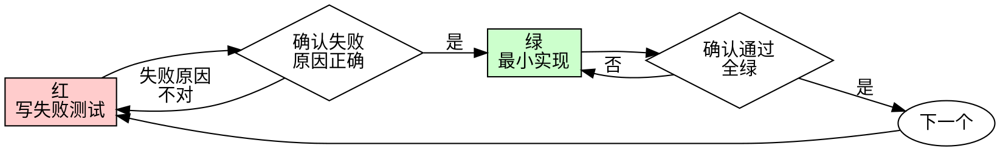

### 任务 T10：精简 TDD 重复劝诫并保留完整纪律

任务类型：pure-refactor
覆盖 Scenario：S27、S28

**文件**：
- 修改：`skills/test-driven-development/SKILL.md`
- 测试：`scripts/tests/skill-streamlining-T10.test.mjs`
- 本票证据：`.spec-dev/2026-09-11-01-skill-instruction-streamlining/execution/serial/T10`
- 状态：`.spec-dev/2026-09-11-01-skill-instruction-streamlining/plan/progress.yaml`

**接口**：
- 消费：T00 的 binding（真实 worktree/branch/source、所有权）；T01 的 readPolicy(root, entry) → {documents, text}；本 spec 的公共规则/客户端行为落点。
- 产出：本票文件块列出的完整指令/测试版本；普通 v1 completed 检查点引用真实代码提交，后继消费导航所列接口及自己的票。
- 验证边界：本票 Node 测试是文档/结构契约验证，不证明模型服从；实际模型取证在 T13。编译、导入、环境或零测试故障不算有效红。

**执行 cwd**：所有片段从 T00 已核实的实施 worktree 根执行；每次工具调用显式指定该目录。bound() 会拒绝来源工作区或错误分支。所有下列程序仅在执行计划获准后运行。


**步骤 1：记录当前行为保护基线**

```````python
from pathlib import Path
import hashlib,json,os,subprocess,uuid,re,shlex
FEATURE=".spec-dev/2026-09-11-01-skill-instruction-streamlining"
ROOT=Path.cwd().resolve()
STATE=ROOT/FEATURE/"plan/progress.yaml"
def git(*args, cwd=None, check=True):
    r=subprocess.run(["rtk","proxy","git",*args],cwd=cwd or ROOT,capture_output=True,text=True)
    if check and r.returncode:raise RuntimeError(r.stdout+r.stderr)
    return r.stdout.strip()
def read_state(): return json.loads(STATE.read_text())
def binding():
    rows=[n[len("binding:"): ] for n in read_state()["notes"] if n.startswith("binding:")]
    if not rows:raise RuntimeError("T00 has not recorded a binding")
    return json.loads(rows[-1])
def bound():
    b=binding()
    if ROOT!=Path(b["worktree"]).resolve():raise RuntimeError("wrong task cwd")
    if git("branch","--show-current")!=b["branch"]:raise RuntimeError("wrong task branch")
    return b
def doc_commit(paths,message):
    staged=git("diff","--cached","--name-only")
    if staged:raise RuntimeError("unexpected staged files: "+staged)
    git("add","--",*paths)
    r=subprocess.run(["rtk","proxy","git","diff","--cached","--check"],cwd=ROOT)
    if r.returncode:raise RuntimeError("staged whitespace check failed")
    r=subprocess.run(["rtk","proxy","env","SKIP_CODEX_PACKAGE_HOOK=1","SKIP_RELEASE_HOOK=1",
                      "git","commit","-m",message],cwd=ROOT)
    if r.returncode:raise RuntimeError("commit failed; preserve staged files")
    return git("rev-parse","HEAD")
def checkpoint(task,status,commit=None,tests=None,note=None,extra_paths=()):
    state=read_state()
    state["tasks"][task]["status"]=status
    if commit is not None:state["tasks"][task]["commit"]=commit
    if tests is not None:state["tasks"][task]["tests"]=tests
    state["current"]=task if status in ("in_progress","blocked") else None
    if note:state["notes"].append(note)
    temp=STATE.with_name(STATE.name+"."+str(uuid.uuid4())+".tmp")
    with temp.open("x") as out:
        out.write(json.dumps(state,ensure_ascii=False,indent=2)+"\n");out.flush();os.fsync(out.fileno())
    os.replace(temp,STATE)
    return doc_commit([str(STATE.relative_to(ROOT)),*extra_paths],"docs(progress): "+task+" "+status)
def start(task,deps):
    bound();state=read_state()
    if any(state["tasks"][d]["status"]!="completed" for d in deps):raise RuntimeError("dependency incomplete")
    if state["tasks"][task]["status"]=="completed":raise RuntimeError("already completed: resume next ready task")
    if state["tasks"][task]["status"]=="blocked":raise RuntimeError("resolve recorded blocker before resume")
    if state["tasks"][task]["status"]!="in_progress":checkpoint(task,"in_progress")
def payload(task,name):
    text=(ROOT/FEATURE/"plan/tasks"/(task+".md")).read_text()
    fence="~"*16
    prefix="<!-- payload:"+name+" -->\n"+fence+"text\n"
    suffix="\n"+fence+"\n<!-- /payload:"+name+" -->"
    if text.count(prefix)!=1:raise RuntimeError("missing/duplicate payload "+name)
    rest=text.split(prefix,1)[1]
    if suffix not in rest:raise RuntimeError("payload terminator missing")
    return rest.split(suffix,1)[0]
def apply_rows(task,rows):
    bound();prepared=[]
    for row in rows:
        rel=row["path"]
        if rel.startswith(("skills/anysearch/","skills/sequential-thinking/")) or rel in (
            "scripts/update-vendored-skill.mjs","scripts/tests/update-vendored.test.mjs"):
            raise RuntimeError("excluded write: "+rel)
        target=ROOT/rel
        if target.resolve()!=target or not target.is_relative_to(ROOT) or ".." in Path(rel).parts:
            raise RuntimeError("noncanonical write: "+rel)
        content=payload(task,row["payload"])
        after=hashlib.sha256(content.encode()).hexdigest()
        current=hashlib.sha256(target.read_bytes()).hexdigest() if target.exists() else None
        if current==after:continue
        if current!=row["before"]:raise RuntimeError("unexpected source content: "+rel)
        prepared.append((target,content))
    for target,content in prepared:
        target.parent.mkdir(parents=True,exist_ok=True)
        temp=target.with_name(target.name+"."+str(uuid.uuid4())+".tmp")
        with temp.open("x") as out:
            out.write(content);out.flush();os.fsync(out.fileno())
        os.replace(temp,target)
def capture(task,label,argv,expected=0,cwd=None):
    b=bound();run=uuid.uuid4().hex
    base=ROOT/FEATURE/"execution/serial"/task/label/run
    base.mkdir(parents=True)
    actual_cwd=Path(cwd).resolve() if cwd else ROOT
    r=subprocess.run(argv,cwd=actual_cwd,capture_output=True)
    for stream,data in [("stdout",r.stdout),("stderr",r.stderr)]:(base/(stream+".log")).write_bytes(data)
    record={"argv":argv,"cwd":str(actual_cwd),"exit_code":r.returncode,"base_commit":git("rev-parse","HEAD"),
            "stdout_sha256":hashlib.sha256(r.stdout).hexdigest(),"stderr_sha256":hashlib.sha256(r.stderr).hexdigest(),
            "kind":"actual-command-result","expected_exit":expected}
    (base/"record.json").write_text(json.dumps(record,ensure_ascii=False,indent=2)+"\n")
    print(r.stdout.decode(errors="replace"));print(r.stderr.decode(errors="replace"))
    print("RECORD",str(base.relative_to(ROOT))+"/record.json")
    if r.returncode!=expected:
        checkpoint(task,"blocked",tests="fail",note=task+" unexpected exit at "+str(base.relative_to(ROOT)),
                   extra_paths=[str(base.relative_to(ROOT))])
        raise RuntimeError("unexpected exit; actual record saved, preserve working changes")
    return base

start('T10',['T01'])
capture('T10','before',['rtk','proxy','node','--test',*['scripts/tests/manifests.test.mjs', 'scripts/tests/search-clause.test.mjs', 'scripts/tests/numbering-docs.test.mjs', 'scripts/tests/resource-ledger-split.test.mjs', 'scripts/tests/plan-single-format.test.mjs', 'scripts/tests/plugin-root.test.mjs']])
```````

预期：现有保护测试 exit 0。T01 此时不运行尚依赖历史档案的两条测试体；它们在本票改成合成夹具后完整运行，不将此选择说成全量基线。纯重构不伪造失败。

**步骤 2：核对本票写集合与原文**

逐项比较下面完整 payload 及来源 SHA；只改变本票声明的组织/测试观察方式。新增回归代码仍有独立真值，不把未来行为写成已通过。

**步骤 3：应用完整内容与回归测试**

```````python
from pathlib import Path
import hashlib,json,os,subprocess,uuid,re,shlex
FEATURE=".spec-dev/2026-09-11-01-skill-instruction-streamlining"
ROOT=Path.cwd().resolve()
STATE=ROOT/FEATURE/"plan/progress.yaml"
def git(*args, cwd=None, check=True):
    r=subprocess.run(["rtk","proxy","git",*args],cwd=cwd or ROOT,capture_output=True,text=True)
    if check and r.returncode:raise RuntimeError(r.stdout+r.stderr)
    return r.stdout.strip()
def read_state(): return json.loads(STATE.read_text())
def binding():
    rows=[n[len("binding:"): ] for n in read_state()["notes"] if n.startswith("binding:")]
    if not rows:raise RuntimeError("T00 has not recorded a binding")
    return json.loads(rows[-1])
def bound():
    b=binding()
    if ROOT!=Path(b["worktree"]).resolve():raise RuntimeError("wrong task cwd")
    if git("branch","--show-current")!=b["branch"]:raise RuntimeError("wrong task branch")
    return b
def doc_commit(paths,message):
    staged=git("diff","--cached","--name-only")
    if staged:raise RuntimeError("unexpected staged files: "+staged)
    git("add","--",*paths)
    r=subprocess.run(["rtk","proxy","git","diff","--cached","--check"],cwd=ROOT)
    if r.returncode:raise RuntimeError("staged whitespace check failed")
    r=subprocess.run(["rtk","proxy","env","SKIP_CODEX_PACKAGE_HOOK=1","SKIP_RELEASE_HOOK=1",
                      "git","commit","-m",message],cwd=ROOT)
    if r.returncode:raise RuntimeError("commit failed; preserve staged files")
    return git("rev-parse","HEAD")
def checkpoint(task,status,commit=None,tests=None,note=None,extra_paths=()):
    state=read_state()
    state["tasks"][task]["status"]=status
    if commit is not None:state["tasks"][task]["commit"]=commit
    if tests is not None:state["tasks"][task]["tests"]=tests
    state["current"]=task if status in ("in_progress","blocked") else None
    if note:state["notes"].append(note)
    temp=STATE.with_name(STATE.name+"."+str(uuid.uuid4())+".tmp")
    with temp.open("x") as out:
        out.write(json.dumps(state,ensure_ascii=False,indent=2)+"\n");out.flush();os.fsync(out.fileno())
    os.replace(temp,STATE)
    return doc_commit([str(STATE.relative_to(ROOT)),*extra_paths],"docs(progress): "+task+" "+status)
def start(task,deps):
    bound();state=read_state()
    if any(state["tasks"][d]["status"]!="completed" for d in deps):raise RuntimeError("dependency incomplete")
    if state["tasks"][task]["status"]=="completed":raise RuntimeError("already completed: resume next ready task")
    if state["tasks"][task]["status"]=="blocked":raise RuntimeError("resolve recorded blocker before resume")
    if state["tasks"][task]["status"]!="in_progress":checkpoint(task,"in_progress")
def payload(task,name):
    text=(ROOT/FEATURE/"plan/tasks"/(task+".md")).read_text()
    fence="~"*16
    prefix="<!-- payload:"+name+" -->\n"+fence+"text\n"
    suffix="\n"+fence+"\n<!-- /payload:"+name+" -->"
    if text.count(prefix)!=1:raise RuntimeError("missing/duplicate payload "+name)
    rest=text.split(prefix,1)[1]
    if suffix not in rest:raise RuntimeError("payload terminator missing")
    return rest.split(suffix,1)[0]
def apply_rows(task,rows):
    bound();prepared=[]
    for row in rows:
        rel=row["path"]
        if rel.startswith(("skills/anysearch/","skills/sequential-thinking/")) or rel in (
            "scripts/update-vendored-skill.mjs","scripts/tests/update-vendored.test.mjs"):
            raise RuntimeError("excluded write: "+rel)
        target=ROOT/rel
        if target.resolve()!=target or not target.is_relative_to(ROOT) or ".." in Path(rel).parts:
            raise RuntimeError("noncanonical write: "+rel)
        content=payload(task,row["payload"])
        after=hashlib.sha256(content.encode()).hexdigest()
        current=hashlib.sha256(target.read_bytes()).hexdigest() if target.exists() else None
        if current==after:continue
        if current!=row["before"]:raise RuntimeError("unexpected source content: "+rel)
        prepared.append((target,content))
    for target,content in prepared:
        target.parent.mkdir(parents=True,exist_ok=True)
        temp=target.with_name(target.name+"."+str(uuid.uuid4())+".tmp")
        with temp.open("x") as out:
            out.write(content);out.flush();os.fsync(out.fileno())
        os.replace(temp,target)
def capture(task,label,argv,expected=0,cwd=None):
    b=bound();run=uuid.uuid4().hex
    base=ROOT/FEATURE/"execution/serial"/task/label/run
    base.mkdir(parents=True)
    actual_cwd=Path(cwd).resolve() if cwd else ROOT
    r=subprocess.run(argv,cwd=actual_cwd,capture_output=True)
    for stream,data in [("stdout",r.stdout),("stderr",r.stderr)]:(base/(stream+".log")).write_bytes(data)
    record={"argv":argv,"cwd":str(actual_cwd),"exit_code":r.returncode,"base_commit":git("rev-parse","HEAD"),
            "stdout_sha256":hashlib.sha256(r.stdout).hexdigest(),"stderr_sha256":hashlib.sha256(r.stderr).hexdigest(),
            "kind":"actual-command-result","expected_exit":expected}
    (base/"record.json").write_text(json.dumps(record,ensure_ascii=False,indent=2)+"\n")
    print(r.stdout.decode(errors="replace"));print(r.stderr.decode(errors="replace"))
    print("RECORD",str(base.relative_to(ROOT))+"/record.json")
    if r.returncode!=expected:
        checkpoint(task,"blocked",tests="fail",note=task+" unexpected exit at "+str(base.relative_to(ROOT)),
                   extra_paths=[str(base.relative_to(ROOT))])
        raise RuntimeError("unexpected exit; actual record saved, preserve working changes")
    return base

apply_rows('T10',[{'path': 'scripts/tests/skill-streamlining-T10.test.mjs', 'before': None, 'payload': 'T10-test'}, {'path': 'skills/test-driven-development/SKILL.md', 'before': 'd3c686c9c4c90a8159a155f0e6fca7d612ea1febcdbd57c08747e4f592363906', 'payload': 'T10-0'}])
```````


**步骤 4：验证目标与相关回归**

```````python
from pathlib import Path
import hashlib,json,os,subprocess,uuid,re,shlex
FEATURE=".spec-dev/2026-09-11-01-skill-instruction-streamlining"
ROOT=Path.cwd().resolve()
STATE=ROOT/FEATURE/"plan/progress.yaml"
def git(*args, cwd=None, check=True):
    r=subprocess.run(["rtk","proxy","git",*args],cwd=cwd or ROOT,capture_output=True,text=True)
    if check and r.returncode:raise RuntimeError(r.stdout+r.stderr)
    return r.stdout.strip()
def read_state(): return json.loads(STATE.read_text())
def binding():
    rows=[n[len("binding:"): ] for n in read_state()["notes"] if n.startswith("binding:")]
    if not rows:raise RuntimeError("T00 has not recorded a binding")
    return json.loads(rows[-1])
def bound():
    b=binding()
    if ROOT!=Path(b["worktree"]).resolve():raise RuntimeError("wrong task cwd")
    if git("branch","--show-current")!=b["branch"]:raise RuntimeError("wrong task branch")
    return b
def doc_commit(paths,message):
    staged=git("diff","--cached","--name-only")
    if staged:raise RuntimeError("unexpected staged files: "+staged)
    git("add","--",*paths)
    r=subprocess.run(["rtk","proxy","git","diff","--cached","--check"],cwd=ROOT)
    if r.returncode:raise RuntimeError("staged whitespace check failed")
    r=subprocess.run(["rtk","proxy","env","SKIP_CODEX_PACKAGE_HOOK=1","SKIP_RELEASE_HOOK=1",
                      "git","commit","-m",message],cwd=ROOT)
    if r.returncode:raise RuntimeError("commit failed; preserve staged files")
    return git("rev-parse","HEAD")
def checkpoint(task,status,commit=None,tests=None,note=None,extra_paths=()):
    state=read_state()
    state["tasks"][task]["status"]=status
    if commit is not None:state["tasks"][task]["commit"]=commit
    if tests is not None:state["tasks"][task]["tests"]=tests
    state["current"]=task if status in ("in_progress","blocked") else None
    if note:state["notes"].append(note)
    temp=STATE.with_name(STATE.name+"."+str(uuid.uuid4())+".tmp")
    with temp.open("x") as out:
        out.write(json.dumps(state,ensure_ascii=False,indent=2)+"\n");out.flush();os.fsync(out.fileno())
    os.replace(temp,STATE)
    return doc_commit([str(STATE.relative_to(ROOT)),*extra_paths],"docs(progress): "+task+" "+status)
def start(task,deps):
    bound();state=read_state()
    if any(state["tasks"][d]["status"]!="completed" for d in deps):raise RuntimeError("dependency incomplete")
    if state["tasks"][task]["status"]=="completed":raise RuntimeError("already completed: resume next ready task")
    if state["tasks"][task]["status"]=="blocked":raise RuntimeError("resolve recorded blocker before resume")
    if state["tasks"][task]["status"]!="in_progress":checkpoint(task,"in_progress")
def payload(task,name):
    text=(ROOT/FEATURE/"plan/tasks"/(task+".md")).read_text()
    fence="~"*16
    prefix="<!-- payload:"+name+" -->\n"+fence+"text\n"
    suffix="\n"+fence+"\n<!-- /payload:"+name+" -->"
    if text.count(prefix)!=1:raise RuntimeError("missing/duplicate payload "+name)
    rest=text.split(prefix,1)[1]
    if suffix not in rest:raise RuntimeError("payload terminator missing")
    return rest.split(suffix,1)[0]
def apply_rows(task,rows):
    bound();prepared=[]
    for row in rows:
        rel=row["path"]
        if rel.startswith(("skills/anysearch/","skills/sequential-thinking/")) or rel in (
            "scripts/update-vendored-skill.mjs","scripts/tests/update-vendored.test.mjs"):
            raise RuntimeError("excluded write: "+rel)
        target=ROOT/rel
        if target.resolve()!=target or not target.is_relative_to(ROOT) or ".." in Path(rel).parts:
            raise RuntimeError("noncanonical write: "+rel)
        content=payload(task,row["payload"])
        after=hashlib.sha256(content.encode()).hexdigest()
        current=hashlib.sha256(target.read_bytes()).hexdigest() if target.exists() else None
        if current==after:continue
        if current!=row["before"]:raise RuntimeError("unexpected source content: "+rel)
        prepared.append((target,content))
    for target,content in prepared:
        target.parent.mkdir(parents=True,exist_ok=True)
        temp=target.with_name(target.name+"."+str(uuid.uuid4())+".tmp")
        with temp.open("x") as out:
            out.write(content);out.flush();os.fsync(out.fileno())
        os.replace(temp,target)
def capture(task,label,argv,expected=0,cwd=None):
    b=bound();run=uuid.uuid4().hex
    base=ROOT/FEATURE/"execution/serial"/task/label/run
    base.mkdir(parents=True)
    actual_cwd=Path(cwd).resolve() if cwd else ROOT
    r=subprocess.run(argv,cwd=actual_cwd,capture_output=True)
    for stream,data in [("stdout",r.stdout),("stderr",r.stderr)]:(base/(stream+".log")).write_bytes(data)
    record={"argv":argv,"cwd":str(actual_cwd),"exit_code":r.returncode,"base_commit":git("rev-parse","HEAD"),
            "stdout_sha256":hashlib.sha256(r.stdout).hexdigest(),"stderr_sha256":hashlib.sha256(r.stderr).hexdigest(),
            "kind":"actual-command-result","expected_exit":expected}
    (base/"record.json").write_text(json.dumps(record,ensure_ascii=False,indent=2)+"\n")
    print(r.stdout.decode(errors="replace"));print(r.stderr.decode(errors="replace"))
    print("RECORD",str(base.relative_to(ROOT))+"/record.json")
    if r.returncode!=expected:
        checkpoint(task,"blocked",tests="fail",note=task+" unexpected exit at "+str(base.relative_to(ROOT)),
                   extra_paths=[str(base.relative_to(ROOT))])
        raise RuntimeError("unexpected exit; actual record saved, preserve working changes")
    return base

capture('T10','green',['rtk','proxy','node','--test','scripts/tests/skill-streamlining-T10.test.mjs'])
capture('T10','regression',['rtk','proxy','node','--test',*['scripts/tests/manifests.test.mjs', 'scripts/tests/search-clause.test.mjs', 'scripts/tests/numbering-docs.test.mjs', 'scripts/tests/resource-ledger-split.test.mjs', 'scripts/tests/plan-single-format.test.mjs', 'scripts/tests/plugin-root.test.mjs', 'scripts/tests/policy-documents.test.mjs', 'scripts/tests/plan-index.test.mjs', 'scripts/tests/integration-plan.test.mjs', 'scripts/tests/skill-streamlining-T01.test.mjs', 'scripts/tests/skill-streamlining-T10.test.mjs']])
```````

预期：目标及上述相关回归 exit 0，实际测试数非零，无未解释 SKIP。保留 stdout/stderr/record，失败按日志归属修复；不把“文件存在”或模型自报告作为通过。未到期最终全量保留给 T14。

**步骤 5：契约自检、提交与独立进度检查点**

对照本票实际 diff 核对范围与接口，没有夹带排除技能或其他工作。取得真实代码提交后再更新状态，状态提交不引用自身。下列两项 pass 只能在已读实际 diff 和日志后记录。

```````python
from pathlib import Path
import hashlib,json,os,subprocess,uuid,re,shlex
FEATURE=".spec-dev/2026-09-11-01-skill-instruction-streamlining"
ROOT=Path.cwd().resolve()
STATE=ROOT/FEATURE/"plan/progress.yaml"
def git(*args, cwd=None, check=True):
    r=subprocess.run(["rtk","proxy","git",*args],cwd=cwd or ROOT,capture_output=True,text=True)
    if check and r.returncode:raise RuntimeError(r.stdout+r.stderr)
    return r.stdout.strip()
def read_state(): return json.loads(STATE.read_text())
def binding():
    rows=[n[len("binding:"): ] for n in read_state()["notes"] if n.startswith("binding:")]
    if not rows:raise RuntimeError("T00 has not recorded a binding")
    return json.loads(rows[-1])
def bound():
    b=binding()
    if ROOT!=Path(b["worktree"]).resolve():raise RuntimeError("wrong task cwd")
    if git("branch","--show-current")!=b["branch"]:raise RuntimeError("wrong task branch")
    return b
def doc_commit(paths,message):
    staged=git("diff","--cached","--name-only")
    if staged:raise RuntimeError("unexpected staged files: "+staged)
    git("add","--",*paths)
    r=subprocess.run(["rtk","proxy","git","diff","--cached","--check"],cwd=ROOT)
    if r.returncode:raise RuntimeError("staged whitespace check failed")
    r=subprocess.run(["rtk","proxy","env","SKIP_CODEX_PACKAGE_HOOK=1","SKIP_RELEASE_HOOK=1",
                      "git","commit","-m",message],cwd=ROOT)
    if r.returncode:raise RuntimeError("commit failed; preserve staged files")
    return git("rev-parse","HEAD")
def checkpoint(task,status,commit=None,tests=None,note=None,extra_paths=()):
    state=read_state()
    state["tasks"][task]["status"]=status
    if commit is not None:state["tasks"][task]["commit"]=commit
    if tests is not None:state["tasks"][task]["tests"]=tests
    state["current"]=task if status in ("in_progress","blocked") else None
    if note:state["notes"].append(note)
    temp=STATE.with_name(STATE.name+"."+str(uuid.uuid4())+".tmp")
    with temp.open("x") as out:
        out.write(json.dumps(state,ensure_ascii=False,indent=2)+"\n");out.flush();os.fsync(out.fileno())
    os.replace(temp,STATE)
    return doc_commit([str(STATE.relative_to(ROOT)),*extra_paths],"docs(progress): "+task+" "+status)
def start(task,deps):
    bound();state=read_state()
    if any(state["tasks"][d]["status"]!="completed" for d in deps):raise RuntimeError("dependency incomplete")
    if state["tasks"][task]["status"]=="completed":raise RuntimeError("already completed: resume next ready task")
    if state["tasks"][task]["status"]=="blocked":raise RuntimeError("resolve recorded blocker before resume")
    if state["tasks"][task]["status"]!="in_progress":checkpoint(task,"in_progress")
def payload(task,name):
    text=(ROOT/FEATURE/"plan/tasks"/(task+".md")).read_text()
    fence="~"*16
    prefix="<!-- payload:"+name+" -->\n"+fence+"text\n"
    suffix="\n"+fence+"\n<!-- /payload:"+name+" -->"
    if text.count(prefix)!=1:raise RuntimeError("missing/duplicate payload "+name)
    rest=text.split(prefix,1)[1]
    if suffix not in rest:raise RuntimeError("payload terminator missing")
    return rest.split(suffix,1)[0]
def apply_rows(task,rows):
    bound();prepared=[]
    for row in rows:
        rel=row["path"]
        if rel.startswith(("skills/anysearch/","skills/sequential-thinking/")) or rel in (
            "scripts/update-vendored-skill.mjs","scripts/tests/update-vendored.test.mjs"):
            raise RuntimeError("excluded write: "+rel)
        target=ROOT/rel
        if target.resolve()!=target or not target.is_relative_to(ROOT) or ".." in Path(rel).parts:
            raise RuntimeError("noncanonical write: "+rel)
        content=payload(task,row["payload"])
        after=hashlib.sha256(content.encode()).hexdigest()
        current=hashlib.sha256(target.read_bytes()).hexdigest() if target.exists() else None
        if current==after:continue
        if current!=row["before"]:raise RuntimeError("unexpected source content: "+rel)
        prepared.append((target,content))
    for target,content in prepared:
        target.parent.mkdir(parents=True,exist_ok=True)
        temp=target.with_name(target.name+"."+str(uuid.uuid4())+".tmp")
        with temp.open("x") as out:
            out.write(content);out.flush();os.fsync(out.fileno())
        os.replace(temp,target)
def capture(task,label,argv,expected=0,cwd=None):
    b=bound();run=uuid.uuid4().hex
    base=ROOT/FEATURE/"execution/serial"/task/label/run
    base.mkdir(parents=True)
    actual_cwd=Path(cwd).resolve() if cwd else ROOT
    r=subprocess.run(argv,cwd=actual_cwd,capture_output=True)
    for stream,data in [("stdout",r.stdout),("stderr",r.stderr)]:(base/(stream+".log")).write_bytes(data)
    record={"argv":argv,"cwd":str(actual_cwd),"exit_code":r.returncode,"base_commit":git("rev-parse","HEAD"),
            "stdout_sha256":hashlib.sha256(r.stdout).hexdigest(),"stderr_sha256":hashlib.sha256(r.stderr).hexdigest(),
            "kind":"actual-command-result","expected_exit":expected}
    (base/"record.json").write_text(json.dumps(record,ensure_ascii=False,indent=2)+"\n")
    print(r.stdout.decode(errors="replace"));print(r.stderr.decode(errors="replace"))
    print("RECORD",str(base.relative_to(ROOT))+"/record.json")
    if r.returncode!=expected:
        checkpoint(task,"blocked",tests="fail",note=task+" unexpected exit at "+str(base.relative_to(ROOT)),
                   extra_paths=[str(base.relative_to(ROOT))])
        raise RuntimeError("unexpected exit; actual record saved, preserve working changes")
    return base

bound()
commit=doc_commit(['scripts/tests/skill-streamlining-T10.test.mjs', 'skills/test-driven-development/SKILL.md', '.spec-dev/2026-09-11-01-skill-instruction-streamlining/execution/serial/T10'],'feat(T10): 精简 TDD 重复劝诫并保留完整纪律')
checkpoint('T10','completed',commit=commit,tests='pass',note='T10'+' self_check: scope and interface checked; actual logs in execution/serial/T10')
```````


**完整文件内容（执行片段从本票提取，不能改成引用前票）**

测试 `scripts/tests/skill-streamlining-T10.test.mjs`
<!-- payload:T10-test -->
~~~~~~~~~~~~~~~~text
import {test} from 'node:test';
import assert from 'node:assert/strict';
import {readFileSync,existsSync} from 'node:fs';
import path from 'node:path';
import {fileURLToPath} from 'node:url';
import {readPolicy} from './helpers/policy-documents.mjs';
const root=path.resolve(path.dirname(fileURLToPath(import.meta.url)),'../..');
const raw=f=>readFileSync(path.join(root,f),'utf8');
const policy=f=>readPolicy(root,f).text;

test("S27 删除劝诫不删除有效红与违规处理",()=>{

const s=raw('skills/test-driven-development/SKILL.md');
assert.match(s,/有效失败测试/);assert.match(s,/删除本次未经测试先行的实现/);
assert.doesNotMatch(s,/那是合理化借口|## 为什么顺序重要（借口对照表）/);

});

test("S28 纯重构和同范围例外授权保持",()=>{

const s=raw('skills/test-driven-development/SKILL.md');
assert.match(s,/刻画通过不是红证据/);assert.match(s,/同一范围内已授权/);
assert.match(s,/不反复询问/);

});

~~~~~~~~~~~~~~~~
<!-- /payload:T10-test -->

文件 `skills/test-driven-development/SKILL.md`；写前 SHA-256：d3c686c9c4c90a8159a155f0e6fca7d612ea1febcdbd57c08747e4f592363906
<!-- payload:T10-0 -->
~~~~~~~~~~~~~~~~text
---
name: test-driven-development
description: >-
  测试驱动开发纪律——实现功能、修复 bug 或改变行为前，沿已批准的公共测试落点先写失败测试，确认有效红后最小实现转绿。批准的前置或收尾纯重构用行为测试保绿。例外按单点清单与可追溯授权处理。
---

> 语言协议：以对话语言输出——用户显式指定（含平台 `language` 设置）优先，其次跟随用户近期消息语言；均无法判定时默认英语。落盘产物以创建时对话语言为准，增量修改保持产物既有语言。本 skill 中的固定话术是语义模板，用对话语言表达其意，不逐字照搬。

> **外部搜索统一入口**：需要联网检索（资料、库/框架文档、时效信息）时一律先用 anysearch skill（插件内嵌），不可用再降级 WebSearch/WebFetch；降级链与派发词要求见 requirement-analysis 的 references/exploration-patterns.md。

# 测试驱动开发（TDD）

## 概述

先写测试。看它失败。写最小代码让它通过。

**核心原则**：没看着测试失败过，你就不知道它测的是不是对的东西。

本 skill 只依赖项目自身的测试命令，不依赖任何平台专属工具，Claude Code 与 Codex 通用。

**违反规则的字面 = 违反规则的精神。**

## 何时使用

**总是**：新功能、bug 修复、行为变更走红绿循环；纯重构走本文「收尾纯重构」，不伪造红。

**例外清单（单点定义）**：一次性原型、生成代码、配置文件，以及不改变行为、契约或测试预期的纯文案。例外需要可追溯的用户授权；同一范围内已授权则引用原决定，不反复询问。技能规则、API 语义与测试预期即使写在 Markdown 中，也不是纯措辞。


## 测试落点确认与消费

测试落点（seam）是观察公共行为的契约边界，可为模块函数、CLI、HTTP API、数据库适配器，不限于最外层界面。优先复用已有落点，选择仍能稳定观察目标行为的较高层接口，尽量少建新接口；一个落点可覆盖多个 Scenario，不逐私有函数制造测试。

spec/plan 已批准的落点直接使用，不重复确认。存量无 seam 标签但批准的精确接口和 Scenario 唯一指向同一边界时，只提取已有决定并记录来源，不迁移旧计划格式或推测新决定。

没有唯一落点或 spec/plan 冲突时，停止受影响任务的测试和实现，主线程走原澄清/偏差流程，不默默择一覆盖。即兴任务在写测试前确认公共接口和落点，quick-fix 并入已有修复确认环节，一次一题。implementer 回报 blocked，不向用户另开门、不改 plan 或扩大 writes。

## 铁律

```
没有有效失败测试，就不写新增或改变行为的生产代码
```

未按纪律先写了行为实现？删除本次未经测试先行的实现，从失败测试重做，不留作参考；不删除无关既有工作。纯重构与已授权例外按对应规则处理，不冒充新增行为的红证据。

## 红绿循环



### 红——写失败测试

在获批 seam 写一个最小测试：一个公共行为、清晰命名、独立真值。mock 准入遵循 references/testing-anti-patterns.md，不用自己的算法重算期望值。

```typescript
// ✅ 好：名字表意、测真实行为、只测一件事
test('retries failed operations 3 times', async () => {
  let attempts = 0;
  const operation = () => {
    attempts++;
    if (attempts < 3) throw new Error('fail');
    return 'success';
  };
  const result = await retryOperation(operation);
  expect(result).toBe('success');
  expect(attempts).toBe(3);
});

// ❌ 坏：名字含糊、测的是 mock 不是代码
test('retry works', async () => {
  const mock = jest.fn()
    .mockRejectedValueOnce(new Error())
    .mockRejectedValueOnce(new Error())
    .mockResolvedValueOnce('success');
  await retryOperation(mock);
  expect(mock).toHaveBeenCalledTimes(3);
});
```

### 确认红——看它失败

**行为红绿路径的强制步骤。** 确认失败源于目标行为缺失，而非拼写、编译或环境故障；刻画已有行为遵循「收尾纯重构」，不冒充红证据。

- **行为缺陷测试直接通过了？** 核实是否复现目标缺陷并修正无效测试。纯重构刻画应先观察当前行为通过，不适用本条。
- **测试报错了？** 修到它以正确原因失败为止。

### 绿——最小实现

写让测试通过的最简代码。不加多余功能、不顺手重构别的代码、不超出测试要求"改进"。

```typescript
// ✅ 好：刚好够通过
async function retryOperation<T>(fn: () => Promise<T>): Promise<T> {
  for (let i = 0; i < 3; i++) {
    try { return await fn(); } catch (e) { if (i === 2) throw e; }
  }
  throw new Error('unreachable');
}

// ❌ 坏：maxRetries/backoff/onRetry 没人要 —— YAGNI
```

### 确认绿——看它通过

**强制步骤。** 运行测试，确认：目标测试通过、其他测试仍通过、输出干净（无报错无警告）。

- **公共行为回归？** 修实现。已核实行为未变但测试绑定私有细节时，按反模式 7 修正落点，不迁就脆弱断言。
- **其他测试挂了？** 现在就修。

### 重构候选

发现重复、命名或结构清理机会时，记录位置、理由与保护证据，交既有收尾，不插入每次红绿循环。每票第五步仍为提交；契约自检只查 over/under-building 与接口锚定。

### 重复

为下一个行为写下一个失败测试。

## 批准的前置纯重构与集成组

批准计划中解除实际实施阻碍的前置纯重构在 T01 执行，复用下方前后公共行为保护规则；不能等到收尾才解除阻碍。执行中额外发现的重构机会仍交收尾，不借此前置规则扩大授权。

集成组不是 TDD 例外：行为变化在实现前仍获得有效行为失败；纯机械/行为保持迁移先取得组基线保护。每票照常跑能运行的检查，仅对计划逐项声明的命令/范围/原因延后整体绿，保存真实 exit 与待验状态。意外局部失败阻塞，环境/编译错误不能当行为红。没有足够保护或无法获得行为红时回到设计，不把该票改名“重构”来跳过。

组员的公共行为最终在唯一组验证票上检验，普通功能票仍保持五步和有效红绿。没有有效红的纯重构与组员/组验证票不派给普通 implementer，不改变 implementation-result phase 或原接收条件。组验证完成不替代最终特性审查、相关回归和收尾全量。

## 收尾纯重构

先核实授权范围及公共行为不变，再用已有行为测试记录调整前后的通过证据；缺保护时，先依据现行契约补行为刻画并观察当前实现通过，再结构调整。刻画通过不是红证据；若当前行为与需求不同，转缺陷复现红绿路径。

计划中的前置纯重构与组迁移按已批准时机执行，额外候选由现有收尾审查接收，收尾修复后复审受影响维度；quick-fix 使用自身收尾，不强制开启可选 acceptance-qa。处置沿已有授权边界。implementer 无法提供有效红证据的纯重构票回报 blocked，由主线程按现有串行分流处理，不改结果 schema 或普通实施票的红绿条件。

## 路径与证据核对

行为变化采用有效红→最小实现→绿；纯重构采用前后公共行为保护；例外只按单点清单和可追溯授权。
未经测试先行的行为实现仍按本文铁律处理；不删除无关既有工作。
证据及完整完成条件见下节，不以重复劝诫替代实际执行。

## 完成前检查清单

- [ ] 获批 seam 的公共行为、相关 Scenario、边缘与错误路径已有覆盖，不按新增函数数量要求直测
- [ ] 新增/改变行为的测试观察到有效红；纯重构另有前后绿，刻画不冒充红
- [ ] 红证据源于行为缺失，编译/环境故障、零测试、SKIP 不当 PASS
- [ ] 行为红绿使用最小实现；纯重构保持已有契约
- [ ] 目标及相关测试通过，计划最终全量和范围外失败裁决保持
- [ ] 输出干净（无报错、无警告）
- [ ] 测试验证真实行为，mock 遵循 testing-anti-patterns 的准入与声明依赖边界
- [ ] 边缘情况与错误路径已覆盖

按适用路径核对，不把其他路径的证据冒充自己的完成依据；例外有授权来源，重构候选已交收尾。

## 调试集成

发现 bug？先写复现它的失败测试，再走 TDD 循环。测试既证明修复又防止回归。**永远不要不带测试修 bug。**

## Mock 与测试反模式

添加 mock、测试工具方法、或想给生产类加测试专用方法时，先读 [testing-anti-patterns.md](references/testing-anti-patterns.md)：不测 mock 的行为、不给生产类加测试专用方法、不在不理解依赖链时 mock、mock 必须镜像真实结构的完整字段。

## 最终规则

```
新增或改变行为 → 有效红 → 最小实现 → 绿
纯重构 → 行为保护 → 结构调整 → 保持绿
例外 → 唯一清单及可追溯授权；普通实施票的红绿条件不变
```

未经用户允许，没有例外。

~~~~~~~~~~~~~~~~
<!-- /payload:T10-0 -->
