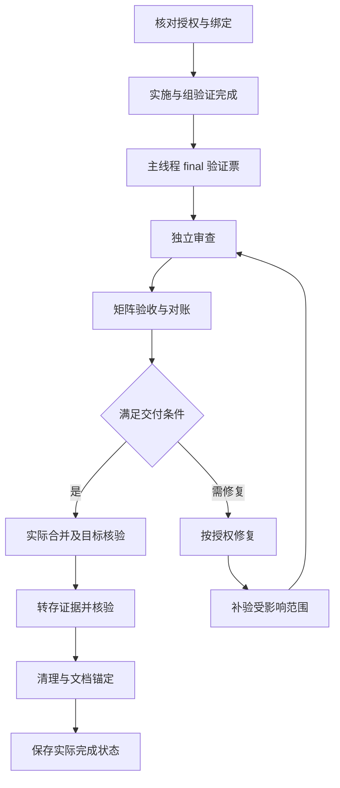

---
spec_dev:
  version: 1
  feature: workflow-consistency
  status: draft
  covers:
    - "guardrail/check-spec-drift.mjs"
    - "guardrail/install.mjs"
    - "guardrail/templates/**"
    - "guardrail/README.md"
    - "guardrail/README.zh-CN.md"
    - "scripts/lib/**"
    - "scripts/validate-output.mjs"
    - "scripts/schemas/**"
    - "scripts/tests/**"
    - "agents/implementer.md"
    - "agents/code-reviewer.md"
    - "skills/requirement-analysis/**"
    - "skills/writing-plans/**"
    - "skills/executing-plans/**"
    - "skills/executing-plans-parallel/**"
    - "skills/quick-fix/**"
    - "skills/test-driven-development/**"
    - "skills/test-strategy/**"
    - "skills/acceptance-qa/**"
    - "skills/using-git-worktrees/**"
    - "skills/clarifying/SKILL.md"
    - "skills/exploring/SKILL.md"
    - "README.md"
    - "README.zh-CN.md"
  supersedes:
    - ".spec-dev/2026-09-12-01-workflow-slimming/spec/workflow-slimming-design.md"
    - ".spec-dev/2026-09-07-01-plan-decomposition/spec/plan-decomposition-design.md"
    - ".spec-dev/2026-09-06-01-concurrent-execution/spec/concurrent-execution-design.md"
    - ".spec-dev/2026-08-27-01-plan-single-format/spec/plan-single-format-design.md"
    - ".spec-dev/2026-08-09-test-scoping/spec/test-scoping-design.md"
    - ".spec-dev/2026-08-10-supersede-lifecycle/spec/supersede-lifecycle-design.md"
    - ".spec-dev/2026-09-06-03-review-conformance/spec/controlled-review-design.md"
  superseded_by: null
---

# 工作流执行、证据与说明一致性设计

## 背景与目标

统一修复 spec-dev 从获批计划实施到交付的六处逻辑断点，以及 critic、验收审计、TDD 例外的三处规则冲突；让代码、状态校验、技能说明和流程图表达同一套条件。

本次合并两个审查来源：当前任务的流程图与文字精简审查，以及「审查逻辑不自洽点」（任务 `01a0c8c0-800d-70c2-b5f1-f762eebfbe15`）的六项发现。后者报告过临时 Git 复现和 282 项测试结果；本次需求设计未重跑这些测试，不将旧回执称为当前验证。当前源码基准为 `cc28f78`；`hooks/hooks.json` 的既有未提交改动不属于本次。

六处断点为：先提交 active spec 后正常实施被守卫拦截；忽略的执行证据又被强制提交；最终 squash 与祖先校验冲突；串行中断无法恢复无完成提交的当前票；final 验收与最终任务互等；全量后的修复未回到审查和验收。

成功标准：上述路径有真实 Git/CLI 正反例；未完成旧计划可恢复；清理后仍能核验本地保留证据；全部入口、图表、元数据与测试预期一致。文本变短和结构检查通过不代表模型行为通过。

## 非目标

- 不新增工作流引擎、授权服务、第二份任务状态源、编译计划快照或远端证据服务。
- 不把文件范围匹配说成语义正确或用户批准的独立证明；不取消原有授权、TDD、独立审查与真实交付要求。
- 不默认并发，不扩大 implementer 权限，不批量迁移已完成计划或改写历史失败。
- 不修改 AnySearch、sequential-thinking 及其上游更新逻辑；不因语言协议整理改写无关第三方指南。
- 本设计保存不授权实施、推送或发版；不改变无关的用户配置和工作区内容。

## 术语与参与者

本节术语限本特性，不创建空的仓库词汇表。

| 术语 | 含义 |
|---|---|
| 任务范围绑定 | 将已提交的 spec/计划静态版本、任务、精确写集合、授权来源与实际执行工作区关联的记录；不是语义审查结果 |
| 操作绑定回执 | 本地入口定位当前绑定的引用；不另存可修改的范围、任务状态或批准结论 |
| 待交付版本 | 被 final、审查及验收实际检查的实现、测试、配置与适用契约集合 |
| final 验证票 | 实施结束后的主线程验证任务，先于审查、验收及最终交付；不是集成组验证票 |
| 交付映射 | 已验证来源版本与实际目标提交之间的可核验关系；不改写任务或组历史 |

| 参与者/事件 | 职责及适用边界 |
|---|---|
| 用户 | 授权、设计与真实语义取舍；已给决定复用 |
| 计划作者 | 写清静态范围、依赖、验证命令、授权来源与恢复步骤 |
| 主线程 | 唯一运行状态写者；绑定、串行恢复、final、集成、证据转存和交付 |
| implementer | 沿已认领任务、绑定工作区和 writes 实施；不自行扩大范围 |
| hook、push/CI 守卫 | 读取对应工作区/index/提交视图，检查版本、文件范围和关联；不批准新行为 |
| reviewer/critic/验收者 | 分别核对实现、覆盖和可观察行为，结论绑定真实范围及证据 |
| 中断、缺证据、合并冲突 | 触发恢复或补验，不产生新授权或完成事实 |

## 已确认决策与范围

用户逐项选择：① final 全量前移；② 守卫使用任务范围核验；③ 未完成旧计划恢复时补齐。随后于 2026-09-23 对完整设计回复 `ok`，授权本稿及相关 ADR 保存、提交和独立审查；尚未确认开始编写计划或实施。

采用既有载体扩展：计划保存静态范围，运行状态留在原进度载体；独立 final 验证票表达完成依赖。相比仅记 notes 检查点，它能明确 ready/恢复位置；相比最终票分两段，它不跨验收挂起交付。守卫放行的边界见 [ADR-0009](../../adr/0009-task-scoped-guard.md)，本地证据与最终交付关系见 [ADR-0010](../../adr/0010-local-evidence-and-delivery.md)。

本特性是一个交付闭环：绑定决定可写范围，验证决定当前版本可否交付，交付决定如何保留证据与清理；图文同步描述这一闭环。全部纳入同一 spec/计划，不把剩余问题留作未登记后续工作。

## 约束归属与拒绝的解读

| 表达 | 采用的含义 | 排除的理解 |
|---|---|---|
| 按计划放行 | 版本、任务、工作区与文件范围可核验；测试及审查仍判断行为 | active、in_progress 或普通 Spec trailer 本身就是批准 |
| 复用证据 | 当前版本、范围、命令和原始回执仍匹配 | 哈希非空、状态 pass 或报告说已测即足够 |
| 进度更新不重测 | 仅记录性变化不使行为测试语义失效 | 任意 Markdown、spec、任务正文变化均可忽略，或旧 review run 可绕过快照校验 |
| 支持 squash | 最终交付有来源历史和目标映射 | 取消所有 ancestry 或放宽票级接收 |
| 旧计划补齐 | 保留原格式与历史，只补当前/未执行范围 | 重写 completed、补造旧证据或全库迁移 |
| 精简 | 图表与文字承担不同信息，权威定义唯一 | 删除条件、审批或失败分支以减少行数 |

## 影响面与规则归属

| 归属 | 改动 |
|---|---|
| guardrail 核心、安装器和模板 | 多入口任务绑定、持久提交关联及独立运行的必要安装材料；保持不依赖用户插件缓存 |
| writing-plans / plan-index | 共用静态写集合、final 验证票、依赖和旧计划补齐规则 |
| executing-plans / parallel / implementer | 当前票恢复、绑定消费、final 与修复回路、证据转存 |
| integration-plan / plan-state | 当前版本与历史来源分开校验，最终 squash 映射；严格保留票级与组协议 |
| review runner / acceptance | 可核验回执来源、条件 critic、按档位审计；保留 run 快照纪律 |
| 入口、README 双语、openai.yaml、evals | 图表、准确短句及对应元数据、预期同步 |

`covers` 表示可能涉及的契约面，不授予实现者修改目录内任意文件；计划仍给逐票精确文件。普通路径与安装后的守卫复用相同判据，不把完整插件校验器复制到用户项目。

## 取代与共存

本 spec 为 draft，尚不改旧 spec 状态或打 pending。定稿并获计划编写授权后激活、标明下列取代预告；真实交付时才逐条回写。旧文原句留作历史，后续消费者按新旧状态过滤。标题在回写时按原文完整匹配。

| 旧 spec | 部分取代的 Requirement 标题 | 本稿承接 |
|---|---|---|
| workflow-slimming | R3 收尾审查路数与证据（改了什么：四路改两路、复跑改读回执、critic 改条件派发） | M06、M07；保留 1/2/5 路及证据复用，纠正无条件短句与无来源回执 |
| workflow-slimming | R4 本地三时点测试（改了什么：删除全量回退，任务内不跑回归）；R5 本地三 lane（改了什么：fast/PR/nightly 改为 fast/final/manual） | M03、M04；保留 T00/每票相关范围与 manual 授权，final 改为独立收尾窗口 |
| workflow-slimming | R6 验收复用执行证据（改了什么：standard 不再默认全套复核与审计）；R7 执行证据留存（改了什么：证据与验收产物不进 git，历史一次性清除） | M05、M07、M08；保留本地原件和按档位审计，补版本/转存；不重做已完成的历史清除 |
| plan-decomposition | M01 plan 单一形态（增加组声明与类型化步骤）；M02 渐进执行与断点恢复（扩展组检查点） | A01、M01—M03；保留三件套、四列导航、组类型与渐进读取，扩展任务范围和当前票恢复 |
| plan-decomposition | A08 集成组恢复核对事实；A09 协议能力检查先于写入 | M01、M05、M09；保留组恢复与拒绝未知协议，终端分支使用来源历史及目标映射；旧实现说明中的无 ancestry squash 禁止随之替代 |
| concurrent-execution | 特性级双交付通道；既有收尾审查全量继承 | M03—M05、M09；本地/PR 授权、ready 非交付和票级集成不变，承接前移 final 与最终 squash |
| plan-single-format | 存量计划兼容读取 | M02；保留格式与复选框，允许在恢复未完成计划时补静态范围；不再以冻结读侧禁止必要补齐 |
| test-scoping | 最终任务归属裁决；executing-plans 消费声明语义 | M03、M04；保留失败来源比较及用户裁决，移到 final 与补验时点 |
| supersede-lifecycle | 装机侧把 superseded 重写为生命周期终态 | A02；保留 draft/active/superseded 及原终态提示，在原路径判定上增加任务范围分支 |
| controlled-review | 快照引用和独立复核 | M06、M07；保留真实引用、独立反驳与快照，critic 完成条件改为适用时必须有回执 |

表中短名分别对应 frontmatter `supersedes` 中的唯一同名文件。A08/A09 原普通组恢复与协议能力保证由 M01/M09 完整继承，不借最终交付映射改变活动组的锁和证据要求。

分面共存：skill-instruction-streamlining 的按需加载、单点定义、保持授权及禁止用静态 PASS 证明模型效果继续有效；tdd-seam 的公共落点、纯重构保护和例外清单不变；resource-ledger 未被取代的资源归属、共享缓存与清理授权不变；supersede-lifecycle 其他现行条款不变。已被 Superseded 的旧恢复/计划 Requirement 不再重复取代。

ADR-0001/0002/0005/0006/0007 保持；新 ADR-0010 完整承接集成组有效决定并整体取代 ADR-0008，旧 ADR 只更新状态行。ADR 取代随本次已获批裁决保存生效，与 spec 的交付期取代分开。

## ADDED Requirements

### Requirement: A01 共用精确任务范围

计划 SHALL 在原静态载体内保存可机器读取、可版本核验的任务写集合，作为串行、并发、组成员和守卫的唯一写集合定义。

字段语义至少包含稳定任务标识、精确仓库相对文件路径、对应 spec/任务正文静态版本及授权来源指针；不得使用目录或 glob 授予未知写入。四列导航不扩列；并发仍声明资源/资格，但引用同一 writes。状态继续只保存在 progress，旧单文件例外见 M02。计划和状态管理文件的必要修改也须明确归属，不给予整个 `.spec-dev/` 写权限。

#### Scenario: S01 串并行消费同一范围
- **GIVEN** T01 有两项精确写路径，同时出现在并发声明中。
- **WHEN** 计划校验和守卫读取该任务。
- **THEN** 两者取得同一集合；出现第二份不一致声明、路径别名碰撞或仓库逃逸时拒绝。

#### Scenario: S02 实施前扩大范围
- **GIVEN** T01 已绑定旧范围，后续需要新增文件。
- **WHEN** 当前变更同时扩大静态声明并写入新文件。
- **THEN** 旧绑定不覆盖新增写入；先按既有授权/偏差纪律保存修订并重新绑定，不能给本批写入即时自授权。

### Requirement: A02 多入口核验任务绑定

守卫 SHALL 仅对版本、任务、执行身份及实际文件范围均匹配的任务绑定，免除对应已处理 spec 的同批修改要求。

编辑/工作区入口使用实际文件系统与当前绑定；暂存入口使用 index 对应内容；历史入口逐提交、逐 ref 使用对应 Git 版本。没有新绑定时沿原同步/已授权例外路径；声明了绑定却无效时明确阻断，不因异常进入既有故障放行。普通 `Spec:` 仍只追溯。批准来源的真实性和行为符合性由原用户裁决、测试及审查承担。

#### Scenario: S03 先提交 spec 后正常实施
- **GIVEN** active spec、获批计划及 T01 范围已提交，工作区绑定有效。
- **WHEN** 对声明文件分别执行编辑、暂存、提交历史和 push 检查，spec 未再次修改。
- **THEN** 这些操作在有效范围内通过，不要求伪造 spec 变更；结果说明实际使用的任务关联。

#### Scenario: S04 无效或越界绑定
- **GIVEN** 绑定缺失版本、指向未知任务、已过期或工作区/claim 不符，或变更超出 writes。
- **WHEN** 对应入口核验。
- **THEN** 拒绝相关操作并指出缺口；删除、rename 两端和链接重绑定同样核对，不能依赖净差异掩盖中间越界。

#### Scenario: S05 多契约与多 ref 隔离
- **GIVEN** 一个文件命中两份现行 spec，绑定只处理其中一份；另一个 push ref 含合法关联。
- **WHEN** 检查该文件或这批 refs。
- **THEN** 另一份未处理契约仍产生明确缺口，不借用其他 ref、任务或区间内无关 spec 修改放行。

### Requirement: A03 可移植的提交关联

任务实施提交 SHALL 保存可恢复其静态范围版本的持久关联，使历史核验不依赖本地操作回执或执行日志。

关联与普通 `Spec:`、宽跳过标记语义分离；最低数据为计划路径、task key、绑定版本定位。提交形成时核对与本地绑定一致。CI 需要的版本材料在 Git 中可取得；源对象不可取得时明确拒绝，不能用当前 checkout 猜旧版本。最终 squash 不冒充普通任务提交，使用 M09 的最终交付关系。

#### Scenario: S06 新检出核验与关联缺失
- **GIVEN** 新检出没有原 worktree 和本地日志，但有提交关联及其所指 Git 材料。
- **WHEN** 运行历史守卫。
- **THEN** 可完成范围核验；删去必要关联或源版本后拒绝，不能以日志不在本机取消范围检查。

## MODIFIED Requirements

### Requirement: M01 恢复先处理当前任务

串行恢复 SHALL 先核对并恢复当前 in_progress/blocked 任务，再调度下一张合法 ready 的 pending 任务。

completed 必须有真实完成依据；in_progress 允许无完成 SHA。实现已存在而状态未保存时只补缺少的核验和检查点。v2 普通串行票使用相同优先序；活动组、parallel 的专属锁、claim、待验与接收规则继续有效。组恢复仍取得排他写权，核对真实绑定、提交及日志，缺证据不推进基线；不支持协议则停下，不按普通票猜测执行。

#### Scenario: S07 未提交实现的中断
- **GIVEN** current=T03、T03=in_progress 且无 commit，另有较小编号独立 pending 任务。
- **WHEN** 恢复。
- **THEN** 核对 T03 的现有工作和授权后续做 T03，不因缺完成 SHA 判坏档，也不先调度 pending。

#### Scenario: S08 提交与状态之间中断
- **GIVEN** T03 实现提交和有效证据存在，completed 检查点未保存；或 current 为 blocked。
- **WHEN** 恢复。
- **THEN** 前者核验后补状态而不重复实现；后者先核实阻塞是否解除，未解除则保持原状态和现场。

### Requirement: M02 未完成旧计划局部补齐

恢复未完成旧计划 SHALL 保留原格式及历史，核对既有授权后补当前及未执行任务的范围绑定和必要收尾步骤。

分文件保留 index/tasks/progress；单文件附静态范围块，以稳定 task key 对应原任务标题，复选框仍是运行状态来源，不新建另一份 progress。只屏蔽明确的状态字符进行静态版本比较，不忽略整行步骤文字。多个未完成任务时显式定位本次任务，不能把第一个未勾选项当授权。无法唯一解析时报告具体缺口，禁止猜测。

#### Scenario: S09 分文件补齐不重写历史
- **GIVEN** 旧计划 T01 completed，T02 写到一半且缺通用写集合。
- **WHEN** 核对授权后接入新流程。
- **THEN** 保留 T01 的状态、提交和证据，只补 T02/后继必要声明与步骤；不重跑仍有效的 T01。

#### Scenario: S10 单文件勾选与正文修订
- **GIVEN** 单文件已补静态绑定，原任务使用复选框。
- **WHEN** 仅勾选进度，或另一次修改任务正文/写集。
- **THEN** 前者不使静态绑定误过期；后者必须重新核验和绑定，原已完成事实仍保留。

### Requirement: M03 final 验证先于审查验收

执行流程 SHALL 使用独立的主线程 final 验证票，在全部实施及组验证出口完成后、独立审查及矩阵验收定稿前取得全量结果。

F 使用已有任务状态，不伪造集成组角色或 TDD 红；F 依赖全部实施出口，验收票依赖 F，最大号最终票依赖 F 和适用验收票。独立审查仍是必需编排门。没有验收票也经过 F、审查及对账。T00 基线和任务内相关测试按现行范围规则，manual 仍仅显式要求时运行；不把 final 前移为每票全量。

#### Scenario: S11 final 验收行不再循环
- **GIVEN** 计划有 F、含 final 行的验收票 A 和最终票 D。
- **WHEN** 实施及组验证完成。
- **THEN** F 可先执行；A 消费 F 的有效回执，不等待 D；D 等验证、审查、A/对账完成后交付，依赖无环。

#### Scenario: S12 无验收票与未完成组
- **GIVEN** 一个计划无验收票，另一个计划仍有 awaiting_verification 组成员。
- **WHEN** 尝试进入收尾。
- **THEN** 前者仍执行 F、审查及对账；后者先完成组验证，不能把待验视为实施全部完成。

### Requirement: M04 失败处置与修复返回验证

final、审查、验收或目标合并检查引出的修复 SHALL 更新当前版本的验证及处置结论后，才继续交付。

范围外失败仍在可核验来源版本上比较；来源已有失败交用户裁决，来源通过则为本次回归。未经说明的 dirty 来源不能当基线。只修本次回归与已授权问题；不以“其他测试失败”自动扩大修复。测试退役沿原证据及授权规则，删除测试后重新确认覆盖。既有失败获准不阻塞时保存实际非零回执与裁决，不标成全绿。

#### Scenario: S13 全量或合并后发现回归
- **GIVEN** 审查/验收已有结论，随后修复回归或合并解决冲突改变候选。
- **WHEN** 准备继续合并或标记交付完成。
- **THEN** 先完成受影响补验、复审及验收/对账更新；旧报告不能直接支持新内容交付。

#### Scenario: S14 既有失败归属
- **GIVEN** final 范围外失败，在已核实来源上也失败。
- **WHEN** 用户决定本次不阻塞。
- **THEN** 保留两个真实结果与裁决，进入其余门；不能改写 exit 为零或顺手修复未授权问题。

### Requirement: M05 证据按实际版本与范围复用

复用方 SHALL 只接受来源、内容完整性、执行条件及检查范围仍支持当前待交付版本的证据。

实现、依赖、构建配置或迁移变化使相关行为及审查证据失效；测试/fixture/命令变化使对应回执失效；契约、Scenario、seam 或验收预期变化使对应符合性/覆盖/对账失效。影响无法可靠划定时重跑 final 全量。纯进度/证据指针/清理记录经实际 diff 核对后可复用行为证据；不泛化排除 Markdown 或 `.spec-dev`。

历史 F 的结果保留；当前版本不足时追加补验 attempt，明确返回哪些门。受控审查 run 仍按其固定快照拒绝续跑；可在新 run 使用经核验测试回执，不拼接不同 run 的报告冒充一次完整审查。

#### Scenario: S15 代码、测试和契约各自失效
- **GIVEN** 对同一已验证版本，分别修改实现、断言和适用 Scenario。
- **WHEN** 判断可复用证据。
- **THEN** 分别要求相关测试、测试回执和 S/critic/验收覆盖更新；无法判定影响时不直接继承 pass。

#### Scenario: S16 仅进度与缺证据
- **GIVEN** 一次仅追加 progress 记录且检查内容不变，另一次日志丢失或哈希不符。
- **WHEN** 恢复验证。
- **THEN** 前者不自动重跑无关全量，但不能绕过 review run 快照；后者保留历史结论，当前标记未验证或阻塞并补证。

### Requirement: M06 critic 触发独立于反驳

审查编排 SHALL 分别判断独立反驳和 critic：高/中候选需要反驳；高/中候选、large、彻底审查要求或 always 任一满足时需要 critic。

保留 1/2/5 路覆盖与证据触发 D；small/regular 且 on-findings、无高/中候选时由 AS 覆盖声明收口。large 默认 always，显式 large+on-findings 为冲突配置并在派发前拒绝。零候选只结束候选循环，覆盖缺口或必要回执未齐仍 incomplete。critic 新候选仍经独立反驳，不能直接 confirmed。

#### Scenario: S17 零候选三种规模
- **GIVEN** small/regular on-findings、large 默认、regular always 三种运行均无高/中候选。
- **WHEN** 编排。
- **THEN** 都不派反驳；仅后两者派 critic；第一种有 AS 缺口时仍不能完成。

#### Scenario: S18 大档冲突配置与候选被反驳
- **GIVEN** 显式 large+on-findings，或 regular 曾有高/中候选但均被反驳否决。
- **WHEN** 初始化或收尾。
- **THEN** 前者初始化拒绝；后者仍完成适用 critic，不因 confirmed=0 跳过已触发义务。

### Requirement: M07 回执来源与验收审计条件一致

审查与验收 SHALL 核验外部回执实际来源及版本，并按验收档位完成适用复核/审计后判定通过。

外部回执至少可定位命令、cwd、退出码、检查版本与范围、原始 stdout/stderr 及哈希；仅字段非空不是有效证据。unit/integration 优先复用有效回执，否则补验并说明原因。所有档位的 Tier A pass 均需证据支持预期；light/standard 不强制 pass 审计并在 coverage_note 明示，deep 独立审计所有 pass 并按既有规则抽两项重执行（不足两项检查全部）。fail/warn 仍按原规则复核，四态不变。

#### Scenario: S19 伪形状或过期外部回执
- **GIVEN** 注入只有合格式哈希但无可核验原件、属于旧检查版本或另一命令的回执。
- **WHEN** review runner 或验收消费。
- **THEN** 不凭 schema 通过认可当前 pass，指出原因并要求实际检查/补证。

#### Scenario: S20 标准与深度验收
- **GIVEN** standard 与 deep 各有证据充分的 pass 和 fail 项。
- **WHEN** 收尾。
- **THEN** 两者复核 fail；standard 不因未独立审计 pass 而拒绝通过，但记录该边界；deep 取得规定审计/抽查回执。

### Requirement: M08 本地证据转存先于清理

清理执行者 SHALL 在删除持有执行证据的 worktree 前，将本特性被引用原件及历史失败尝试转存至已确认存活的位置并逐项核验。

移除 record_check 对证据的提交；日志及记录完整落盘后，按原任务检查点频率提交 progress/引用/摘要，不为每份日志新造提交。默认转存到存活来源工作区同特性 execution 相对目录；登记路径与归属。原 record 字节、cwd、时间、退出码和哈希不改。同名不同内容、路径逃逸、复制中断或没有可靠持久目标时保留原区，最终票不完成。台账外及共享资源不扩大清理。跨机器缺原件明确不可完整复核。

#### Scenario: S21 ignore 下记录与清理后复核
- **GIVEN** 真实 `.gitignore` 排除 execution，组和 implementer 有实际命令原件。
- **WHEN** 记录、转存并清理原 worktree。
- **THEN** Git 索引没有原始证据；转存原件哈希一致；原 cwd 保留；存活位置仍可完成约定核验。

#### Scenario: S22 转存冲突或中断
- **GIVEN** 目标同名不同字节，或复制途中失败。
- **WHEN** 收尾恢复。
- **THEN** 原区不被删除、不覆盖冲突原件；按已完成转存事实续接，缺口可见，未满足交付条件不标 completed。

### Requirement: M09 最终交付映射与来源历史

最终交付校验 SHALL 区分票级集成、已验证来源与实际目标，以真实交付关系核验最终 merge/squash 并保留来源历史。

票级 ancestry、写集合及原始 claim 校验不放宽。普通最终 merge 核对目标包含来源；squash 核对来源历史内任务/组 ancestry、真实交付回执和目标内容映射。目标有差异时按 M04/M05 补验。清理前为来源 tip 建立台账管理的本地持久历史锚；仅保存 SHA 字符串不足。原 implementation_commit、组验证 SHA、历史 cwd/binding 不改写。运行中恢复继续要求原绑定；终端状态只允许交付恢复，不重新调度业务。

交付映射至少含来源 tip/检查内容标识、目标分支与真实提交、方式、回执和必要补验引用，存于唯一进度载体。实际合并、证据转存、适用清理、取代回写和 sync_commit 全部完成才 completed；PR awaiting_merge 不提前完成。合并提交、后续文档锚定提交分别记录，不把锚定 SHA 自引用为已测代码。跨机器无来源对象/证据时不宣称完整历史复核；历史守卫所需可移植材料另按 A03 检查。

#### Scenario: S23 最终 squash 保留票级约束
- **GIVEN** 所有票在来源历史内合法集成，最终真实 squash 产生目标提交。
- **WHEN** 保存映射、保留来源锚并删除临时分支/worktree。
- **THEN** 终端核验可经来源历史与目标映射通过；用 squash 替代普通 implementer 票级接收仍被拒绝。

#### Scenario: S24 错误目标与缺来源
- **GIVEN** 映射指错目标、来源历史不可解析、历史 binding 被改写，或目标存在未经补验差异。
- **WHEN** 请求交付完成。
- **THEN** 明确阻断并保留现场；不得删除原 ancestry 反例测试来获得通过。

### Requirement: M10 TDD 路径及失败责任准确表达

执行说明 SHALL 引用 TDD 唯一规则，区分行为红绿、纯重构保护及已授权例外，并按归属处置测试失败。

不再使用“铁律无例外”“没有失败测试就没有任何生产代码”概括所有路径；技能行为或测试预期写在 Markdown 中也不自动成为纯文案。任务简单不构成免测理由；同范围授权不重问；公共 seam 与真实故障对应检查保留。

#### Scenario: S25 重构与例外不冒充行为红
- **GIVEN** 行为变更、批准的纯重构、已获授权的清单例外三种任务。
- **WHEN** 消费入口、模板和技能简介。
- **THEN** 分别走对应证据路径，不伪造红、不自动免测，也不重复询问已有例外授权。

### Requirement: M11 图表与精简文字保持唯一规则

相关文档 SHALL 以小型路径图、条件表和准确短句表达本设计，并在正文、references、元数据及双语 README 中保持一致。

分诊/quick-fix/恢复使用决策图；Spec 生命周期使用事件—状态/标注表；计划入口使用动作—必读资料表。正文保留每条授权、证据和失败条件，图不暗示绕过门。语言/搜索入口保留独立触发必需摘要并直达权威；不新造公共规则框架。不以绝对句承诺“脚本每次结果相同”“子代理数量无限”“任何情况不复跑”。所有图有可读文本规则；无 Mermaid 支持时仍能正确执行。

#### Scenario: S26 图文与元数据的边界样本
- **GIVEN** 零候选 large、standard pass、未知契约影响、当前任务无 commit 四个边界。
- **WHEN** 分别从主文件图表、引用细则和简介导航读取规则。
- **THEN** 到达同一处理路径；未知契约影响不会被画成契约不变；缺图形渲染不丢分支。

#### Scenario: S27 移动规则与触发边界
- **GIVEN** 合并计划导航并缩短语言/搜索摘要。
- **WHEN** 检查相对链接、按需读取条件及技能触发正反例。
- **THEN** 权威定义可达且只保留一份，独立技能能取得必要规则，原审批与角色边界没有消失。

## REMOVED Requirements

无独立删除的用户能力；被替换的是竞争性说明和错误执行路径。全量验证、独立审查、原始证据、资源治理及既有交付通道均保留。

## 方案设计

### 数据与接口边界

| 对象 | 必要信息与唯一归属 |
|---|---|
| 静态任务范围 | plan index 的专用机器块；单文件计划使用原文专用块。任务 key、精确 writes、spec/任务静态版本、授权引用；并发消费同一集合 |
| 执行绑定 | 原进度/claim 对静态范围的引用及实际 worktree 身份；操作回执仅作定位，失效可拒绝、可从权威恢复 |
| 历史任务关联 | 提交中独立于 Spec/Spec-Guard 的关联，定位计划、任务及绑定版本；不能依赖被忽略日志 |
| 执行证据 | 原命令、cwd、exit、版本/范围、stdout/stderr 原件与哈希；每次 attempt 独立，保存于本地 execution |
| 交付映射 | 唯一进度载体内的来源→目标关系，统一串并行；不得同时维护两个竞争性 delivery 真源 |

字段精确拼写与已有 parser 的改动片段在计划中定稿，但上述字段含义、归属和失败边界不能改变。普通 v1、含组 v2 和旧单文件的静态提取分别适配；不靠将 v1 标成 v2 或把串行伪装为 parallel 取得校验能力。现有 v2 严格字段校验与状态概览同时识别合法扩展，历史已完成格式保持可读。

守卫现有 `--hook`、`--worktree`、`--staged`、`--range`、`--push`、`--files` 入口保留；新增绑定支持在这些公共行为入口验证。计划继续通过 `validate-output.mjs plan-index <plan-dir>`，含组状态通过 `plan-state <plan-dir>`；只读验证不取得锁、不修改进度或补造证据。守卫安装后的必要共享判据随守卫最小分发，不携带完整插件校验器及 schema 副本。

### 无环执行与恢复

检查失败、未知授权、缺版本对象或证据均保留具体原因。历史范围误绑定属于拒绝，缺原始证据属于当前未验证，业务 blocked 与记录损坏分开。修复需要回写已完成任务时沿既有偏差与组修复协议保留历史；不把原 pass 改成未曾发生，也不因原 F completed 而忽略新候选补验门。

## 测试与验收策略

### 已批准公共测试落点

1. 守卫真实 CLI：临时 Git 仓库控制工作区、index、提交、refs 和 hook stdin，断言退出码与诊断。覆盖安装后独立运行及无本地日志的新检出；不以直接调用私有路径函数替代入口。
2. plan-index / plan-state 公共 CLI：复用现有真实 Git/worktree/日志夹具，验证无环、当前票、状态拒绝、转存与最终交付。票级 `verifyResult` 既有真实 Git 保护保留；不削弱其反例。
3. review-runner CLI / broker：复用 `controlled-review.test.mjs` 的受控客户端验证调度、证据资格和快照拒绝；替身只代替模型/平台交互，不替代被测校验逻辑或真实 Git/哈希。
4. 文档测试：复用 `policy-documents.mjs` 读取定义及链接，核对互斥条件、图表分支、metadata、模板与实际产物；更新错误的短句断言，不以全文镜像代替条件。
5. 模型行为：实际 CLI 加载候选技能，在有界夹具保留输入、工具回执、产物前后差异及独立判读。该项属 manual，仅另有显式执行要求时运行；未执行写未验证。

不新建 HTTP/数据库或私有测试专用接口。测试允许使用受控远端 Git 仓库和审查客户端替身，但权限/托管平台的真实在线行为仍需另有实际证据；本地受控通过不代表已部署。

### 验收矩阵

| Scenario | Lane / 维度 | 执行位置及可判定结果 |
|---|---|---|
| S01—S06 | fast / CLI 与 Git 集成 | 目标化 TDD；合法范围通过，过期/越界/跨 ref 借用/缺历史对象拒绝；index 与提交视图分别构造 |
| S07—S10 | fast / 状态与文档 | 当前票/中断窗口真实夹具及旧单文件静态提取；无历史改写，无假完成 |
| S11—S14 | fast / 计划与收尾集成 | 真实依赖图与命令回执；含组、无验收、既有失败和修复回路均有合法出口 |
| S15—S20 | fast / 证据与审查协议 | 命令/树/原件变化正反例，strict run 不被绕过，critic 与审计条件一致 |
| S21—S24 | fast / Git 与文件系统 | 真实 ignore、转存中断、ff/merge/真实 squash、原区删除及来源历史缺失；旧拒绝反例保留 |
| S25—S27 | fast / 文档、图表、包元数据 | 条件、路径、模板和渲染检查；无精确长话术依赖，无图仍可读 |
| S01—S27 适用程序回归 | final / 全量 | 本特性收尾一次完整套件；失败按归属处理，后续改动依 M05 补验 |
| S07、S10—S18、S20、S25—S27 的技能执行 | manual / 模型行为 | 实际模型任务与独立判读；未执行保持 manual-pending，不由静态检查冒充 |

fast 中真实本地 Git/受控文件 IO 是公共 CLI 正确性的必要夹具，逐票仅跑目标范围；不连接外部服务。验证具体命令由实施计划依据当前测试入口列出。所有测试结果为后续要求，本稿没有修复后的 PASS。

## 风险与边缘情况

- 静态绑定与运行状态混合会导致每次勾选/检查点误过期；必须精确分离状态字符，不忽略步骤语义。
- 任务关联不能依靠同批扩大范围；多 active spec、rename/delete、链接、多个 ref 和合并提交要有反例。
- 原始日志留本地使跨机器核验有明确缺口；不能为让 CI 通过而 force-add 原始证据或伪造来源。
- squash 来源历史仅有 SHA 不等于可长期解析；清理前核验持久锚，远端所需版本材料不可用时不声称历史守卫已验证。
- sync_commit、取代回写和测试退役也可能改变检查依据；按实际内容判定影响，不能一律视作进度元数据。
- 正文图表、metadata 和固定词句测试是同一改动面；只更新其中一处会再造竞争规则。

## 来源、保存与当前状态

当前工作区及引用任务结论已复核；本次三份探索报告分别覆盖守卫、证据/交付、验证/审查，已通过 exploration-report 结构校验。报告是设计来源，非实施或模型验收证据。

本稿按已批准完整设计保存；spec 维持 draft，等待独立审查后的用户定稿与计划编写确认。没有新增 roadmap 子项目或批量修改旧 spec；后续 plan 与本 spec 共用本特性目录。原有 dirty 工作保持不动。
