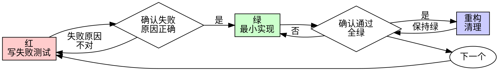

# 测试驱动开发（TDD）

## 概述

先写测试。看它失败。写最小代码让它通过。

**核心原则**：没看着测试失败过，你就不知道它测的是不是对的东西。

本 skill 只依赖项目自身的测试命令，不依赖任何平台专属工具，Claude Code 与 Codex 通用。

**违反规则的字面 = 违反规则的精神。**

## 何时使用

**总是**：新功能、bug 修复、重构、行为变更。

**例外（需征得用户同意）**：一次性原型、生成代码、配置文件。

想着"就这一次跳过 TDD"？停。那是合理化借口。

## 铁律

```
没有失败测试，就没有生产代码
```

先写了代码？删掉，重来。**没有例外**：不留作"参考"、不"边写测试边改造它"、不看它。删除就是删除，从测试出发重新实现。

## 红-绿-重构



### 红——写失败测试

写一个最小测试，表达应该发生什么：一个行为、清晰命名、测真实代码（万不得已才 mock）。

```typescript
// ✅ 好：名字表意、测真实行为、只测一件事
test('retries failed operations 3 times', async () => {
  let attempts = 0;
  const operation = () => {
    attempts++;
    if (attempts < 3) throw new Error('fail');
    return 'success';
  };
  const result = await retryOperation(operation);
  expect(result).toBe('success');
  expect(attempts).toBe(3);
});

// ❌ 坏：名字含糊、测的是 mock 不是代码
test('retry works', async () => {
  const mock = jest.fn()
    .mockRejectedValueOnce(new Error())
    .mockRejectedValueOnce(new Error())
    .mockResolvedValueOnce('success');
  await retryOperation(mock);
  expect(mock).toHaveBeenCalledTimes(3);
});
```

### 确认红——看它失败

**强制步骤，永不跳过。** 运行测试，确认：失败而非报错、失败信息符合预期、失败原因是功能缺失（不是拼写错误）。

- **测试直接通过了？** 你在测既有行为，改测试。
- **测试报错了？** 修到它以正确原因失败为止。

### 绿——最小实现

写让测试通过的最简代码。不加多余功能、不顺手重构别的代码、不超出测试要求"改进"。

```typescript
// ✅ 好：刚好够通过
async function retryOperation<T>(fn: () => Promise<T>): Promise<T> {
  for (let i = 0; i < 3; i++) {
    try { return await fn(); } catch (e) { if (i === 2) throw e; }
  }
  throw new Error('unreachable');
}

// ❌ 坏：maxRetries/backoff/onRetry 没人要 —— YAGNI
```

### 确认绿——看它通过

**强制步骤。** 运行测试，确认：目标测试通过、其他测试仍通过、输出干净（无报错无警告）。

- **测试失败？** 修代码，不是修测试。
- **其他测试挂了？** 现在就修。

### 重构——清理

只在全绿后：去重、改名、提取辅助函数。保持全绿，不加行为。

### 重复

为下一个行为写下一个失败测试。

## 为什么顺序重要（借口对照表）

| 借口 | 现实 |
|------|------|
| "太简单不用测" | 简单代码也会坏。测试 30 秒的事。 |
| "我写完再补测试" | 事后测试立即通过，什么都证明不了——可能测错对象、测实现不测行为、漏掉你忘了的边缘情况。 |
| "事后测试达到同样目的" | 事后测试回答"这代码做了什么"；事前测试回答"这代码该做什么"。事后测试被实现偏置——你测你建的，不是需求要的。 |
| "我已经手工测过了" | 手工测试无记录、不可重跑、高压下必漏。"我试了没问题" ≠ 系统性验证。 |
| "删掉 X 小时的工作太浪费" | 沉没成本谬误。留着没有真实测试的代码才是技术债。 |
| "留着当参考，先写测试" | 你会照着改。那就是事后测试。删除就是删除。 |
| "需要先探索" | 可以。探索完扔掉，从 TDD 重新开始。 |
| "测试难写 = 该 mock 更多" | 测试难写 = 设计有问题。难测即难用。 |
| "TDD 教条，我要务实" | TDD 就是务实：提交前抓 bug 比事后调试快，回归即刻暴露，测试即文档，重构有保护网。"务实的捷径" = 在生产环境调试 = 更慢。 |

## Red Flags —— 停下来重来

- 代码先于测试；测试后补；测试立即通过
- 说不清测试为什么失败
- "就这一次"、"我已经手工测过了"、"事后测试目的一样"、"重要的是精神不是仪式"
- "留作参考"、"改造现有代码"、"已经花了 X 小时删了可惜"
- "TDD 教条，我在务实"、"这次情况特殊因为……"

**以上任何一条出现 = 删代码，从 TDD 重来。**

## 完成前检查清单

- [ ] 每个新函数/方法都有测试
- [ ] 每个测试都看着它失败过
- [ ] 每次失败原因正确（功能缺失，不是拼写错误）
- [ ] 每个测试都用最小实现通过
- [ ] 全部测试通过
- [ ] 输出干净（无报错、无警告）
- [ ] 测试用真实代码（mock 仅在万不得已时）
- [ ] 边缘情况与错误路径已覆盖

勾不满？你跳过了 TDD。重来。

## 调试集成

发现 bug？先写复现它的失败测试，再走 TDD 循环。测试既证明修复又防止回归。**永远不要不带测试修 bug。**

## Mock 与测试反模式

添加 mock、测试工具方法、或想给生产类加测试专用方法时，先读 [testing-anti-patterns.md](references/testing-anti-patterns.md)：不测 mock 的行为、不给生产类加测试专用方法、不在不理解依赖链时 mock、mock 必须镜像真实结构的完整字段。

## 最终规则

```
生产代码 → 存在先失败过的测试
否则 → 不是 TDD
```

未经用户允许，没有例外。
