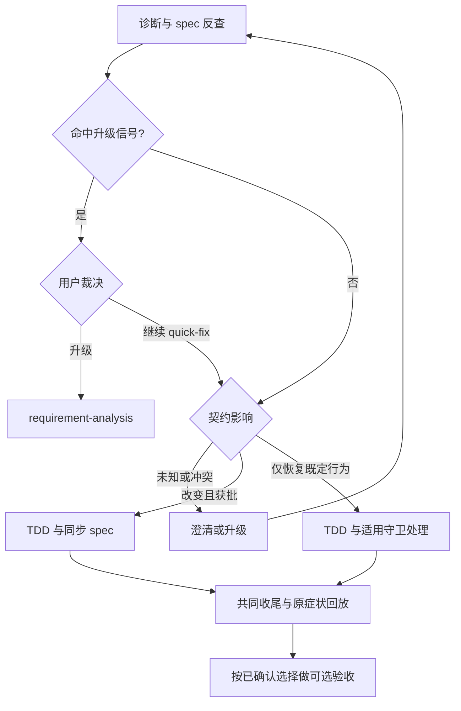

> 输出语言：用户显式指定（含平台语言设置）优先，其次跟随近期对话，否则使用英语。新产物使用创建时语言，增量修改沿用原文语言；固定话术按语义表达。

> **外部搜索统一入口**：外部检索先用 anysearch；不可用时按[搜索与降级规则](../requirement-analysis/references/exploration-patterns.md)执行。

# 轻量修复（Quick-Fix）

处理"已决定要修、无设计空间"的小 bug 修复与小调整，走"定位根因 → 逐题校对 → TDD 修复 → 可选验收"的最短路径；以 spec 反查与契约分流保证修复不制造文档漂移；非显然根因先取得真实诊断红信号，证据不足时交用户裁决。

**开始时声明**：「我正在使用 quick-fix skill 修复这个问题。」

**这是最短路径，不是免设计的后门。** 命中步骤 2.5 的影响范围、现行契约冲突或证据不足信号时，就把控制权交还用户、建议升级 requirement-analysis——放松的是流程重量，不是漂移防护。

## 定位：分诊三角里的位置

| skill | 承诺状态 | 设计空间 | 终态 |
|-------|---------|---------|------|
| exploring | 未承诺（还在想要不要做） | — | 交接 requirement-analysis |
| **quick-fix** | **已承诺 + 无设计空间**（小 bug、小调整） | **无** | **修复完成并验证** |
| requirement-analysis | 已承诺 + 有设计空间 | 有 | 交接 writing-plans |

**拿不准档默认倾向**：已承诺的开发请求、大小/设计空间拿不准时，默认先进 quick-fix——升级便宜、降级浪费；步骤 2.5 基于根因证据的升级门（含上下文交接）是安全网。与 requirement-analysis 阶段 1 小修检查的对偶表述同向。

## 决策路径

先诊断和反查契约，再处理升级信号与用户取舍。影响未知必须回澄清或升级，不等同于“不变”；证据充分且已有授权时直接消费原决定。图中任何分支都不产生新授权或守卫豁免。

## 流程（6 步）

### 步骤 1：接收问题 + 入口分诊自检

理解要修的 bug/调整。提出路线前按 [context-reuse.md](../requirement-analysis/references/context-reuse.md) 双查已有实现与历史否决、读取适用共享术语；历史记录不替代原症状证据，已有有效决定直接消费。**入口分诊自检**：若发现这其实不是"无设计空间的小修"——请求措辞是新功能、涉及多个子系统、或用户还在犹豫要不要做——立即建议改用 requirement-analysis（有设计空间）或 exploring（未承诺），等待用户裁决，不硬留在 quick-fix。

**修复对象边界**：以同一用户症状及经证据确认的根因链为对象。多文件、多调用方、跨轮次或上下文压缩不自动拆对象；恢复沿已有证据和决定继续，跨模块修法仍走升级门。发现无关根因的旁支只记录症状、位置与后续入口；用户明确扩大范围时更新对象记录和路由，不默认顺手修。

### 步骤 2：定位根因 + spec 反查

- **根因定位**：轻量场景主线程直查（Grep/Glob/Read）；根因不明朗时可派 1 个 `code-explorer` 子代理只读追踪；失败先缩小范围重试 1 次，再失败主线程接管（定义见 exploration-patterns「派发要求与失败隔离」）。
- **spec 反查**：取得 [Spec 发现与时效](references/spec-discovery.md) 全文，按五条 glob、covers 和状态链反查适用契约；未安装守卫也执行，不把按需加载理解为可省略反查。
- **不硬依赖 guardrail**：发现规则与适用降级见同一 [发现专题](references/spec-discovery.md)。

**诊断前置**：根因非显而易见时，优先实际运行已有测试、CLI/API 或原场景回放，在根因认定前给出输入/触发条件、命令及针对原症状的失败输出。环境、鉴权、缺依赖或编译失败不算该 bug 的诊断红；先恢复条件或如实交接缺口。已有有效证据仍适用于当前代码和条件时直接复用，不强制新建测试。写新测试前先消费获批 seam，落点未定不先写某个候选测试；生产源码插桩仍受现行 TDD/例外授权约束。

**显然小修**：症状、具体代码条件与纠正方向唯一对应时，说明依据可免额外诊断前置；只免此步骤，后续 TDD 和例外授权仍按原规则。不能以“显然”免测或虚构失败。

**有界调查与证据进展**：调查前说明对象、方法和预期证据。有证据支持、排除或区分候选时继续；没有证据进展时，汇总原始输出、已排除项和缺失条件，交用户决定下一步。重复尝试或换措辞不算进展；不设固定轮数。代理失败隔离沿 exploration-patterns 的单点规则。

### 步骤 2.5：升级门（用户裁决式护栏）

基于**当前代码、复现和调查证据**判定，允许尚未定位根因时报告证据不足；不把工具调用错误本身等同于 bug 复杂。命中以下任一即停下：

- **行为契约变更且跨越单一 spec 覆盖范围**（改动会改变多个 spec 描述的行为，或需在多个 spec 间协调）；
- **跨模块改动**（根因修复需要动多个模块、牵连面超出单点）；
- **引入新依赖**（需要新第三方库/框架）；
- **现行契约冲突**（同一行为面的两份 active spec 相互矛盾且互无取代声明，见步骤 2 的时效处理）；
- **诊断证据不足**（当前有界调查结束后仍无法可靠捕获/比较原症状，或无证据进展、根因仍缺足够依据）。偶发但有实际失败样本和可比较条件可继续轻量诊断，不单因 flaky 升级；其他影响范围信号仍适用。

命中时向用户呈现两个选项：**升级到 requirement-analysis** / **明确坚持在 quick-fix 继续**。不自动切换、不强制终止。继续只表示保留 quick-fix 流程：缺红/落点时限于获授权取证，双 spec 冲突仍先裁决；不能据此伪造根因、跳过 TDD 或绕过契约同步。升级交接保留已试方法、失败输出、候选状态和缺少条件；调用失败与产品证据不足分别记录。**若用户坚持继续且修复改变契约，仍强制走步骤 5a 的 spec 同步分支**——护栏放松的是流程重量，不是漂移防护。升级经用户同意后调用 requirement-analysis skill，**并把已定位的根因、spec 反查结果与步骤 3 已裁决的澄清答案作为其阶段 1 输入——其阶段 2 不重查已查证部分、阶段 3 不重问已裁决问题，升级不等于重来**。

### 步骤 3：逐题校对（一次一个问题）

提问纪律遵循 clarifying skill 的核心纪律（被引用模式，纪律定义以 clarifying 为准）：提问前自我披露、一次一题、选择题优先且推荐项放首位（Claude Code 用 `AskUserQuestion`）、事实自查决策交用户。核心确认三类：

1. **根因认定或下一步调查方向**：已唯一定位则给一个根因及证据，不凑候选；尚未唯一确定但有区分依据时给 2–3 个排序候选，各附依据和可证伪预测（若是 X，观察 Y 应出现 Z）。明确证实/待验证状态，一次只确认当前事项；用户选择调查方向不证明根因，出现反证即记录并修正。不得在修法/落点决定前改实现验证猜测；
2. **修复方案**选哪个（有多个修法时）；
3. **契约影响**：根据现行 Requirement/Scenario、实际行为和拟议修复形成带引用的判断。证据充分、范围已授权且仅恢复既定行为时直接使用，不固定询问“是否改变契约”；真实语义取舍、冲突或证据不足才交用户裁决。未命中适用 spec 如实说明，不编造契约或人工确认题。

### 步骤 4：契约影响判定（分流点）

依据步骤 3 的证据判断和适用用户决定分流：修复改变现行 Requirement/Scenario 的可观察行为则走 5a；仅恢复既定行为则走 5b。未知、冲突和证据不足仍走原澄清/升级门，事实判断不授权新行为或守卫放行。

### 步骤 5a：TDD 修复 + 同步 spec 小节（契约改变，单 spec 内）

- **强制 TDD**：失败复现 → 确认有效红 → 最小实现 → 确认绿，遵循 test-driven-development；例外清单以 test-driven-development skill 为准，按其授权纪律处理，不另设自有例外。写测试前复用获批 seam，无唯一落点时并入步骤 3 原确认，不重复询问已有决定。重构候选记录位置、理由和保护证据，交自身修复收尾；纯重构遵循 TDD「收尾纯重构」，不因此强制开启可选验收。
- **真实故障对应检查**：确认获批公共 seam 覆盖真实输入、调用顺序及多调用方触发模式，不能仅以孤立纯函数绿代替真实故障。无 seam 标签但批准接口与 Scenario 唯一对应时记录来源直接消费；多候选或冲突仍并入原确认，决定前不写候选测试。只有实际调用/观察证据表明公共边界无法覆盖目标行为时，才说明具体结构障碍，沿原澄清/升级处置；共享判据见 writing-plans/references/design-principles.md。不因架构发现自动重构、制造私有接口或无测试交付。5b 同样适用。
- **同步 spec**：修改命中 spec 的对应 Requirement/Scenario 小节，使其与新行为一致（不重写设计，只改被影响的那几行）。
- **spec 增量提交前给用户过目**：把 spec 小节改动展示给用户确认。
- **提交**：spec + 代码 + 测试同一 commit，按该提交视图核对同步；若存在任务绑定，先按已有授权更新范围与版本，不能混用旧关联或宽跳过。

### 步骤 5b：TDD 修复 + trailer 放行（契约不变）

强制 TDD 同 5a；契约不变不伪造 spec 修改。未命中 covers 的普通提交与命中 covers 的提交/编辑处理，按 [守卫处理](references/guardrail-handling.md) 在首次相关动作前取得全文。
保留用户对实际守卫放行的授权边界，不静默绕过；环境变量与 trailer 的作用不可互代。

### 修复收尾（5a/5b 共用）

- **偶发复现率**：仅对偶发/时序问题，按可比较的输入、环境、触发方式和观察窗口记录修复前后失败次数/运行次数及原始输出；试验次数由当前观察方案确定，不统一固定。单次绿、缩短窗口或换输入不构成可比较结果；零次失败只表示本次观察未出现，不声称概率为零。比较不足时补足原定观察或明确未验证。
- **临时插桩**：本次临时日志使用可追踪唯一标识。核对源码和辅助文件的实际归属，移除本次临时插桩，或记录保留位置与理由；清理后再验证。用户原有/归属不明工作保留，归档日志中的历史标识不要求清零。持久资源继续遵循原台账与授权，不因清插桩扩大删除范围；无本次插桩记录不适用。
- **原症状回放**：在处置插桩后的最终代码上重跑原始输入/完整调用链，分别记录最小回归和原场景结果。原环境不可访问时报告本地通过、原场景未验证、缺失条件与恢复下一步；仍有目标失败照实报告，不能以流程结束声称整体修复已证实。
- **根因说明**：交付说明串起原症状、经证据支持的根因、改动为何有效、命令/结果和未验证边界。候选与被否定解释不冒充最终根因；有提交/PR授权时可写入相应说明，未授权时留交付总结，不为写叙事自动提交、推送或发布。

### 步骤 6：可选自动化验收

询问用户一次是否触发 acceptance-qa（选择题）：

- **要** → 触发 acceptance-qa skill。输入按 spec 命中情况装配：命中 active spec 则传 spec 路径 + 变更文件清单（acceptance-qa 按变更面裁剪矩阵）；未命中则由 acceptance-qa 现场生成迷你矩阵。无需改动 acceptance-qa。
- **不要** → 至少运行受影响的测试文件作为最低验证，区分"本次新增失败"与"既有失败"，结果呈现给用户，不留"没验证"空白。

**收尾资源清理**：修复过程创建的持久资源（测试数据/表、临时容器等，对话内记账）在验证完成后展示清单（标识 + 清理命令）请用户确认——确认后逐条清理并报告结果；婉拒则保留并说明位置与手动清理方式；无创建资源时声明"无待清理资源"。共享缓存默认保留；台账纪律细则以 writing-plans 的资源台账定义（[完整权威](../writing-plans/references/plan-format.md#资源台账总则)）为准（有计划时：progress.yaml 的 resources 键）。

## 与 guardrail 的关系

quick-fix 消费 spec 的 covers/status 和已有任务关联。契约变化同步 spec；契约不变沿适用的范围绑定或已授权例外处理。范围核验不证明语义符合，未知影响不得当作不变。

## 执行环境兼容性

通用工具映射（澄清/进度/并行子任务/规范文件/搜索）以 requirement-analysis 的 [codex-compat.md](../requirement-analysis/references/codex-compat.md) 工具映射总表为准（单一定义点，此处不复述）；逐题提问的 Codex 形态见 clarifying 内嵌 Codex 规范节。本 skill 自有映射：

| 用途 | Claude Code | Codex |
|------|-------------|-------|
| 根因探索子代理 | `Agent`（subagent_type: code-explorer） | `spawn_agent`（`fork_turns: "none"`）+ `wait_agent` |

sequential-thinking skill（插件内嵌）不可用时降级为回复中分点推演并注明工具降级原因。Codex 沙箱下 `SPEC_DEV_GUARD=off git commit` 与守卫交互同 Claude；沙箱禁止 commit 时请用户在沙箱外执行。

## Red Flags

- “一次绿就说明偶发故障消失” → 同口径前后计数，结论只覆盖实际观察
- “最小测试绿了，原场景不用回放” → 单列原始症状验证，缺原条件明确未验证
- “用户选了候选 A，所以 A 就是根因” → 选择不是证据，保留反证并更新结论
- “没有 seam，写条架构笔记就免测交付” → 具体结构证据交原澄清/升级，TDD边界保持

- "这个新功能顺手在 quick-fix 里做了吧" → 有设计空间就升级 requirement-analysis，quick-fix 不是免设计后门
- "契约变了但我 trailer 放行更快" → 契约变更强制走 5a 同步 spec，trailer 只给契约不变的修复
- "先改代码再补测试" → 强制 TDD，先写复现失败测试
- "编辑被守卫拦了就偷偷 spec 改一行糊弄过去" → 核对已有绑定与授权；需宽例外时先退出任务关联，不伪造 spec 同步
- "跨了三个模块但应该算小修吧" → 跨模块命中升级门，交用户裁决
- "反查 glob 少写一条无所谓" → 必须与守卫五条逐字对齐，否则分流与守卫拦截面错位
