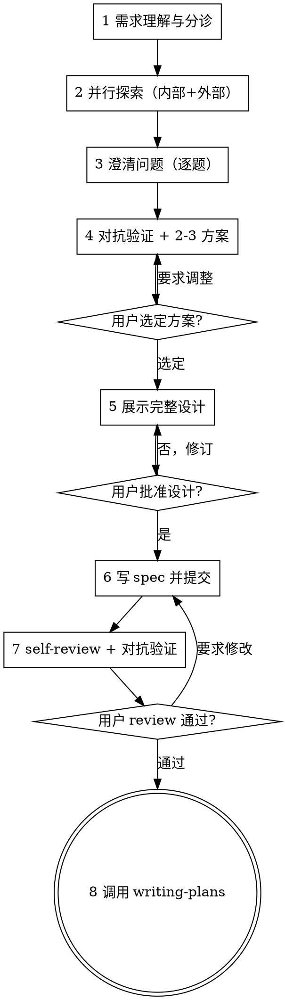

# 需求设计工作流

通过自然的协作对话，把想法转化为经过验证的完整设计与 spec。

先理解项目现状，再逐题澄清打磨想法；理解到位后做对抗验证、给出多方案对比；用户批准设计后落盘 spec，最终交接 writing-plans 生成实施计划。

<HARD-GATE>
在设计展示给用户并获得批准之前，不得调用任何实施类 skill、不得编写任何代码、不得搭建任何脚手架、不得采取任何实施动作。此门槛适用于所有项目，无论看起来多简单。
</HARD-GATE>

## 反模式："这需求太简单，不需要设计"

所有需求都要走完本流程。加一个字段、改一处文案、一个单函数工具——都一样。"简单"需求恰恰是未经检验的假设造成返工最多的地方。设计可以很短（light 档几句话即可），但**必须展示并获得批准**。

## Checklist

必须为以下每一项创建任务（Claude Code 用 `TaskCreate`，Codex 用 `update_plan`），按序完成；被跳过的项标记完成并注明原因：

1. **需求理解与分诊** — 理解意图，判定档位，标记外部探索/视觉候选
2. **并行探索** — 内部代码 + 外部资源同一波次 fan-out，深度按档位
3. **澄清问题** — 一次一个问题，不限轮数；视觉问题 JIT 提议 visual-preview
4. **对抗验证 + 提出 2-3 方案** — sequential-thinking 校验信息后给方案与推荐，用户选定
5. **展示完整设计** — 整篇展示不分章节，获得用户批准
6. **写 spec 并提交** — 落盘 `docs/YYYY-MM-DD-<feature>/spec/<feature>-design.md` 并 git commit
7. **Spec self-review + 对抗验证** — inline 自检 + 审查子代理；有修改则请用户再 review
8. **交接 writing-plans** — 唯一终态；经用户确认后调用 writing-plans 生成实施计划

## 流程图



**终态是调用 writing-plans。** 不得调用 executing-plans、acceptance-qa 或任何其他实施类 skill——本 skill 之后唯一可调用的 skill 是 writing-plans。

## 执行档位

档位在阶段 1 判定，向用户声明并允许覆盖；它只调节探索规模与 spec 篇幅，**不豁免任何 Checklist 项与 HARD-GATE**。

```
light    — 单文件/单模块、无新依赖、无方案分歧（如加字段、改文案）
           探索：主线程直查或 1 个子代理；方案可收敛为 1 个（说明为何无分歧）；spec 几句话到半页
standard — 默认档。跨 2-3 模块或有方案取舍
           探索：按架构层次或功能模块 3-5 个子代理；完整 2-3 方案对比
deep     — 跨层架构变更、新技术栈、用户使用"彻底/全面/审计"等措辞
           探索：multi-modal sweep，按模态数派发、不设上限；方案对比含更完整的风险分析
```

**判定依据**：涉及文件数与模块数（阶段 1 初判、阶段 2 修正）、是否引入新依赖、是否存在多解取舍、用户措辞强度。声明格式：「本需求判定为 {档位}（理由），如需更彻底/更轻量请告知」。

## 执行环境兼容性

本 skill 同时兼容 Claude Code 和 Codex。核心工具映射：

| 用途 | Claude Code | Codex |
|------|-------------|-------|
| 用户澄清/确认 | `AskUserQuestion`（单题带选项） | 对话消息提问并等待回复 |
| 进度跟踪 | `TaskCreate` / `TaskUpdate` | `update_plan` |
| 并行子任务 | `Agent`（单响应一次性发起） | `spawn_agent`（继承上下文，参数见 codex-compat）+ `wait_agent` |
| 项目规范文件 | `CLAUDE.md` → `AGENTS.md` | `AGENTS.md` → `CLAUDE.md` |
| 网页搜索 | `WebSearch` | 内置 web 搜索（托管 `web_search` 工具） |

Codex 环境的完整规则见 [codex-compat.md](references/codex-compat.md)。

---

## 阶段 1: 需求理解与分诊

**目标**：理解意图，给流程定参。

- 理解核心功能、业务实体、约束与成功标准；描述模糊或多模块时用 `mcp__sequential-thinking__sequentialthinking` 分解
- **意图承诺检查**：用户仍在"要不要做"的犹豫期（探索性措辞、无交付承诺）→ 建议切换 exploring skill，不硬拉八阶段；存在相关的 `docs/explorations/` 探索笔记时作为本阶段输入，已探索过的部分阶段 2 不重做
- **范围分解检查**：需求的意图必须能用一句话说清——说不清就该拆。出现过大信号（范围读起来像不相关功能清单、审查一份 spec 要一下午、两人同时做会撞车、一半任务可独立交付）或描述了多个独立子系统（如"做一个带聊天、文件存储、计费、分析的平台"）时立即指出，先帮用户分解为子项目（各自独立的 spec → plan → 实施周期），再对第一个子项目走本流程——不要在一个需要分解的项目上浪费澄清轮次
- 判定档位并声明（见"执行档位"）
- 打标记，供后续阶段消费：
  - **需要外部探索？**——涉及新第三方库/框架、需要行业最新实践、内部示例不足，任一满足即标记
  - **视觉候选？**——需求涉及 UI 布局、页面结构、视觉风格等"看比说清楚"的题材时标记；此标记只影响阶段 3 的 JIT 提议时机，**不在此时提议**

## 阶段 2: 并行探索

**目标**：一个波次拿齐内部代码事实与外部最佳实践。

**首要任务**：查找并阅读项目规范文件（优先级按环境映射表）。

**编排**：内部与外部探索相互独立，**必须在单条消息中一次性发起全部子代理**——分批发起会退化为串行等待。子代理数量不设上限，按档位与需求结构决定：

- **light**：主线程直查（Glob/Grep/Read 或 codegraph），或 1 个 `code-explorer`
- **standard**：按架构层次或功能模块拆 3-5 个 `code-explorer`；阶段 1 标记了外部探索时，同波次加 1-2 个 `external-resource-explorer`
- **deep**：multi-modal sweep——每个模态一个 `code-explorer` 彼此盲扫，模态数由项目形态决定、不设上限；外部按主题拆多个 `external-resource-explorer` 同波次发起

外部探索工具优先级：`context7`（库文档）→ `WebSearch` / `WebFetch`，降级链与模态定义、契约校验、失败隔离规则见 [exploration-patterns.md](references/exploration-patterns.md)。

**每个子代理必须给定**：清晰的主题或模态、相关文件线索、期望输出格式。失败的子代理先缩小范围重试 1 次，再失败由主线程接管。

## 阶段 3: 澄清问题

**目标**：解决所有模糊、歧义与多解取舍。

- **一次只问一个问题**——一个话题需要展开就拆成多个问题多轮问；不限总轮数，问到理解到位为止
- **先探索后提问**：每个问题提出前先检查能否由代码库或阶段 2 探索结果回答——能则自己查证，不消耗用户澄清轮次；只把真正需要用户裁决的问题带到对话
- **按决策依赖排序**：沿设计的决策树逐支下行，上游决策未定时不问下游问题（如存储选型未定就不问索引设计），避免上游答案变化令下游澄清作废
- Claude Code 用 `AskUserQuestion`（单题、2-4 个具体选项、推荐项放首位并说明理由）；开放式问题用对话直接问；Codex 提问规范见 [codex-compat.md](references/codex-compat.md)
- 优先覆盖：目的、约束、成功标准；阶段 1-2 暴露的歧义、约束冲突、隐含假设、边缘场景
- **术语挑战**：用户用词模糊或一词多义时（如"账户"既可指 Customer 又可指 User），当场提出规范术语请用户裁决；术语确定后全程沿用，并在 spec 术语表中记录规范名、一句话定义与 Avoid 别名
- **不编造问题**：若阶段 1-2 未暴露任何疑点，明确记录"需求已清晰，无需澄清"后进入阶段 4——带着错误假设实施的返工成本远高于一次提问，但为走流程而提问同样是浪费

**可视化预览（JIT 提议）**：不要在开场提议。当某个问题**用看的比用说的更清楚**时（真实的 mockup/布局/图示问题，而不只是"话题涉及 UI"），首次出现的那一刻单独发一条消息提议使用 visual-preview skill——该消息只含提议、不夹带其他问题。用户接受则按 visual-preview skill 执行；拒绝则继续纯文字，不再重复提议。逐题判断浏览器 vs 终端：内容本身是视觉的（线框、布局对比、架构图）用浏览器，内容是文字的（需求、取舍、概念选择）留在终端。

**回补探索**：澄清或方案期发现新库/新领域，允许回补一轮外部探索（同样单响应发起），回补后继续当前阶段。

## 阶段 4: 对抗验证 + 提出 2-3 方案

**目标**：先证伪自己的信息，再给出可比较的方案。

**零子代理**：本阶段全部在主线程完成，用 `mcp__sequential-thinking__sequentialthinking` 结构化推进；该 MCP 不可用时降级为在回复中显式分点推演，不得因工具缺失跳过分析。

**第一步——信息对抗验证**。对阶段 1-3 收集的每条承重结论（将直接决定方案取舍的事实）逐条质询：

- 来源可靠吗？（外部结论：官方文档还是二手博客？版本时效？）
- 与代码库事实冲突吗？（外部最佳实践与项目现有模式矛盾时，回读代码裁决）
- 是未验证的假设吗？（是→标记，能在代码中验证的立即验证，只能由用户裁决的回到阶段 3 补问）

冲突未消解前不进入方案设计。

**第二步——提出 2-3 个方案**。基于验证后的信息给出方案对比：

- 每个方案：核心思路、与现有模式的契合度、改动半径、风险、成本
- **推荐方案放首位并说明理由**，以对话方式呈现，不堆砌表格
- YAGNI：从所有方案中删掉没人要求的功能
- light 档确无分歧时可收敛为 1 个方案，但必须说明"为何无分歧"
- 用户选定方案后才进入阶段 5；用户提出调整则修订方案重新呈现

## 阶段 5: 展示完整设计

**目标**：把选定方案展开为完整设计，整篇获得批准。

- **整篇展示、不分章节逐节确认**——一次性给出全文，用户整体反馈
- 覆盖：架构与组件划分、数据流、关键接口/数据结构、错误处理、测试策略、风险与边缘情况
- 篇幅与复杂度匹配：light 档几句话，复杂设计每节最多两三百词——设计文档不是越长越好
- **面向隔离与清晰设计**：拆成职责单一、接口明确、可独立理解与测试的单元；每个单元能回答"做什么、怎么用、依赖什么"；不读内部实现就能理解一个单元、改内部实现不破坏消费者——做不到就重划边界
- **在既有代码库中**：跟随现有模式；当前工作触及的既有问题（文件过大、边界混乱）可纳入设计做定向改进，但不做无关重构
- 用户批准前不进入阶段 6；有修改意见则修订后重新整篇展示

## 阶段 6: 写 spec 并提交

- 为本需求创建特性目录 `docs/YYYY-MM-DD-<feature>/`（feature 取需求主题的短语义名，跟随项目语言；同日同名冲突时追加序号 `-2`、`-3`），将批准的设计写入其 `spec/<feature>-design.md`（用户对 spec 位置的偏好优先于此默认值）
- spec 与后续 writing-plans 的计划（同目录 `plan/<feature>-plan.md`）共用这一个特性目录——一个需求的全部产物收纳在一处
- **决策分流（ADR）**：检查"已确认的关键决策"中是否有同时满足三判据的决策——**难以逆转**（事后改主意成本高）、**缺上下文会费解**（未来读者会问"当初为什么这么做"）、**真实取舍**（存在真正的备选且因具体理由选定其一）——满足者每条沉淀为仓库级 `docs/adr/NNNN-<slug>.md`（全项目共用一个目录、统一编号：扫描现有最高编号递增，目录不存在时随首个 ADR 创建；正文 1-3 句写清背景、决定与理由即可，值得记住的被否方案附一行），spec 决策节保留一行摘要并链接过去；三判据缺一即不建 ADR，留在 spec 决策节就够——ADR 泛滥和没有 ADR 一样没用
- 结构参考 [spec-template.md](assets/spec-template.md)，按需增删节；**行为需求必须用 Requirement + Scenario 结构表达**（`### Requirement:` 一条一个 SHALL 且可观察，`#### Scenario:` 用 GIVEN/WHEN/THEN——它们是后续 TDD 测试与验收的直接锚点）；修改既有功能时行为部分改用差量三节（ADDED/MODIFIED/REMOVED Requirements，见模板）
- **漂移守卫锚点（必填）**：落盘时保留模板顶部的 `spec_dev` frontmatter，填写 `feature` 与 `covers`（本特性拥有的代码路径 glob；纯文档特性留空数组 `[]`）——此阶段 `status` 保持 `draft`。该 frontmatter 是 pre-commit / CI 漂移守卫的锚点，缺失或永停 draft 意味着该特性代码不受"改了代码却没同步 spec"的拦截保护
- git commit 该 spec 文件与本次新增的 ADR 文件（仅这些文件；非 git 仓库则跳过并向用户说明）

## 阶段 7: Spec self-review + 对抗验证

**第一步——inline 自检**（自己以新鲜眼光重读，发现即改，无需复审）：

1. **占位符扫描**：有无 "TBD"、"TODO"、未写完的节、含糊的需求？
2. **内部一致性**：各节是否互相矛盾？架构是否与功能描述匹配？术语是否全篇沿用术语表的规范名、未混入 Avoid 别名？
3. **范围检查**：整份 spec 的意图能否一句话说清？是否聚焦到单个实施计划能承载？出现过大信号（不相关功能清单、一半任务可独立交付）则回到分解
4. **歧义检查**：有无可以两种方式解读的需求？有则选定一种写明
5. **Requirement 质量**：每条 Requirement 是否一个 SHALL 且可观察？每条是否至少有一个真正检验它的 Scenario（不是复述）？最怕坏掉的场景有没有命名的 Scenario？差量三节（如使用）分类是否与既有行为对得上？

**第二步——对抗验证**：派 1 个临时子代理（Claude Code 用 general-purpose，Codex 用 `spawn_agent`），提示词按 [spec-reviewer-prompt.md](references/spec-reviewer-prompt.md) 模板构造，对 spec 做独立审查（完整性/一致性/清晰度/范围/YAGNI）。审查回报的问题逐条处置：成立则修 spec，不成立则记录理由。

**第三步——用户 review 门**：

> 「Spec 已写入并提交至 `<路径>`。请 review，如需修改请告诉我，确认后我们开始编写实施计划。」

等待用户回复。**若第一/二步曾修改 spec，必须让用户重新 review 修改后的版本**；用户要求修改则改完重跑本阶段。用户确认后才进入阶段 8。

## 阶段 8: 交接 writing-plans

- **前置确认**：须持有用户对「开始编写实施计划」的明确同意——阶段 7 的确认话术已包含此询问；用户仅认可 spec、未表态是否继续时，先问「现在开始编写实施计划吗？」，同意后才交接
- **激活漂移守卫**：交接前把 spec frontmatter 的 `status: draft` 翻为 `active` 并 commit（仅 `active` 参与漂移拦截——不翻转则守卫对本特性静默失效）
- 调用 writing-plans skill，基于已批准的 spec 生成实施计划
- **不得调用任何其他 skill**——writing-plans 是本流程唯一的下一步；实施纪律（worktree 隔离、TDD、审查编排）由 writing-plans → executing-plans 链路承接

---

## Key Principles

- **一次一个问题**——不要用一串问题淹没用户
- **选择题优先**——能给具体选项就不问开放式问题
- **YAGNI 无情裁剪**——从所有设计里删掉不必要的功能
- **先证伪再方案**——承重信息未经对抗验证不得进入方案设计
- **多方案对比**——定稿前必出 2-3 个方案（light 档例外需说明理由）
- **增量验证**——方案选定、设计批准、spec review 三道门逐一通过
- **随时回退**——发现理解有误就回到对应阶段澄清，不带着错误假设前进

## Red Flags

出现以下想法时，停下来重新对照 Checklist：

- "这太简单了，直接写代码吧" → HARD-GATE 适用于一切需求
- "一次多问几个问题效率高" → 一次一个
- "外部搜到的做法直接用" → 先对抗验证，与代码库事实对照
- "方案很明显，不用对比" → 除 light 档且说明理由外，必出 2-3 方案
- "设计批准了，spec 就不用再让用户看了" → self-review 后有修改必须让用户再 review
- "顺手把代码也写了" → 终态只有 writing-plans，实施是后续 skill 的职责
- "先开工，档位/任务清单回头补" → Checklist 每项建任务，跳过要注明原因
